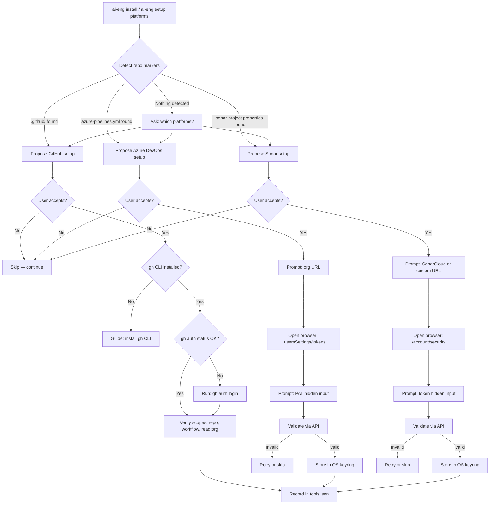

# Plan — Sonar Scanner Integration & Platform Credential Onboarding

## Architecture

### New Files

| File | Purpose |
|------|---------|
| `src/ai_engineering/credentials/__init__.py` | Credentials module init |
| `src/ai_engineering/credentials/service.py` | OS-native secret store operations via `keyring` |
| `src/ai_engineering/credentials/models.py` | Pydantic models for credential metadata |
| `src/ai_engineering/platforms/__init__.py` | Platforms module init |
| `src/ai_engineering/platforms/detector.py` | Platform auto-detection from repo markers |
| `src/ai_engineering/platforms/github.py` | GitHub CLI auth verification and setup |
| `src/ai_engineering/platforms/sonar.py` | SonarCloud/SonarQube token validation and setup |
| `src/ai_engineering/platforms/azure_devops.py` | Azure DevOps PAT validation and setup |
| `src/ai_engineering/cli_commands/setup.py` | `ai-eng setup` subcommand group |
| `.ai-engineering/skills/dev/sonar-gate/SKILL.md` | Sonar gate skill definition |
| `.ai-engineering/skills/dev/sonar-gate/scripts/sonar-pre-gate.sh` | Bash Sonar scanner wrapper |
| `.ai-engineering/skills/dev/sonar-gate/scripts/sonar-pre-gate.ps1` | PowerShell Sonar scanner wrapper |
| `.ai-engineering/skills/dev/sonar-gate/references/sonar-threshold-mapping.md` | Quality contract ↔ Sonar mapping |
| `.ai-engineering/state/tools.json` | Platform metadata state file (schema + initial) |
| `tests/unit/test_credentials.py` | Unit tests for credential service |
| `tests/unit/test_platforms.py` | Unit tests for platform detection and validation |
| `tests/unit/test_sonar_gate.py` | Unit tests for Sonar gate logic |
| `tests/unit/test_setup_cli.py` | Unit tests for setup CLI commands |
| `tests/integration/test_platform_onboarding.py` | Integration tests for full onboarding flows |
| `src/ai_engineering/platforms/sonarlint.py` | Multi-IDE SonarLint Connected Mode configuration |
| `tests/unit/test_sonarlint.py` | Unit tests for SonarLint IDE configuration |

### Modified Files

| File | Change |
|------|--------|
| `pyproject.toml` | Add `keyring` dependency |
| `src/ai_engineering/cli_factory.py` | Register `setup` subcommand group |
| `src/ai_engineering/cli_commands/core.py` | Add `--check-platforms` flag to `doctor_cmd` |
| `src/ai_engineering/doctor/service.py` | Add platform credential validation checks |
| `.ai-engineering/skills/quality/install-check/SKILL.md` | Add platform onboarding reference |
| `.ai-engineering/skills/quality/audit-code/SKILL.md` | Add optional Sonar gate step |
| `.ai-engineering/skills/quality/release-gate/SKILL.md` | Add optional Sonar gate dimension |
| `.ai-engineering/state/decision-store.json` | Record spec-023 decisions |
| `.ai-engineering/context/specs/_active.md` | Point to spec-023 |
| `.github/copilot-instructions.md` | Add `sonar-gate` skill reference |
| `AGENTS.md` | Add `sonar-gate` skill reference |
| `CLAUDE.md` | Add `sonar-gate` skill reference |
| `src/ai_engineering/cli_factory.py` | Register `sonarlint` subcommand |
| `src/ai_engineering/cli_commands/setup.py` | Add `setup_sonarlint_cmd` |
| `.ai-engineering/standards/framework/quality/sonarlint.md` | Add IDE integration guidance per IDE family |

### Mirror Copies

| Canonical | Template Mirror |
|-----------|-----------------|
| `.ai-engineering/skills/dev/sonar-gate/SKILL.md` | `src/ai_engineering/templates/.ai-engineering/skills/dev/sonar-gate/SKILL.md` |
| `.ai-engineering/skills/dev/sonar-gate/scripts/sonar-pre-gate.sh` | `src/ai_engineering/templates/.ai-engineering/skills/dev/sonar-gate/scripts/sonar-pre-gate.sh` |
| `.ai-engineering/skills/dev/sonar-gate/scripts/sonar-pre-gate.ps1` | `src/ai_engineering/templates/.ai-engineering/skills/dev/sonar-gate/scripts/sonar-pre-gate.ps1` |
| `.ai-engineering/skills/dev/sonar-gate/references/sonar-threshold-mapping.md` | `src/ai_engineering/templates/.ai-engineering/skills/dev/sonar-gate/references/sonar-threshold-mapping.md` |

## File Structure

```
src/ai_engineering/
├── credentials/
│   ├── __init__.py
│   ├── service.py          # keyring abstraction: store/retrieve/delete/validate
│   └── models.py           # CredentialRef, PlatformState Pydantic models
├── platforms/
│   ├── __init__.py
│   ├── detector.py          # detect_platforms() → list[Platform]
│   ├── github.py            # GitHubSetup: gh CLI check, auth verify, scope check
│   ├── sonar.py             # SonarSetup: token prompt, API validate, keyring store
│   ├── azure_devops.py      # AzureDevOpsSetup: PAT prompt, API validate, keyring store
│   └── sonarlint.py         # SonarLintConfigurator: multi-IDE config generation
├── cli_commands/
│   └── setup.py             # setup_app = typer.Typer(); platforms/sonar/github/azure-devops/sonarlint
└── doctor/
    └── service.py           # (modified) add check_platforms() diagnostic

.ai-engineering/
├── skills/
│   └── dev/
│       └── sonar-gate/
│           ├── SKILL.md
│           ├── scripts/
│           │   ├── sonar-pre-gate.sh
│           │   └── sonar-pre-gate.ps1
│           └── references/
│               └── sonar-threshold-mapping.md
└── state/
    └── tools.json            # { "github": {...}, "sonar": {...}, "azure_devops": {...} }
```

## Onboarding Flow Diagram



## Session Map

### Phase 0: Scaffold [S]

- Scaffold spec files, activate, commit.
- Branch: `feat/sonar-platform-onboarding`.
- Size: S (< 1 session).

### Phase 1: Foundation — Credentials Module [M]

- Add `keyring` dependency.
- Create `credentials/` module with service and models.
- Create `platforms/detector.py` for repo marker detection.
- Unit tests for credentials and detection.
- Size: M (1 session).

### Phase 2: Platform Setup Implementations [L]

- Implement `platforms/github.py`, `platforms/sonar.py`, `platforms/azure_devops.py`.
- Implement `cli_commands/setup.py` with all subcommands.
- Register `setup` in `cli_factory.py`.
- Define `state/tools.json` schema.
- Unit tests for each platform module and CLI.
- Size: L (1-2 sessions).

### Phase 3: Sonar Gate Skill [M]

- Create `dev/sonar-gate/SKILL.md`.
- Create cross-OS scripts (`sonar-pre-gate.sh`, `sonar-pre-gate.ps1`).
- Create `references/sonar-threshold-mapping.md`.
- Create template mirrors.
- Unit tests for gate logic.
- Size: M (1 session).

### Phase 4: Integration — Existing Skills & Doctor [M]

- Modify `install-check` skill to reference platform onboarding.
- Modify `audit-code` skill to include optional Sonar gate.
- Modify `release-gate` skill to include optional Sonar dimension.
- Add `--check-platforms` to `doctor` command.
- Add platform validation to `doctor/service.py`.
- Integration tests for full flows.
- Size: M (1 session).

### Phase 5: Registration & Governance [S]

- Register `sonar-gate` skill in all 6 instruction files.
- Update skill counts in `product-contract.md`.
- Create Claude Code command wrapper + mirror.
- Create Copilot prompt wrapper.
- Update `CHANGELOG.md`.
- Add cross-references to related skills.
- Record decisions in `decision-store.json`.
- Size: S (< 1 session).

### Phase 6: Verification & Close [S]

- Run full test suite.
- Run `ruff`, `ty`, `gitleaks`, `semgrep`, `pip-audit`.
- Run `integrity-check`.
- Verify all 18 acceptance criteria.
- Create `done.md`.
- Size: S (< 1 session).

### Phase 7: SonarLint IDE Configuration [M]

- Create `src/ai_engineering/platforms/sonarlint.py` — multi-IDE SonarLint configurator.
- IDE family detection: VS Code family (`.vscode/`), JetBrains (`.idea/`), VS 2022 (`.vs/`).
- VS Code family covers: VS Code, Cursor, Windsurf, Antigravity (all use `.vscode/` config).
- JetBrains family covers: IntelliJ IDEA, Rider, WebStorm, PyCharm, GoLand.
- Visual Studio 2022: `.vs/SonarLint/settings.json`.
- Merge-safe JSON/XML writes (preserve existing settings).
- Add `sonarlint` subcommand to `ai-eng setup`.
- Register in `cli_factory.py`.
- Update `sonarlint.md` quality standard with per-IDE integration guidance.
- Unit tests for all IDE config generators.
- Size: M (1 session).

## Patterns

- **Dependency injection**: platform setup classes receive `keyring` backend via constructor.
- **Strategy pattern**: each platform (GitHub, Sonar, AzDO) implements a common `PlatformSetup` protocol.
- **Silent skip**: all optional gates check for configuration before executing. Missing config = skip, not fail.
- **Masked output**: all CLI prompts for tokens use `typer.prompt(hide_input=True)`. No token echoed.
- **Cross-OS**: `pathlib.Path` for all paths; Bash + PowerShell scripts for Sonar gate.
- **Create-only state**: `tools.json` follows create-only semantics — never overwrites team-customized entries.
