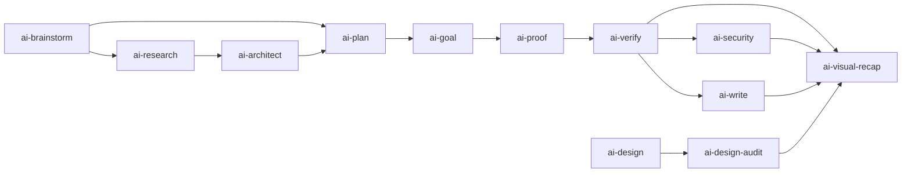

<div align="center">
  <a href="https://github.com/arcasilesgroup/ai-engineering">
    <picture>
      <source media="(prefers-color-scheme: dark)" srcset="https://raw.githubusercontent.com/arcasilesgroup/ai-engineering/main/.github/assets/banner-dark.svg">
      <source media="(prefers-color-scheme: light)" srcset="https://raw.githubusercontent.com/arcasilesgroup/ai-engineering/main/.github/assets/banner-light.svg">
      
    </picture>
  </a>

  <p><strong>Install. Guard. Prove.</strong> — guardrails for the AI coding agent you already run, in any repo and any IDE.</p>

  <p>
    <a href="https://github.com/arcasilesgroup/ai-engineering/actions/workflows/check.yml"><picture>
      <source media="(prefers-color-scheme: dark)" srcset="https://shieldcn.dev/github/ci/arcasilesgroup/ai-engineering.svg?workflow=check.yml&amp;branch=main&amp;variant=secondary&amp;font=geist-mono&amp;size=sm&amp;mode=dark">
      
    </picture></a>
    <a href="https://sonarcloud.io/project/overview?id=arcasilesgroup_ai-engineering"></a>
    <a href="https://sonarcloud.io/project/overview?id=arcasilesgroup_ai-engineering&amp;metric=coverage"></a>
    <a href="https://app.snyk.io/org/soydachi/project/a415e4c8-3688-4cda-94e5-43fab7b6c56d"></a>
  </p>

  <p>
    <a href="https://ai-engineering.arcasiles.com"><picture>
      <source media="(prefers-color-scheme: dark)" srcset="https://shieldcn.dev/badge/website-ai--engineering.arcasiles.com.svg?variant=secondary&amp;font=geist-mono&amp;size=sm&amp;mode=dark">
      
    </picture></a>
    <a href="https://github.com/arcasilesgroup/ai-engineering/releases"><picture>
      <source media="(prefers-color-scheme: dark)" srcset="https://shieldcn.dev/badge/release-v2.0.0--rc.1.svg?variant=secondary&amp;font=geist-mono&amp;size=sm&amp;mode=dark">
      
    </picture></a>
    <a href="LICENSE"><picture>
      <source media="(prefers-color-scheme: dark)" srcset="https://shieldcn.dev/badge/license-Apache--2.0.svg?variant=secondary&amp;font=geist-mono&amp;size=sm&amp;mode=dark">
      
    </picture></a>
  </p>

  <p>
    <a href="#skills"></a>
    <a href="#the-five-guards"></a>
    <a href="#surfaces"></a>
    <a href="#usage"></a>
  </p>
</div>

Guardrails for AI coding agents: install a contract, deny destructive calls, prove every run.

One binary — `ai-eng`, compiled with Bun — puts guardrails under your AI coding agent: guards that deny a destructive tool call before it runs, git hooks that fire even when the agent is not involved, an executable contract per milestone, and a receipt for every execution. Your agent keeps writing the code in whatever editor it already runs in; `ai-eng` makes its failures expensive and its successes provable.

It is not a review of the output. It is a constraint on the run. A guard denial happens before the call executes, the contract refuses to execute until a human approves it, and a check that cannot run is red rather than silently green. Editing a markdown file turns none of it off: the only bypass is an override with a written reason and an expiry date.

Works where you already work: **macOS, Windows and Linux**, one file, no service to run, no hosted control plane. Governs **Claude Code, Oh My Pi, OpenCode, Cursor, Codex CLI, Copilot, Pi and Zed** — the agent keeps its own editor, the rules do not depend on it.

Nothing is hosted: the payload is the binary, and the state is versioned files in your repository and in `~/.ai-engineering/`. The one outbound read is a daily anonymous registry version check, cached for 24 hours, silent when offline, and off with `notices = false` in `config.toml` or `AI_ENG_NO_UPDATE_NOTICES=1`.

## Table of Contents

- [Why](#why)
- [Install](#install)
- [Usage](#usage)
- [Surfaces](#surfaces)
- [The five guards](#the-five-guards)
- [The executable contract](#the-executable-contract)
- [Skills](#skills)
- [Security](#security)
- [Development](#development)
- [Maintainers](#maintainers)
- [Contributing](#contributing)
- [Contributors](#contributors)
- [License](#license)

## Why

AI agents write code at machine speed and break things at the same speed: bypassed git hooks, silenced linters, contracts nobody approved, green checks that never ran. Tooling that reviews the output arrives after the damage; `ai-eng` constrains the run while it happens.

Three verbs carry the product:

1. **Install** — `ai-eng init` writes the machine canon and the repository contract: `AGENTS.md`, `DECISIONS.md`, `config.toml`, `spec.html`, `plan.html`, and the git-hook shims.
2. **Guard** — `ai-eng chain` screens each tool call and denies the destructive ones, fail-closed.
3. **Prove** — one receipt per execution and a contract that must execute to pass turn "done" into a checkable claim.

Two documents carry the detail. [docs/recap.html](docs/recap.html) is the product as it stands — the repository, the guards, the executable contract, the skill canon, the surfaces, CI and the lifecycle, section by section. [docs/blueprint.html](docs/blueprint.html) is the original design document this line was built from.

Where each host reads its guard, and how a repo declares itself, is in [docs/global-carriers.md](docs/global-carriers.md).

Every artifact ai-engineering generates — `spec.html`, `plan.html`, a recap, a research page, an issue report, a design audit — renders in one design system: [skills/ai-design/references/artifact-design.md](skills/ai-design/references/artifact-design.md). The tokens are pinned by `bun test`, so a drifted artifact fails the build instead of shipping in its own palette.

## Install

**Bun**

```bash
bun add -g ai-engineering@latest && ai-eng init
```

**npm**

```bash
npm install -g ai-engineering@latest && ai-eng init
```

One command, start to finish: it installs the CLI and runs it. `init` writes the machine canon, and inside a repository it writes the contract for that repo — it is idempotent, so run it again in any project whenever you like.

The whole payload arrives with the package: the `ai-eng` binary, the skill canon and the templates. [Bun](https://bun.sh) ≥ 1.4 must be installed, because the package ships a Bun entrypoint.

Want the CLI without running it yet? Same line, without `&& ai-eng init`. To stay current: `ai-eng upgrade` re-runs the install after showing you the changelog, and `ai-eng update` rewrites the installed files from the binary you already have, with no network at all — reporting the repo's assets and the machine's canon, carriers and git floor in one pass, so a run that changed nothing says so.

<details>
<summary>Building from source</summary>

Requires [Bun](https://bun.sh) ≥ 1.4.

```bash
git clone https://github.com/arcasilesgroup/ai-engineering.git
cd ai-engineering
bun install
bun run build        # → dist/ai-eng, skills and templates embedded
bun link             # expose ai-eng in PATH for testing in other repos
```

</details>

## Usage

```bash
cd my-project
ai-eng init          # installs the contract; creates a repo if you are outside one
ai-eng doctor        # health checks, plus a real adversarial payload fired at the guard chain
```

`init` is idempotent and interactive: outside a git repository it offers to create one; in an already-governed repository it offers to reinstall assets or exit. CI and scripts pass `--yes --surface <id>` for zero prompts.

Human verbs:

| Verb | Does |
|---|---|
| `init` | install governance: the machine canon and the repository contract |
| `doctor` | run the health checks, fire one adversarial payload, report receipt stats (`--gc` collects) |
| `config` | add or remove agent surfaces, and regenerate their adapters and mirrors |
| `update` | rewrite ai-eng's files from the installed binary — zero network |
| `upgrade` | show the changelog, confirm, hand the install to bun/npm |
| `uninstall` | revert ai-eng's files, keep yours: `AGENTS.md`, `DECISIONS.md`, spec and plan stay |

Machine verbs — called by hooks and CI, no human interface:

| Verb | Does |
|---|---|
| `chain <event>` | the guard dispatcher; reads the surface payload on stdin |
| `git <hook>` | the pre-commit, commit-msg and pre-push checks |
| `wrap test -- <cmd>` | test-output filter: failures grouped, noise dropped |
| `spec run\|open\|approve\|close` | the executable contract |

`ai-eng complete <shell>` serves shell completion for zsh, bash and fish through [tab](https://github.com/bombshell-dev/tab).

## Surfaces

A surface is the agent or editor you already work in. One canonical payload is mirrored into every surface you enable, so the same guard judges the same call whichever client sent it. Each surface's loop capability is measured against the host's own CLI, and the claim carries its evidence in `src/surfaces/surfaces.json`.

| Surface | Tier | Carrier lands in | Loop |
|---|---|---|---|
| Claude Code | core | `.claude/settings.json` (machine) | native |
| Oh My Pi | core | `.omp/agent/hooks/pre/` (machine) | native |
| OpenCode | core | `.config/opencode/plugins/` (machine) | native |
| Pi | core | `.pi/agent/extensions/` (machine) | none |
| Cursor | experimental | `.cursor/hooks.json` (repo) | native |
| Codex CLI | experimental | `.codex/hooks.json` (machine) | native |
| Copilot | best-effort | `.github/hooks/` (repo) + `.copilot/hooks/` (machine) | native |
| Zed | skills-only | — none: it denies through its own tool permissions | none |

Tiers decide what a missing carrier means: on `core` it fails `doctor`, on the other tiers it warns. `experimental` denies but its row names what degrades, `best-effort` denies and what survives is the host's deployment, and `skills-only` gets the skill canon with no guards in the hot path. `ai-eng doctor` reports, per surface, whether the carrier is where that host actually reads it.

`ai-eng config --add <id>` enables a surface and regenerates its adapter; `--remove <id>` takes it out and leaves the rest of your files alone.

## The five guards

Each guard is compiled into the binary and writes a receipt on every denial, carrying the reason verbatim.

| Guard | Denies |
|---|---|
| `no-verify` | `--no-verify`, `git commit -n`, `HUSKY=0`, deleting `.git/hooks/`, repointing `core.hooksPath` — and silencing a check: `eslint-disable`, `@ts-ignore`, `# noqa`, `# nosec`, `NOLINTNEXTLINE` |
| `self-protect` | writes against anything that governs the agent: `.ai-engineering/`, the surface settings, the git hooks, the global canon, and `spec.html` once its sha256 is pinned |
| `injection` | reading a file whose text carries an instruction payload — denied before the model sees it — and acting on a fetched page that carries one |
| `loop` | the same call repeated, the same edit reverted, the same failure retried with the arguments tweaked; the thresholds live in `config.toml` |
| `wrap` | nothing: `wrap` rewrites a test command before it runs, so the filter prints the failures and drops the rest |

The only way to turn a guard off is an entry in `.ai-engineering/overrides.toml` with a `reason` and an `until` date. `doctor` reports every active override with the time it has left, and an expired entry re-arms the guard.

## The executable contract

`ai-eng init` writes two HTML files per milestone, and `ai-eng.lock` pins them:

- `spec.html` — **what** must hold: requirements, data contracts and acceptance gates.
- `plan.html` — **how** it gets there: ordered steps, their dependencies, and the risk points.

A contract nobody approved refuses to run: its sha256 must be pinned in `ai-eng.lock` by `ai-eng spec approve`. `ai-eng spec run` executes every gate and refuses an empty gate list, so a tick in a box is never evidence. `ai-eng spec close` re-runs what the artifact claims and closes the milestone.

## Skills

Twenty `ai-*` skills ship inside the binary and install once per machine into `~/.ai-engineering/skills/`, then get mirrored into `~/.claude/skills`, `~/.agents/skills` and `~/.config/opencode/skill` — plus `/ai-*` slash commands for OpenCode. Every skill follows one contract: one `SKILL.md` per folder, English only, no machine paths.

| Skill | What it does |
|---|---|
| `ai-brainstorm` | Pins a fuzzy idea down until it can be explained in plain language, and writes the document the next skill runs on |
| `ai-research` | Answers questions from outside the repository with numbered citations, or marks a claim `[unsourced]` |
| `ai-architect` | Chooses the approach, the stack and the tradeoff before the build starts |
| `ai-plan` | Turns the answers into checks: what "done and right" means, written before the work |
| `ai-goal` | Writes the loop contract — what it consumes, which gates close it, when it stops |
| `ai-proof` | Anti-laziness execution: gate files and runnable checks instead of promises |
| `ai-verify` | Judges finished work against its own standard and reports verdicts with evidence |
| `ai-security` | Six-phase security audit, validated by an agent that did not write the finding |
| `ai-write` | Writes the README, the wiki page or the API doc, verified against the tree |
| `ai-visual-recap` | Turns a diff into an interactive recap: diagrams, file map and annotated diff |
| `ai-design` | Elects the one design skill a UI request needs and sequences the phases |
| `ai-design-audit` | Measures a rendered page in a real browser and fixes what the numbers say |
| `ai-debug` | Names the root cause at `file:line` and writes the check that fails for that reason |
| `ai-explore` | Answers "where does this live" from the repository, anchored to `file:line` |
| `ai-note` | Saves a hard-won finding as committed markdown, stamped so staleness is detectable |
| `ai-issue-report` | Files a governed bug report: scrubbed fields, local draft, nothing sent unconfirmed |
| `ai-read-docs` | Forces a documentation pass before depending on versioned or external behaviour |
| `ai-agents-md` | Writes and maintains the `AGENTS.md` a repository owes its coding agents |
| `ai-writing-behavior` | Authors `BEHAVIOR.md` specs for recurring, judgeable agent conduct |
| `ai-rtk` | Routes long-output commands — tests, builds, logs — through rtk, so the agent reads 60–90% less |

They work as a chain, and each skill declares its own next step in front matter — so the handoff is a contract, not a convention:



`ai-plan` opens the loop, `ai-goal` runs it, `ai-proof` closes every step of it, and `ai-verify` decides which trigger fires next: `ai-security` when the security trigger fired, `ai-write` when the public interface changed, `ai-visual-recap` otherwise — which is the terminal node. `ai-explore`, `ai-read-docs`, `ai-note`, `ai-rtk`, `ai-agents-md` and `ai-writing-behavior` run on demand, wherever the work needs them.

Attribution for every upstream skill travels with the payload: [NOTICE.md](NOTICE.md) and [THIRD-PARTY-NOTICES.md](THIRD-PARTY-NOTICES.md).

## Security

The product is a security boundary, so an attack on it is a vulnerability. Report through the policy in [SECURITY.md](SECURITY.md); a guard bypass is critical by definition.

Two properties hold by construction: `update` never touches the network — it reinstalls what the binary you already installed carries — and the release assets are verified by attestation, not only by a checksum fetched from the same origin.

## Development

```bash
bun install
bun run build              # compile dist/ai-eng (skills and templates embedded)
bun test                   # unit + adversarial (oracle) + gates + arch
bun run lint               # oxlint
bun run typecheck          # oxlint --type-aware --type-check, the single type gate
bun scripts/gen-assets.ts  # regenerate src/assets.ts after touching skills/ or templates/
bun link                   # expose the local ai-eng for testing in other repos
```

`bun scripts/gen-assets.ts` is not optional after a payload change: the binary carries `src/assets.ts`, and a file that is not in it does not ship.

Versioning runs on [changesets](.changeset/README.md). Release is a dispatched workflow with two channels: `integration` ships a prerelease and the npm `next` dist-tag, `production` ships the latest release and the npm `latest` tag. Both channels build the eight cross-compiled binaries, the SBOM and the attestations.

## Maintainers

[Arcasiles Group](https://github.com/arcasilesgroup).

## Contributing

Read [CONTRIBUTING.md](CONTRIBUTING.md) for the repo rules, commit conventions and the changeset requirement. This project follows its [Code of Conduct](CODE_OF_CONDUCT.md).

## Contributors

<a href="https://github.com/arcasilesgroup/ai-engineering/graphs/contributors"><picture>
  <source media="(prefers-color-scheme: dark)" srcset="https://shieldcn.dev/contributors/arcasilesgroup/ai-engineering.svg?title=false&preset=transparent&border=false&mode=dark">
  
</picture></a>

## License

[Apache-2.0](LICENSE) © Arcasiles Group — see [NOTICE.md](NOTICE.md) and [THIRD-PARTY-NOTICES.md](THIRD-PARTY-NOTICES.md) for third-party attribution.
