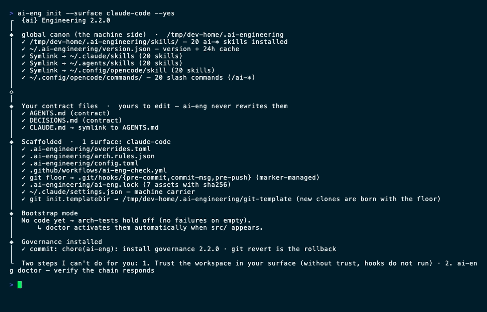
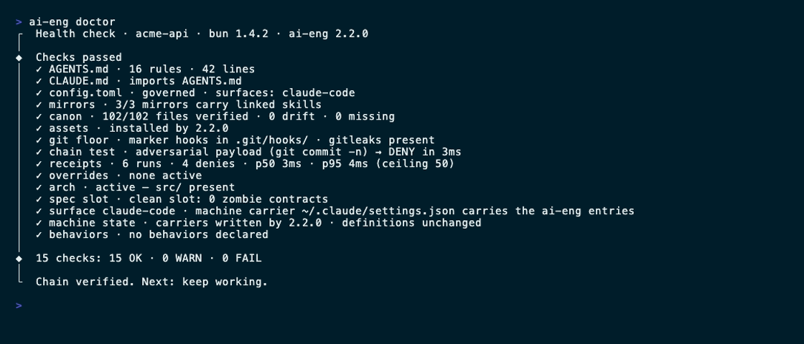
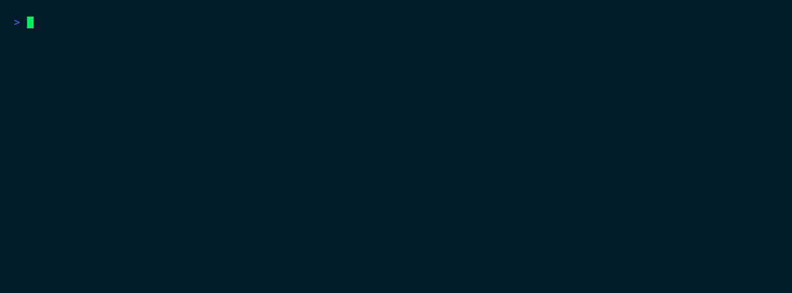
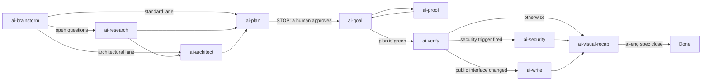

<div align="center">


### Install. Guard. Prove.

<p><strong>Guardrails for the AI coding agent you already run.</strong><br/>
A contract the agent cannot execute before a human approves it, guards that deny a destructive
tool call <em>before</em> it runs, and a receipt for every denial.</p>

<p>
  <a href="https://github.com/arcasilesgroup/ai-engineering/actions/workflows/check.yml"><picture>
    <source media="(prefers-color-scheme: dark)" srcset="https://shieldcn.dev/github/ci/arcasilesgroup/ai-engineering.svg?workflow=check.yml&amp;branch=main&amp;variant=secondary&amp;font=geist-mono&amp;size=sm&amp;mode=dark">
    
  </picture></a>
  <a href="https://sonarcloud.io/project/overview?id=arcasilesgroup_ai-engineering"></a>
  <a href="https://sonarcloud.io/project/overview?id=arcasilesgroup_ai-engineering&amp;metric=coverage"></a>
  <a href="https://app.snyk.io/org/soydachi/project/a415e4c8-3688-4cda-94e5-43fab7b6c56d"></a>
</p>

<p>
  <a href="https://ai-engineering.arcasiles.com"><picture>
    <source media="(prefers-color-scheme: dark)" srcset="https://shieldcn.dev/badge/website-ai--engineering.arcasiles.com.svg?variant=secondary&amp;font=geist-mono&amp;size=sm&amp;mode=dark">
    
  </picture></a>
  <a href="https://github.com/arcasilesgroup/ai-engineering/releases"><picture>
    <source media="(prefers-color-scheme: dark)" srcset="https://shieldcn.dev/badge/release-v2.2.0.svg?variant=secondary&amp;font=geist-mono&amp;size=sm&amp;mode=dark">
    
  </picture></a>
  <a href="LICENSE"><picture>
    <source media="(prefers-color-scheme: dark)" srcset="https://shieldcn.dev/badge/license-Apache--2.0.svg?variant=secondary&amp;font=geist-mono&amp;size=sm&amp;mode=dark">
    
  </picture></a>
</p>

<p>
  <a href="#skills-how-twenty-of-them-run-as-one-pipeline"></a>
  <a href="#the-five-guards"></a>
  <a href="#surfaces"></a>
  <a href="#cli"></a>
</p>

### One binary. Five guards. Twenty skills. Every claim below has a command that answers for it.

| What | Number | The command that proves it |
|---|---|---|
| Guards that decide before the tool call runs | **5** | `ai-eng doctor` fires a real adversarial payload at the chain |
| Skills that ship inside the binary | **20** | `ls ~/.ai-engineering/skills` |
| Agent surfaces governed by one canonical payload | **8** | `ai-eng doctor`, per-surface carrier check |
| Verbs — 6 for people, 4 for hooks and CI | **10** | `ai-eng --help`; the machine verbs are `chain`, `git`, `wrap`, `spec` |
| Tests, including an adversarial oracle over the guards | **476 passing, 34 files** | `bun test` |
| Time the chain took to deny the probe it fires itself | **3 ms** | the `chain test` line in `ai-eng doctor` |

</div>

Guardrails for AI coding agents: install a contract, deny destructive calls, prove every run.

One binary — `ai-eng`, compiled with Bun — puts guardrails under the AI coding agent you already
run: guards that deny a destructive tool call before it runs, git hooks that fire even when the
agent is not involved, an executable contract per milestone, and a receipt for every execution.
The agent keeps writing code in whatever editor it already runs in; `ai-eng` makes its failures
expensive and its successes provable.

It is not a review of the output. It is a constraint on the run. A guard denial happens before the
call executes, the contract refuses to execute until a human approves it, and a check that cannot
run is red rather than silently green. Editing a markdown file turns none of it off: the only
bypass is an override with a written reason and an expiry date.

Works where you already work: **macOS, Windows and Linux**, one file, no service to run, no hosted
control plane. Governs **Claude Code, Oh My Pi, OpenCode, Cursor, Codex CLI, Copilot, Pi and Zed** —
the agent keeps its own editor, the rules do not depend on it.

Nothing is hosted: the payload is the binary, and the state is versioned files in your repository
and in `~/.ai-engineering/`.

## Contents

- [Quick start](#quick-start)
- [The problem](#the-problem)
- [What `ai-eng` does](#what-ai-eng-does)
- [The guard chain](#the-guard-chain) — [the five guards](#the-five-guards) · [what the agent sees](#what-the-agent-sees)
- [The executable contract](#the-executable-contract)
- [Skills: how twenty of them run as one pipeline](#skills-how-twenty-of-them-run-as-one-pipeline)
  — [lanes](#lanes) · [the triggers](#the-triggers) · [the twenty](#the-twenty)
- [Surfaces](#surfaces)
- [CLI](#cli)
- [What runs where](#what-runs-where)
- [Security](#security)
- [Development](#development)
- [Maintainers](#maintainers) · [Contributing](#contributing) · [Contributors](#contributors) · [License](#license)

## Quick start

```bash
git clone https://github.com/arcasilesgroup/ai-engineering.git
cd ai-engineering
bun install
bun run build        # → dist/ai-eng, skills and templates embedded
bun link             # ai-eng on your PATH
```

Then, in the repository you want governed:

```bash
cd my-project
ai-eng init          # installs the contract; creates a repo if you are outside one
ai-eng doctor        # health checks, plus a real adversarial payload fired at the guard chain
```

One command, start to finish. `init` writes the machine canon and, inside a repository, the
contract for that repo. It is idempotent: run it again in any project whenever you like.

<p align="center">
  
  <br/><sub>a first install on a clean machine — the canon, the contract, the git floor, one commit</sub>
</p>

Then verify the chain answers:

```bash
ai-eng doctor        # health checks, plus a real adversarial payload fired at the guard chain
```

<p align="center">
  
</p>

`init` is interactive when a person runs it and silent when a script does: outside a git repository
it offers to create one, and in an already-governed repository it offers to reinstall assets or
exit. CI and scripts pass `--yes --surface <id>` for zero prompts. Everything `init` writes is
idempotent, so re-running it in a project is the safe move before any upgrade.

[Bun](https://bun.sh) ≥ 1.4 is the only prerequisite: the package ships a Bun entrypoint, and the
whole payload — the `ai-eng` binary, the skill canon, the templates — travels inside it.

To stay current: `ai-eng upgrade` shows the changelog and hands the install to bun/npm; `ai-eng
update` rewrites the installed files from the binary you already have, with no network at all,
reporting the repo's assets and the machine's canon, carriers and git floor in one pass, so a run
that changed nothing says so.

<details>
<summary>Installing from the registry</summary>

The release workflow publishes this package to npm — `next` from the `integration` channel,
`latest` from `production` — and once a version is on the registry these four commands collapse
into one:

```bash
bun add -g ai-engineering@latest && ai-eng init    # or: npm install -g ai-engineering@latest
```

Until then, the source install above is the path that works.

</details>

## The problem

An agent with a shell has more permissions than judgement. It will commit past the hooks, silence
the linter to make an error go away, retry the same failing call a fifth time, and report a task
complete on the strength of a check that never ran. None of that is malice — it is the shortest
path to a green result, which is exactly what an agent optimises for.

Reviewing the diff arrives after the damage, and it is a person doing the noticing. What is missing
is a constraint that holds *while the agent works*: something that can say no to a tool call, that
a session cannot switch off by editing a file, and that leaves a record a second person can audit
without replaying the session.

`ai-eng` is that layer, and it is deliberately small: five guards, one contract per milestone, one
receipt per execution, all of it files in git.

## What `ai-eng` does

Three verbs carry the product:

1. **Install** — `ai-eng init` writes the machine canon and the repository contract: `AGENTS.md`,
   `DECISIONS.md`, `config.toml`, `spec.html`, `plan.html`, and the git-hook shims.
2. **Guard** — `ai-eng chain` screens each tool call and denies the destructive ones, fail-closed.
3. **Prove** — one receipt per execution, and a contract that must execute before turn "done"
   becomes a checkable claim.

Two documents carry the detail. [docs/recap.html](docs/recap.html) is the product as it stands —
the repository, the guards, the executable contract, the skill canon, the surfaces, CI and the
lifecycle, section by section. [docs/blueprint.html](docs/blueprint.html) is the original design
document this line was built from. Where each host reads its guard, and how a repo declares itself,
is in [docs/global-carriers.md](docs/global-carriers.md).

Every artifact `ai-engineering` generates — `spec.html`, `plan.html`, a recap, a research page, an
issue report, a design audit — renders in one design system:
[skills/ai-design/references/artifact-design.md](skills/ai-design/references/artifact-design.md).
The tokens are pinned by `bun test`, so a drifted artifact fails the build instead of shipping in
its own palette.

## The guard chain

`ai-eng chain <event>` is the only way anything runs. The host sends the tool call it is about to
execute; the chain selects the guards that match that tool, runs them, and answers in the host's
own denial vocabulary — allow, deny, or a rewritten command. Below, three real payloads go through
the real binary in a governed repository:

<p align="center">
  
  <br/><sub>deny → deny → rewrite, and a receipt for each — the payloads are the host's own shape</sub>
</p>

What the agent is shown is the guard's own words, verbatim. This is the whole message for a commit
that skips the hooks:

```text
[ai-eng] no-verify: --no-verify skips the git hooks, the floor every agent and every person in
this repository commits through. Whatever the hooks would have said is what needs fixing. Run
the command without it.
```

A guard that crashes denies. A guard that cannot decide denies. Denying everything would disable
the product by installing it, so each denial has to name the act and the repair, and each one
writes a receipt with that reason in it. The chain budgets **200 ms** for the hot path and prints a
warning past it rather than failing in silence.

### The five guards

Each guard is compiled into the binary and writes a receipt on every denial, carrying the reason
verbatim.

| Guard | Denies |
|---|---|
| `no-verify` | `--no-verify`, `git commit -n`, `HUSKY=0`, deleting `.git/hooks/`, repointing `core.hooksPath` — and silencing a check: an ESLint disable comment, a TypeScript ignore pragma, Python's `noqa` and `nosec`, clang's `NOLINT` |
| `self-protect` | writes against anything that governs the agent: `.ai-engineering/` — except its four milestone slots, which the session owns — the surface settings, the git hooks, the global canon, and `spec.html` once its sha256 is pinned |
| `injection` | reading a file whose text carries an instruction payload — denied before the model sees it — and acting on a fetched page that carries one |
| `loop` | the same call repeated, the same edit reverted, the same failure retried with the arguments tweaked; the thresholds live in `config.toml` |
| `wrap` | nothing: `wrap` rewrites a test command before it runs, so the filter prints the failures and drops the rest |

The exact patterns each guard matches live in [`src/guards/`](src/guards/), and
`tests/adversarial/` fires them at the real binary on every pull request that touches governance.

The only way to turn a guard off is an entry in `.ai-engineering/overrides.toml` with a `reason`
and an `until` date. `doctor` reports every active override with the time it has left, and an
expired entry re-arms the guard.

### What the agent sees

The guard runs before the call, so the agent never gets the result it wanted, and the receipt is
written whether the call was allowed, denied or rewritten. One denial, on disk:

```json
{"schema":"urn:ai-eng:receipt:2","operation_id":"9b55abb3","ts":"2026-09-15T17:10:30.238Z",
 "event":"PreToolUse","tool":"Bash","guards":{"ran":["self-protect","no-verify"],
 "denied_by":"no-verify"},"latency_ms":2,"outcome":"deny"}
```

`ai-eng doctor` reports the receipts as a distribution — `6 runs · 4 denies · p50 3ms · p95 4ms
(ceiling 50)` — and `--gc` aggregates them once they pass `receipts_ttl`.

## The executable contract

`ai-eng init` wires the slots, the planner skills write them, and `ai-eng.lock` pins them:

- `spec.html` — **what** must hold: requirements, data contracts and acceptance gates.
- `plan.html` — **how** it gets there: ordered steps, their dependencies, and the risk points.

A contract nobody approved refuses to run: its sha256 must be pinned in `ai-eng.lock` by `ai-eng
spec approve`. `ai-eng spec run` executes every gate and refuses an empty gate list, so a tick in a
box is never evidence. `ai-eng spec close` re-runs what the artifact claims and closes the
milestone.

<p align="center">
  
  <br/><sub>unapproved → pinned → red → implemented → green → closed, with a receipt per run</sub>
</p>

Three rules make the contract worth more than a checklist:

- **A check that prints nothing is not evidence.** A gate resting on an exit code is a green nobody
  can read, so the executor leaves it unticked and writes the remedy into its `EVIDENCE` line.
  `ABANDON: G3 <reason>` is the honest exit.
- **A fired trigger leaves an artifact or an ABANDON.** Five routing triggers ([below](#the-triggers))
  each map to a skill; once one fires, the planner writes a gate for it or writes down why not. A
  silent hole is the failure this design exists to prevent.
- **Approval is a person's act.** `self-protect` denies the session any edit to a pinned `spec.html`,
  so the contract the gates execute is the contract a human read.

## Skills: how twenty of them run as one pipeline

Twenty `ai-*` skills ship inside the binary and install once per machine into `~/.ai-engineering/
skills/`, then get mirrored into `~/.claude/skills`, `~/.agents/skills` and
`~/.config/opencode/skill` — plus `/ai-*` slash commands for OpenCode.

They are not a menu. Each skill declares, in front matter, the lane it serves, what it writes, who
reads that artifact, when the artifact dies, and **what runs next**. That last field is what makes
the handoff a contract instead of a convention: the next skill reads it from the file it was handed,
and no orchestrator has to be told the order.

<p align="center">
  <picture>
    <source media="(prefers-color-scheme: dark)" srcset=".github/assets/skill-chain-dark.svg">
    
  </picture>
</p>



### Lanes

The lane decides how much of the pipeline runs. `ai-brainstorm` and `ai-verify` run on all three;
`ai-goal` opens a loop only where a contract exists.

| Lane | What runs | What you get |
|---|---|---|
| **light** | `ai-brainstorm` → `ai-verify` | A verdict with evidence. No contract is written, because the work does not need one |
| **standard** | `ai-brainstorm` → `ai-plan` → `ai-goal` ⇄ `ai-proof` → `ai-verify` → the close | `spec.html`, `plan.html`, a receipt per gate, and the recap at the end |
| **full** | the standard lane plus `ai-research`, `ai-architect`, `ai-design` and `ai-security` on their triggers | The same contract, with the decisions that needed evidence written down before the build |

`ai-plan` opens the loop, `ai-goal` runs it, `ai-proof` closes every step of it, and `ai-verify`
decides which trigger fires next. `ai-visual-recap` is the terminal node: `ai-eng spec close`
archives the recap into git and frees the milestone slot.

`ai-explore`, `ai-read-docs`, `ai-note`, `ai-rtk`, `ai-agents-md` and `ai-writing-behavior` run on
demand, wherever the work needs them — the bottom band of the diagram, not a rung of it.

### The triggers

The set is closed, and each id is a hook into another node:

| Trigger | Kind | Routes to | Fires when |
|---|---|---|---|
| `ui` | path | `ai-design`, then `ai-design-audit` | the diff touches `**/*.tsx`, `**/*.css`, `**/components/**`, a Tailwind config… |
| `security` | path | `ai-security` | the diff touches `**/auth/**`, `**/*.sql`, `**/migrations/**`, `.github/workflows/**`, `src/chain/**`… |
| `open-questions` | judgment | `ai-research` | the brainstorm lists open questions, or the plan cites an external API or version |
| `arch-change` | judgment | `ai-architect` | the milestone adds a subsystem, changes a layer contract, or points a dependency a different way |
| `public-interface` | judgment | `ai-write` | the diff changes a public interface, a documented behaviour, or a command a README shows |

A **path** trigger fires on its own: the node declares the globs, and `doctor` and `ai-eng spec
close` evaluate them against the milestone's diff. A **judgment** trigger cannot be read from a diff,
and pretending otherwise would be theatre — so it is asked once, out loud, and the answer decides.

### The twenty

| Skill | What it does |
|---|---|
| `ai-brainstorm` | Pins a fuzzy idea down until it can be explained in plain language, and writes the document the next skill runs on |
| `ai-research` | Answers questions from outside the repository with numbered citations, or marks a claim `[unsourced]` |
| `ai-architect` | Chooses the approach, the stack and the tradeoff before the build starts |
| `ai-plan` | Turns the answers into checks: what "done and right" means, written before the work |
| `ai-goal` | Writes the loop contract — what it consumes, which gates close it, when it stops |
| `ai-proof` | Anti-laziness execution: gate files and runnable checks instead of promises |
| `ai-verify` | Judges finished work against its own standard and reports verdicts with evidence |
| `ai-security` | Six-phase security audit, validated by an agent that did not write the finding |
| `ai-write` | Writes the README, the wiki page or the API doc, verified against the tree |
| `ai-visual-recap` | Turns a diff into an interactive recap: diagrams, file map and annotated diff |
| `ai-design` | Elects the one design skill a UI request needs and sequences the phases |
| `ai-design-audit` | Measures a rendered page in a real browser and fixes what the numbers say |
| `ai-debug` | Names the root cause at `file:line` and writes the check that fails for that reason |
| `ai-explore` | Answers "where does this live" from the repository, anchored to `file:line` |
| `ai-note` | Saves a hard-won finding as committed markdown, stamped so staleness is detectable |
| `ai-issue-report` | Files a governed bug report: scrubbed fields, local draft, nothing sent unconfirmed |
| `ai-read-docs` | Forces a documentation pass before depending on versioned or external behaviour |
| `ai-agents-md` | Writes and maintains the `AGENTS.md` a repository owes its coding agents |
| `ai-writing-behavior` | Authors `BEHAVIOR.md` specs for recurring, judgeable agent conduct |
| `ai-rtk` | Routes long-output commands — tests, builds, logs — through rtk, so the agent reads 60–90% less |

Attribution for every upstream skill travels with the payload: [NOTICE.md](NOTICE.md) and
[THIRD-PARTY-NOTICES.md](THIRD-PARTY-NOTICES.md).

## Surfaces

A surface is the agent or editor you already work in. One canonical payload is mirrored into every
surface you enable, so the same guard judges the same call whichever client sent it. Each surface's
loop capability is measured against the host's own CLI, and the claim carries its evidence in
`src/surfaces/surfaces.json`.

| Surface | Tier | Carrier lands in | Loop |
|---|---|---|---|
| Claude Code | core | `.claude/settings.json` (machine) | native |
| Oh My Pi | core | `.omp/agent/hooks/pre/` (machine) | native |
| OpenCode | core | `.config/opencode/plugins/` (machine) | native |
| Pi | core | `.pi/agent/extensions/` (machine) | none |
| Cursor | experimental | `.cursor/hooks.json` (repo) | native |
| Codex CLI | experimental | `.codex/hooks.json` (machine) | native |
| Copilot | best-effort | `.github/hooks/` (repo) + `.copilot/hooks/` (machine) | native |
| Zed | skills-only | — none: it denies through its own tool permissions | none |

Tiers decide what a missing carrier means: on `core` it fails `doctor`, on the other tiers it warns.
`experimental` denies but its row names what degrades, `best-effort` denies and what survives is the
host's deployment, and `skills-only` gets the skill canon with no guards in the hot path. `ai-eng
doctor` reports, per surface, whether the carrier is where that host actually reads it.

`ai-eng config --add <id>` enables a surface and regenerates its adapter; `--remove <id>` takes it
out and leaves the rest of your files alone.

## CLI

People get six verbs; hooks, CI and the loop get four more. The machine verbs appear in neither
`--help` nor TAB completion, because no human types them.

```bash
ai-eng init                      # install governance: the machine canon and the repo contract
ai-eng init --yes --surface claude-code   # in CI: no prompts, one surface
ai-eng doctor                    # health checks, one adversarial payload, receipt stats
ai-eng doctor --gc               # aggregate expired receipts
ai-eng config --add cursor       # enable a surface and regenerate its adapter
ai-eng config --remove cursor    # take it out; your other files are left alone
ai-eng update                    # rewrite ai-eng's files from the installed binary, zero network
ai-eng upgrade                   # show the changelog, confirm, hand the install to bun/npm
ai-eng uninstall                 # revert ai-eng's files, keep yours
ai-eng complete zsh              # shell completion, via tab
```

The machine verbs:

```bash
echo "$PAYLOAD" | ai-eng chain PreToolUse   # the guard dispatcher; reads the surface payload on stdin
ai-eng git pre-commit                       # the pre-commit, commit-msg and pre-push checks
ai-eng wrap test -- bun test                # test-output filter: failures grouped, noise dropped
ai-eng spec run                             # execute every gate in the approved spec.html
ai-eng spec approve                         # STOP 1: pin the contract's sha256 in ai-eng.lock
ai-eng spec close                           # verify the claims, archive the recap, free the slot
```

`ai-eng chain` answers in the dialect of the surface that called it — Claude Code's
`permission`/`user_message`, Cursor's, Codex's, Copilot's — so one set of guard definitions serves
every host without a per-IDE fork.

## What runs where

- **On your machine, no network:** everything except the version notice. The guards, the git floor,
  the contract runner, the receipts and `doctor` are local files and local processes.
- **Your key, your model:** `ai-eng` never calls a model. `config.toml` carries a model pin per tier
  — cheap for verifying, expensive for judging — and the framework injects that line into the
  surfaces; the calls stay yours.
- **One outbound read:** a daily anonymous registry version check, cached for 24 hours, silent when
  offline. Turn it off with `notices = false` in `config.toml` or `AI_ENG_NO_UPDATE_NOTICES=1`.
- **State, not a service:** everything written lives in your repository (`.ai-engineering/`,
  `AGENTS.md`, `DECISIONS.md`, the git hooks) and in `~/.ai-engineering/` on your machine.

## Security

The product is a security boundary, so an attack on it is a vulnerability. Report through the policy
in [SECURITY.md](SECURITY.md); a guard bypass is critical by definition.

Two properties hold by construction: `update` never touches the network — it reinstalls what the
binary you already installed carries — and the release assets are verified by attestation, not only
by a checksum fetched from the same origin.

## Development

```bash
bun install
bun run build              # compile dist/ai-eng (skills and templates embedded)
bun test                   # unit + adversarial (oracle) + gates + arch
bun run lint               # oxlint
bun run typecheck          # oxlint --type-aware --type-check, the single type gate
bun scripts/gen-assets.ts  # regenerate src/assets.ts after touching skills/ or templates/
bun link                   # expose the local ai-eng for testing in other repos
```

`bun scripts/gen-assets.ts` is not optional after a payload change: the binary carries
`src/assets.ts`, and a file that is not in it does not ship. The brand is generated too — `bun
scripts/brand.ts gen` owns `src/theme.ts` and the landing site's tokens, and `parity` fails when
someone edits a generated file by hand. [brand/README.md](brand/README.md) has the gates.

Versioning runs on [changesets](.changeset/README.md). Release is a dispatched workflow with two
channels: `integration` ships a prerelease and the npm `next` dist-tag, `production` ships the latest
release and the npm `latest` tag. Both channels build the eight cross-compiled binaries, the SBOM and
the attestations.

## Maintainers

[Arcasiles Group](https://github.com/arcasilesgroup).

## Contributing

Read [CONTRIBUTING.md](CONTRIBUTING.md) for the repo rules, commit conventions and the changeset
requirement. This project follows its [Code of Conduct](CODE_OF_CONDUCT.md).

## Contributors

<a href="https://github.com/arcasilesgroup/ai-engineering/graphs/contributors"><picture>
  <source media="(prefers-color-scheme: dark)" srcset="https://shieldcn.dev/contributors/arcasilesgroup/ai-engineering.svg?title=false&preset=transparent&border=false&mode=dark">
  
</picture></a>

## License

[Apache-2.0](LICENSE) © Arcasiles Group — see [NOTICE.md](NOTICE.md) and
[THIRD-PARTY-NOTICES.md](THIRD-PARTY-NOTICES.md) for third-party attribution.
