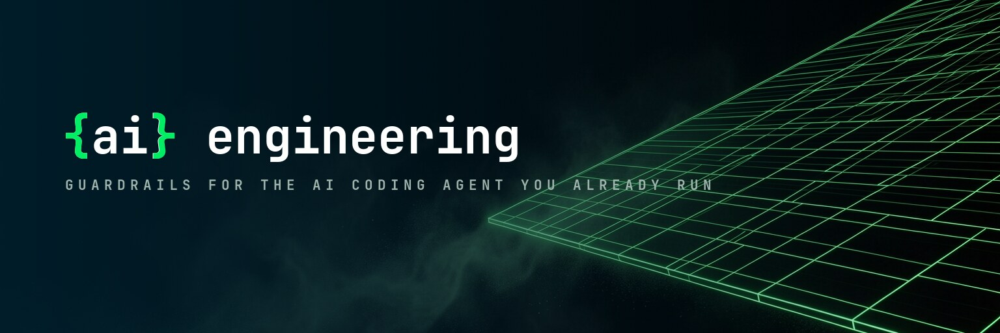
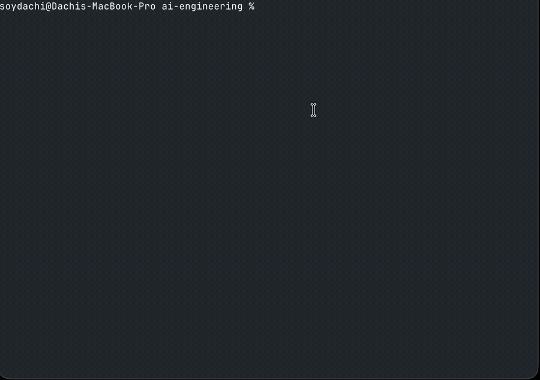
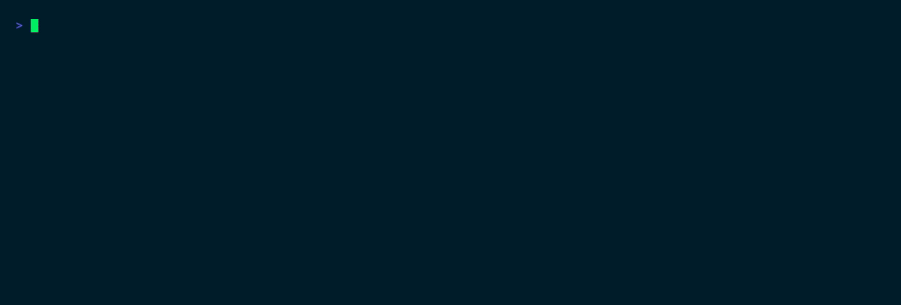
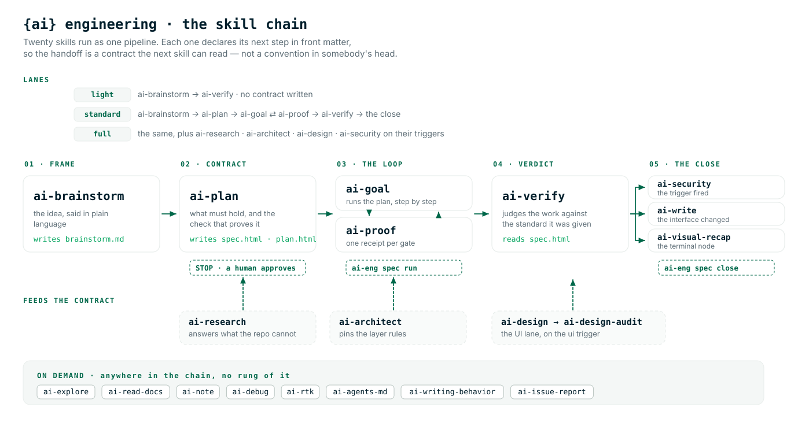
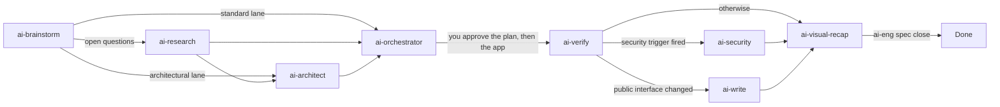

<div align="center">



### Guardrails for the AI coding agent you already run

<p>A contract it cannot execute before you approve it.<br/>
Guards that say <strong>no</strong> before the tool call runs.<br/>
A receipt for every denial, on disk, in git.</p>

<p>
  <a href="https://github.com/arcasilesgroup/ai-engineering/actions/workflows/check.yml"><picture>
    <source media="(prefers-color-scheme: dark)" srcset="https://shieldcn.dev/github/ci/arcasilesgroup/ai-engineering.svg?workflow=check.yml&amp;branch=main&amp;variant=secondary&amp;font=geist-mono&amp;size=sm&amp;mode=dark">
    
  </picture></a>
  <a href="https://sonarcloud.io/project/overview?id=arcasilesgroup_ai-engineering"></a>
  <a href="https://app.snyk.io/org/soydachi/project/a415e4c8-3688-4cda-94e5-43fab7b6c56d"></a>
</p>

<p>
  <a href="https://ai-engineering.arcasiles.com"><picture>
    <source media="(prefers-color-scheme: dark)" srcset="https://shieldcn.dev/badge/website-ai--engineering.arcasiles.com.svg?variant=secondary&amp;font=geist-mono&amp;size=sm&amp;mode=dark">
    
  </picture></a>
  <a href="https://github.com/arcasilesgroup/ai-engineering/releases"><picture>
    <source media="(prefers-color-scheme: dark)" srcset="https://shieldcn.dev/badge/release-v2.2.0.svg?variant=secondary&amp;font=geist-mono&amp;size=sm&amp;mode=dark">
    
  </picture></a>
  <a href="LICENSE"><picture>
    <source media="(prefers-color-scheme: dark)" srcset="https://shieldcn.dev/badge/license-Apache--2.0.svg?variant=secondary&amp;font=geist-mono&amp;size=sm&amp;mode=dark">
    
  </picture></a>
</p>

| | |
|---|---|
| **5** guards | decide before the call runs, and write a receipt |
| **21** skills | one canon, mirrored into Claude Code, Oh My Pi and OpenCode |
| **8** surfaces | one payload, no per-IDE fork |
| **1** binary | Bun-compiled, no daemon, no hosted control plane |
| **0** model calls | by `ai-eng` itself — your key, your model |

</div>

## Install

```bash
bun add -g ai-engineering@latest && ai-eng init    # or: npm install -g ai-engineering@latest
```

One command. `init` asks which agents to govern, installs the canon on your machine, and writes
the contract into this repository. It is idempotent — run it again whenever you like.

`npm install` needs no runtime on your machine: the package ships a compiled binary for your
platform as an optional dependency (`ai-engineing-<platform>`, eight targets, musl included)
and the `ai-eng` launcher picks it up. Bun remains the path for `bun add -g` and for
development — where bun is present, the launcher runs the source.

<p align="center">
  
  <br/><sub>a real session, 43 seconds, sped up: install → govern → verify → add a surface → update</sub>
</p>

<details>
<summary>From source, or with no global install</summary>

```bash
git clone https://github.com/arcasilesgroup/ai-engineering.git
cd ai-engineering && bun install && bun run build && bun link
```

[Bun](https://bun.sh) ≥ 1.4 is the only prerequisite — the whole payload (the binary, the skill
canon, the templates) travels inside the package.

</details>

## What you get

| | Verb | What it does | What it leaves behind |
|---|---|---|---|
| **1** | `ai-eng init` | asks which agents to govern, then installs. Open the IDE and load `/ai-config-to-project` to adapt the rules to this tree | `AGENTS.md`, `DECISIONS.md`, `config.toml`, the git hooks |
| **2** | `ai-eng chain` | screens every tool call the agent makes, fail-closed | allow, deny or a rewritten command — plus a receipt for each |
| **3** | `ai-eng spec approve` then `spec close` | a person pins the contract; close checks evidence and frees the slot | the sha256 in the lock, then an empty slot |

Ask it how it is doing:

```bash
ai-eng doctor        # every check it knows, one real adversarial payload fired at the chain, receipt stats: denies per guard/tool, the 90-day series, a spike WARN
```

## What it stops

The interesting part is not that it blocks things — it is what it says back. Real verdicts, from
the real binary:

| The agent reaches for | What comes back |
|---|---|
| `git commit --no-verify` | *"--no-verify skips the git hooks, the floor every agent and every person in this repository commits through. Whatever the hooks would have said is what needs fixing. Run the command without it."* |
| a silenced linter | *"Silencing a check is skipping a hook. If the skip is legitimate, `overrides.toml` with a reason — it lands in the receipt and the commit."* |
| editing the contract you approved | denied. A person changes that, in a reviewed diff. |
| the fifth identical retry | denied by the loop guard, with the threshold it crossed |
| a file that argues with the model | stopped before the model reads it — the text is treated as data |

<p align="center">
  
  <br/><sub>deny → deny → rewrite, and a receipt for each — one binary, three real calls</sub>
</p>

### The five guards

| Guard | Denies |
|---|---|
| `no-verify` | `--no-verify`, `git commit -n`, `HUSKY=0`, deleting `.git/hooks/`, repointing `core.hooksPath` — and silencing a check: an ESLint disable comment, a TypeScript ignore pragma, Python's `noqa` and `nosec`, clang's `NOLINT` |
| `self-protect` | writes against anything that governs the agent: `.ai-engineering/` (except the milestone slots the session owns), the surface settings, the git hooks, and the global canon |
| `injection` | reading a file whose text carries an instruction payload, and acting on a fetched page that carries one |
| `loop` | the same call repeated, the same edit reverted, the same failure retried with the arguments tweaked — thresholds in `config.toml` |
| `wrap` | nothing: it rewrites a test command before it runs, so the filter prints the failures and drops the rest |

A guard that crashes denies. A guard that cannot decide denies. The only bypass is an entry in
`.ai-engineering/overrides.toml` with a `reason` and an `until` date — `doctor` reports every
active one with the time it has left, and an expired entry re-arms the guard.

## The feature

`ai-research` brings the evidence, `ai-brainstorm` pins the idea, `ai-orchestrator` builds it in gated checkpoints. You approve the plan, then the app.

## Skills: one pipeline

Each skill declares in front matter what it writes, who reads it, when it dies, and **what runs
next** — so the handoff is a contract, not a convention.

<p align="center">
  <picture>
    <source media="(prefers-color-scheme: dark)" srcset=".github/assets/skill-chain-dark.svg">
    
  </picture>
</p>



**Lanes** decide how much of it runs. `ai-brainstorm` pins the idea and `ai-orchestrator` builds it. The checkpoint viewer is the live state. `ai-visual-recap` is a picture of a diff, when you ask for one.

| Lane | What runs | What you get |
|---|---|---|
| **light** | `ai-brainstorm` → `ai-verify` | A verdict with evidence. No contract, because the work does not need one |
| **standard** | `ai-brainstorm` → `ai-orchestrator` | The feature, three gates per step |
| **full** | standard plus `ai-research`, `ai-architect`, and `ai-security` plus `ai-write` when their triggers fire | The same, with the evidence and the docs the change owed |

**Five triggers**, and the set is closed:

| Trigger | Kind | Routes to | Fires when |
|---|---|---|---|
| `ui` | path | `ai-audit-design` | the diff touches `**/*.tsx`, `**/*.css`, `**/components/**`, a Tailwind config… |
| `security` | path | `ai-security` | the diff touches `**/auth/**`, `**/*.sql`, `**/migrations/**`, `.github/workflows/**`… |
| `open-questions` | judgment | `ai-research` | the brainstorm lists open questions, or the plan cites an external API |
| `arch-change` | judgment | `ai-architect` | the milestone adds a subsystem or moves a layer contract |
| `public-interface` | judgment | `ai-write` | the diff changes what somebody outside can see |

A **path** trigger fires on its own — `doctor` and `spec close` evaluate the globs against the
milestone's diff. A **judgment** trigger cannot be read from a diff, so it is asked once, out
loud. Either way: a gate or an `ABANDON`, never silence.

<details>
<summary><b>The skills</b></summary>

| Skill | What it does |
|---|---|
| `ai-brainstorm` | Pins a fuzzy idea down until it can be explained in plain language |
| `ai-research` | Answers from outside the repository with numbered citations, or marks a claim `[unsourced]` |
| `ai-architect` | Chooses the approach, the stack and the tradeoff before the build starts |
| `ai-orchestrator` | Builds a feature in gated checkpoints. You approve the plan, then the app |
| `ai-verify` | Judges finished work against its own standard, verdicts with evidence |
| `ai-debug` | Names the root cause at `file:line` and writes the check that fails for that reason |
| `ai-security` | Six-phase audit, validated by an agent that did not write the finding |
| `ai-stress-test` | Finds the breaking point under load, with the load that caused it |
| `ai-write` | Writes the README, the wiki page or the API doc, verified against the tree |
| `ai-visual-recap` | Turns a diff into an interactive recap: diagrams, file map, annotated diff |
| `ai-design-md-planner` | Writes `.ai-engineering/DESIGN.md` for the product, from the code or from an interview |
| `ai-audit-design` | Measures a rendered page in a real browser and fixes what the numbers say |
| `ai-explore` | Answers "where does this live" from the repository, anchored to `file:line` |
| `ai-note` | Saves a hard-won finding as committed markdown, stamped so staleness is detectable |
| `ai-issue-report` | Files a governed bug report: scrubbed fields, local draft, nothing sent unconfirmed |
| `ai-read-docs` | Forces a documentation pass before depending on versioned or external behaviour |
| `ai-agents-md` | Writes and maintains the `AGENTS.md` a repository owes its coding agents |
| `ai-writing-behavior` | Authors `BEHAVIOR.md` specs for recurring, judgeable agent conduct |

</details>

Attribution for every upstream skill travels with the payload: [NOTICE.md](NOTICE.md) and
[THIRD-PARTY-NOTICES.md](THIRD-PARTY-NOTICES.md).

## Surfaces

One canonical payload, mirrored into every surface you enable — so the same guard judges the same
call whichever client sent it. Each row's loop capability is measured against the host's own CLI;
the evidence lives in `src/surfaces/surfaces.json`.

| Surface | Tier | Carrier |
|---|---|---|
| Claude Code | core | `.claude/settings.json` (machine) |
| Oh My Pi | core | `.omp/agent/hooks/pre/` (machine) |
| OpenCode | core | `.config/opencode/plugins/` (machine) |
| Pi | core | `.pi/agent/extensions/` (machine) |
| Cursor | core | `.cursor/hooks.json` (repo) |
| Codex CLI | experimental | `.codex/hooks.json` (machine) |
| Copilot CLI | best-effort | `.github/hooks/` (repo) + `.copilot/hooks/` (machine) |
| Zed | skills-only | none — it denies through its own tool permissions |

`ai-eng config` ticks them on and off (`--add <id>`, `--remove <id>`) and regenerates the adapters.
`doctor` reports, per surface, whether the carrier is where that host actually reads it.

## CLI

Six verbs for people — `init`, `doctor`, `config`, `update`, `upgrade`, `uninstall` — and four for
hooks, CI and the loop, which appear in neither `--help` nor TAB completion because no human types
them:

```bash
echo "$PAYLOAD" | ai-eng chain PreToolUse   # the guard dispatcher: reads the host's payload on stdin
ai-eng git pre-commit                       # the pre-commit, commit-msg and pre-push checks
ai-eng wrap test -- bun test                # test-output filter: failures grouped, noise dropped
ai-eng spec open | approve | close        # the milestone slot
```

`chain` answers in the dialect of the surface that called it — Claude Code's `permission` /
`user_message`, Cursor's, Codex's, Copilot's — so one set of definitions serves every host.

## Under the hood

- **Nothing is hosted.** State is versioned files: `.ai-engineering/`, `AGENTS.md`,
  `DECISIONS.md` and the git hooks in your repo; `~/.ai-engineering/` on your machine.
- **`ai-eng` never calls a model.** `config.toml` carries a model pin per tier — cheap for
  verifying, expensive for judging — and the framework injects that line; the calls stay yours.
- **One outbound read**, if you allow it: a daily anonymous registry version check, cached 24 h,
  silent offline. `notices = false` in `config.toml`, or `AI_ENG_NO_UPDATE_NOTICES=1`.
- **The hot path budgets 200 ms** and prints a warning past it rather than failing in silence.
- `update` never touches the network; releases are verified by attestation, not only by a
  checksum fetched from the same origin.

Security policy: [SECURITY.md](SECURITY.md) — a guard bypass is critical by definition.
The design document is [docs/blueprint.html](docs/blueprint.html); the product as it stands is
[docs/recap.html](docs/recap.html).

## Development

```bash
bun install
bun run build              # compile dist/ai-eng (skills and templates embedded)
bun test                   # unit + adversarial oracle + gates + arch
bun run lint && bun run typecheck
bun scripts/gen-assets.ts  # regenerate src/assets.ts after touching skills/ or templates/
```

`gen-assets.ts` is not optional after a payload change: the binary carries `src/assets.ts`, and a
file that is not in it does not ship. The brand is generated too — `bun scripts/brand.ts gen` owns
`src/theme.ts` and the landing site's tokens ([brand/README.md](brand/README.md)).

Versioning runs on [changesets](.changeset/README.md); releases go out from a dispatched workflow
with two channels, `integration` (`next`) and `production` (`latest`), each building the eight
cross-compiled binaries, the SBOM and the attestations.

## Maintainers

[Arcasiles Group](https://github.com/arcasilesgroup) · [Contributing](CONTRIBUTING.md) ·
[Code of Conduct](CODE_OF_CONDUCT.md) · [Apache-2.0](LICENSE) © Arcasiles Group — third-party
attribution in [NOTICE.md](NOTICE.md) and [THIRD-PARTY-NOTICES.md](THIRD-PARTY-NOTICES.md).

<a href="https://github.com/arcasilesgroup/ai-engineering/graphs/contributors"><picture>
  <source media="(prefers-color-scheme: dark)" srcset="https://shieldcn.dev/contributors/arcasilesgroup/ai-engineering.svg?title=false&preset=transparent&border=false&mode=dark">
  
</picture></a>
