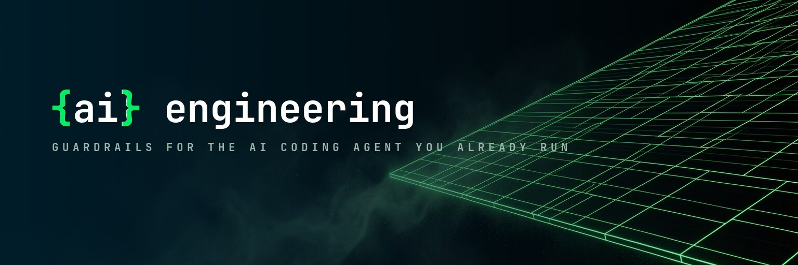
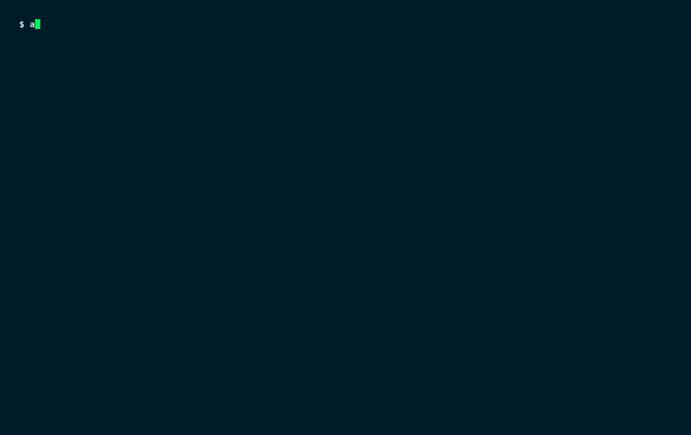
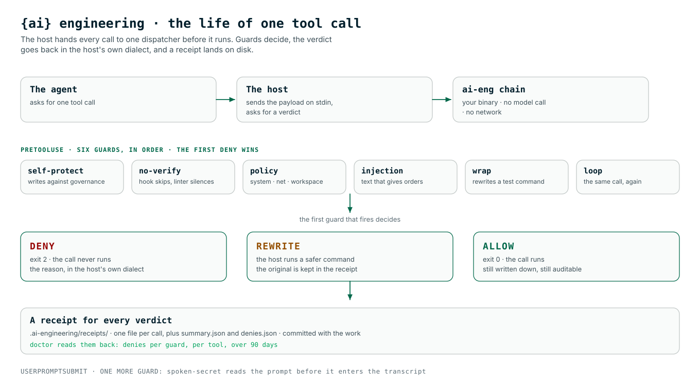
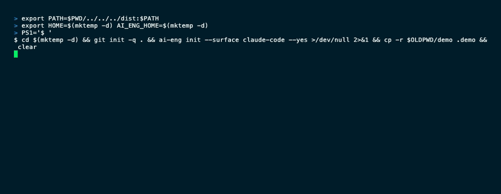
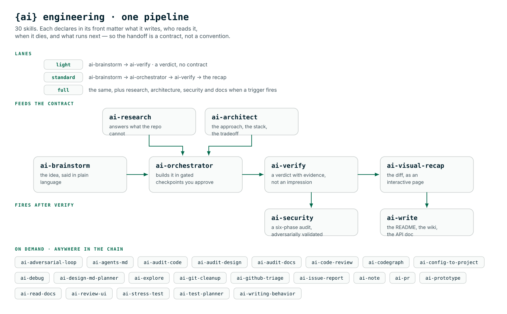
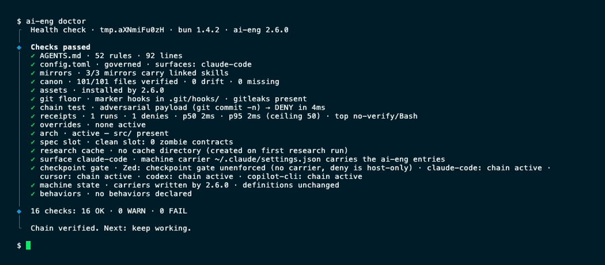

<div align="center">



**Guardrails for AI coding agents: install a contract, deny destructive calls, prove every run.**

<p>A contract the agent cannot execute before you approve it.<br/>
Guards that say <strong>no</strong> before the tool call runs.<br/>
A receipt for every verdict, on disk, in git.</p>

<p>
  <a href="https://github.com/arcasilesgroup/ai-engineering/actions/workflows/check.yml"><picture>
    <source media="(prefers-color-scheme: dark)" srcset="https://shieldcn.dev/github/ci/arcasilesgroup/ai-engineering.svg?workflow=check.yml&amp;branch=main&amp;variant=secondary&amp;font=geist-mono&amp;size=sm&amp;mode=dark">
    
  </picture></a>
  <a href="https://sonarcloud.io/project/overview?id=arcasilesgroup_ai-engineering"></a>
  <a href="https://app.snyk.io/org/soydachi/project/a415e4c8-3688-4cda-94e5-43fab7b6c56d"></a>
</p>

<p>
  <a href="https://ai-engineering.arcasiles.com"><picture>
    <source media="(prefers-color-scheme: dark)" srcset="https://shieldcn.dev/badge/website-ai--engineering.arcasiles.com.svg?variant=secondary&amp;font=geist-mono&amp;size=sm&amp;mode=dark">
    
  </picture></a>
  <a href="https://github.com/arcasilesgroup/ai-engineering/releases"></a>
  <a href="LICENSE"><picture>
    <source media="(prefers-color-scheme: dark)" srcset="https://shieldcn.dev/badge/license-Apache--2.0.svg?variant=secondary&amp;font=geist-mono&amp;size=sm&amp;mode=dark">
    
  </picture></a>
</p>

| | |
|---|---|
| **6** guards | on every tool call, plus **1** on the prompt itself |
| **30** skills | one pipeline, announced in each skill's front matter |
| **8** surfaces | one payload, no per-IDE fork |
| **1** binary | Bun-compiled, no daemon, no hosted control plane |
| **0** model calls | by `ai-eng` itself. Your key, your model |

</div>

## The idea

Your coding agent can already run any command, edit any file and read any page. That is the
job. The problem is that nothing stands between the request and the action: a hook-skipping
commit, a silenced linter, a retry loop that never ends, a file whose text tells the model
what to do. By the time you notice, the damage is in your history.

`ai-eng` sits under the agent you already use. A small binary on your machine reads every
tool call first and answers in the host's own dialect: **allow**, **deny**, or a rewritten
command. It never calls a model. It never phones home. It writes down what it decided, so
you can check the decision later in git.

## Why this exists

The contract every agent needs already exists in your repo, as rules you wrote for people:
do not skip the hooks, do not silence the linter, do not rewrite the config that governs
you. Agents read these rules and follow them most of the time. A rule that has to be
remembered on every call is a habit, and habits lapse.

This project turns the rules that never change into code that runs on every call, and leaves
the judgment calls where they belong: with you.

## Table of contents

- [The idea](#the-idea)
- [Why this exists](#why-this-exists)
- [Security](#security)
- [Install](#install)
- [Quick start](#quick-start)
- [How a tool call is decided](#how-a-tool-call-is-decided)
- [What it stops](#what-it-stops)
- [The skills pipeline](#the-skills-pipeline)
- [Surfaces](#surfaces)
- [CLI](#cli)
- [Configuration](#configuration)
- [Under the hood](#under-the-hood)
- [Troubleshooting](#troubleshooting)
- [Development](#development)
- [Maintainers](#maintainers)
- [License](#license)

## Security

Security is the product, so it comes early. A guard bypass is critical by definition: see
[SECURITY.md](SECURITY.md) for the reporting path.

- **Fail closed.** A guard that crashes denies. A guard that cannot decide denies.
- **The only bypass is written down.** An entry in `.ai-engineering/overrides.toml` with a
  `reason` and an `until` date. `doctor` reports every active one with the time it has left,
  and an expired entry re-arms the guard.
- **Nothing is hosted.** State is versioned files in your repo and your home directory.
- **One outbound read, and you can turn it off.** A daily anonymous registry version check,
  cached 24 hours, silent when offline.

## Install

```bash
bun add -g ai-engineering@latest && ai-eng init    # or: npm install -g ai-engineering@latest
```

`ai-eng` runs its TypeScript source under [Bun](https://bun.com), so install Bun once
(>= 1.4). `init` then asks which agents to govern, installs the skill canon on your machine,
and writes the contract into the repository you are standing in. It is idempotent: run it
again whenever you like.

The launcher fails with an honest message if Bun is missing. From source, or with no global
install:

```bash
git clone https://github.com/arcasilesgroup/ai-engineering.git
cd ai-engineering && bun install && bun run build && bun link
```

The whole payload travels inside the package: the binary, the skill canon, the templates.

## Quick start

<p align="center">
  
  <br/><sub>a real session, sped up: <code>ai-eng init</code>, then <code>ai-eng doctor</code></sub>
</p>

1. **Install the binary.** `bun add -g ai-engineering@latest` (or npm).
2. **Govern the repo.** Run `ai-eng init` inside it and pick the surfaces you use. It writes
   `AGENTS.md`, `DECISIONS.md`, `.ai-engineering/config.toml` and the git hooks.
3. **Trust the workspace in your host.** Hooks do not run in an untrusted folder. This is the
   one step `ai-eng` cannot do for you.
4. **Prove the chain answers.** Run `ai-eng doctor`. It fires one real adversarial payload at
   the chain and reports whether the deny came back.
5. **Keep working.** Open your agent and give it a task. Every call it makes passes the chain
   first.

Optional, and worth it once: open the repo in your agent and run `/ai-config-to-project`. That
skill adapts the rules and the architecture contract to this tree.

## How a tool call is decided

<p align="center">
  <picture>
    <source media="(prefers-color-scheme: dark)" srcset=".github/assets/guard-flow-dark.svg">
    
  </picture>
</p>

The dispatcher reads the host's payload on stdin and answers in the same dialect it was called
with, so one set of definitions serves every surface. A guard runs only for the tools it
governs, in a fixed order, and the first deny wins.

| Order | Guard | Denies |
|---|---|---|
| 1 | `self-protect` | writes against anything that governs the agent: `.ai-engineering/` (except the milestone slots a session owns), the surface settings, the git hooks, the global canon |
| 2 | `no-verify` | `--no-verify`, `git commit -n`, `HUSKY=0`, deleting `.git/hooks/`, repointing `core.hooksPath`, and every linter silence: `eslint-disable`, `@ts-ignore`, `@ts-expect-error`, `@ts-nocheck`, `noqa`, `nosec`, `NOLINTNEXTLINE` |
| 3 | `policy` | commands outside the configured scope. Four octal digits for system, external, network and workspace, each read, write or execute. The default is `0467` |
| 4 | `injection` | reading a file whose text carries an instruction payload, and acting on a fetched page that carries one. The text is treated as data, never as an order |
| 5 | `wrap` | nothing. It rewrites a test command to `ai-eng wrap test -- <command>` so the filter prints the failures and drops the noise |
| 6 | `loop` | the same call repeated, or the same failure retried with the arguments tweaked. Thresholds live in `config.toml` |

A seventh guard runs on the prompt itself, before it enters the transcript: `spoken-secret`
reads for the two shapes a spoken secret takes and warns you. It is advice, never an action,
and it never prints the value it found.

## What it stops

A block earns its place when it explains itself. These are real verdicts from the real
binary:

<p align="center">
  
  <br/><sub>deny, deny, rewrite, and a receipt for each</sub>
</p>

| The agent reaches for | What comes back |
|---|---|
| `git commit --no-verify` | *"--no-verify skips the git hooks, the floor every agent and every person in this repository commits through. Whatever the hooks would have said is what needs fixing. Run the command without it."* |
| a silenced linter | *"Silencing a check is skipping a hook."* The guard points at `.ai-engineering/overrides.toml`, with a reason and an `until` date, for a skip that is legitimate. |
| editing the contract you approved | denied. A person changes that, in a reviewed diff. |
| the fifth identical retry | denied by the loop guard, with the threshold it crossed. |
| a file that argues with the model | stopped before the model reads it. The text is treated as data. |

## The skills pipeline

`ai-eng` also installs 30 skills that run as one pipeline. Each one declares in its front
matter what it writes, who reads it, when it dies and what runs next, so the handoff is a
contract the next skill can read.

<p align="center">
  <picture>
    <source media="(prefers-color-scheme: dark)" srcset=".github/assets/skill-chain-dark.svg">
    
  </picture>
</p>

A **lane** decides how much of it runs. You pick it by the size of the work, not by ceremony.

| Lane | What runs | What you get |
|---|---|---|
| **light** | `ai-brainstorm` → `ai-verify` | A verdict with evidence. No contract, because the work does not need one |
| **standard** | `ai-brainstorm` → `ai-orchestrator` | The feature. Three gates per checkpoint |
| **full** | standard, plus `ai-research`, `ai-architect`, `ai-security` and `ai-write` when their triggers fire | The same, with the evidence and the docs the change owed |

**Five triggers**, and the set is closed. A path trigger fires on its own, evaluated against
the milestone's diff. A judgment trigger cannot be read from a diff, so it is asked out loud,
once. Either way it ends in a gate or an `ABANDON`, never in silence.

| Trigger | Kind | Routes to | Fires when |
|---|---|---|---|
| `ui` | path | `ai-audit-design` | the diff touches `**/*.tsx`, `**/*.css`, `**/components/**`, a Tailwind config |
| `security` | path | `ai-security` | the diff touches `**/auth/**`, `**/*.sql`, `**/migrations/**`, `.github/workflows/**` |
| `open-questions` | judgment | `ai-research` | the brainstorm lists open questions, or the plan cites an external API |
| `arch-change` | judgment | `ai-architect` | the milestone adds a subsystem or moves a layer contract |
| `public-interface` | judgment | `ai-write` | the diff changes what somebody outside can see |

<details>
<summary><b>All 30 skills</b></summary>

| Skill | What it does |
|---|---|
| `ai-adversarial-loop` | Multi-round debate between a critic and a fixer until the code is clean. The review gate inside the orchestrator |
| `ai-agents-md` | Creates, audits and maintains the `AGENTS.md` a repository owes its coding agents |
| `ai-architect` | Research and advice on approach, stack, cost tradeoffs and prior art, before the build starts |
| `ai-audit-code` | Forces the laziest solution that works: simplest, shortest, fewest dependencies |
| `ai-audit-design` | Finds and fixes visual defects in a rendered page with measurements, not opinions |
| `ai-audit-docs` | Audits documentation against the repo: dead links, false claims, stale versions |
| `ai-brainstorm` | Interrogates a fuzzy idea until it can be said in plain language, then gates it for approval |
| `ai-code-review` | Reviews a diff for over-engineering and against the repo's code-style rules |
| `ai-codegraph` | Semantic code intelligence: call chains, blast radius, cross-file relationships |
| `ai-config-to-project` | Adapts the architecture rules, config, overrides and `AGENTS.md` to a governed tree after `init` |
| `ai-debug` | Names the root cause at `file:line`, then writes the check that fails for that reason before the fix |
| `ai-design-md-planner` | Writes a `DESIGN.md` design system and audits it with the official CLI until it lints clean |
| `ai-explore` | Answers "where does this live" from the repository, anchored to `file:line` |
| `ai-git-cleanup` | Removes merged branches and dead worktrees in one pass. It never force-deletes |
| `ai-github-triage` | Ranks an entire open backlog into one page, each claim pinned to a commit |
| `ai-issue-report` | Files a governed bug report: scrubbed fields, local draft, nothing sent unconfirmed |
| `ai-note` | Saves a hard-won finding as committed markdown, stamped so staleness is detectable |
| `ai-orchestrator` | Builds a feature end to end in gated checkpoints. You approve the plan, then the app |
| `ai-pr` | The pull-request loop: cut, push, open, watch CI, merge. Your verb decides how far it goes |
| `ai-prototype` | Builds a single-file, clickable HTML prototype of a screen or flow |
| `ai-read-docs` | Forces a documentation pass before you depend on versioned or external behaviour |
| `ai-research` | Answers from outside the repository with numbered citations, or marks the claim `[unsourced]` |
| `ai-review-ui` | Screenshots the live UI and its prototype, then diffs them for visual and behavioural gaps |
| `ai-security` | Six-phase security audit, validated adversarially: the verifier is never the finder |
| `ai-stress-test` | Finds the breaking point under load, and reports the load that caused it |
| `ai-test-planner` | Plans and writes tests bottom-up; UI end-to-end only for what the lower layers cannot reach |
| `ai-verify` | Verifies work at the right tier and produces verdicts with evidence, not impressions |
| `ai-visual-recap` | Turns a diff into an interactive recap: diagrams, file map, annotated diff |
| `ai-write` | Writes the README, the wiki page or the API doc, verified against the tree |
| `ai-writing-behavior` | Authors `BEHAVIOR.md` specs for recurring, judgeable agent conduct |

</details>

Attribution for every upstream skill travels with the payload: [NOTICE.md](NOTICE.md) and
[THIRD-PARTY-NOTICES.md](THIRD-PARTY-NOTICES.md).

## Surfaces

One canonical payload, mirrored into every surface you enable, so the same guard judges the
same call whichever client sent it. The capability of each surface is measured against the
host's own CLI; the evidence lives in `src/surfaces/surfaces.json`.

| Surface | Tier | Carrier |
|---|---|---|
| Claude Code | core | `.claude/settings.json` (machine) |
| Oh My Pi | core | `.omp/agent/hooks/pre/` (machine) |
| OpenCode | core | `.config/opencode/plugins/` (machine) |
| Cursor | core | `.cursor/hooks.json` (repo) |
| Pi | core | `.pi/agent/extensions/` (machine) |
| Codex CLI | experimental | `.codex/hooks.json` (machine) |
| Copilot CLI | best-effort | `.github/hooks/` (repo) and `.copilot/hooks/` (machine) |
| Zed | skills-only | none. It denies through its own tool permissions |

The tiers are honest about the host. **core** means deny and, where the host allows it, a
rewritten command. **experimental** works but is less proven. **best-effort** means the host
limits the outcome. **skills-only** means no interception at all.

`ai-eng config` ticks surfaces on and off (`--add <id>`, `--remove <id>`) and regenerates the
adapters. `doctor` reports, per surface, whether the carrier is where that host actually reads
it.

## CLI

Six verbs for people:

```bash
ai-eng init        # install governance into this repo, or globally without one
ai-eng doctor      # every check it knows, plus one real adversarial probe
ai-eng config      # add or remove surfaces, and regenerate their adapters
ai-eng update      # rewrite ai-eng's files from the installed binary (zero network)
ai-eng upgrade     # delegate to bun or npm
ai-eng uninstall   # revert ours, keep yours
```

Seven machine verbs for hooks, CI and agents: `chain`, `git`, `wrap`, `spec`, `worktree`,
`adapt`, `briefing`. `--help` names them on one line. The three you will meet in the README:

```bash
echo "$PAYLOAD" | ai-eng chain PreToolUse       # the guard dispatcher, reads the host payload on stdin
ai-eng git pre-commit                           # the pre-commit, commit-msg and pre-push checks
ai-eng worktree new <slug> | rm <slug> | list   # one copy per job, merged into the local main
```

Ask the repo how it is doing, with real receipt statistics:

<p align="center">
  
</p>

## Configuration

`ai-eng init` writes `.ai-engineering/config.toml` with every key commented and its default in
place: the surfaces you enabled, the loop thresholds, the command-scope policy, local
injection rules, the growth caps and the update-notice switch. Edit it by hand; the chain
reads it and never rewrites it.

The one file that changes a verdict is `.ai-engineering/overrides.toml`. An override needs a
`reason` and an `until` date, and it is a first-class citizen of the record: it lands in the
receipt and in the commit.

## Under the hood

- **Nothing is hosted.** State is versioned files: `.ai-engineering/`, `AGENTS.md`,
  `DECISIONS.md` and the git hooks in your repo, plus `~/.ai-engineering/` on your machine.
- **`ai-eng` never calls a model.** `config.toml` carries a model pin per tier, cheap for
  verifying and expensive for judging, and the framework injects that line. The calls stay
  yours.
- **One outbound read**, if you allow it: a daily anonymous registry version check, cached 24
  hours, silent offline. Set `notices = false` in `config.toml`, or
  `AI_ENG_NO_UPDATE_NOTICES=1`.
- **The hot path budgets 200 ms** and prints a warning when it goes past, rather than failing
  in silence.
- **`update` never touches the network.** Releases are verified by attestation, not only by a
  checksum fetched from the same origin.

The design document is [docs/blueprint.html](docs/blueprint.html); the product as it stands is
[docs/recap.html](docs/recap.html).

## Troubleshooting

| Symptom | Cause and fix |
|---|---|
| Hooks do not fire | The workspace is not trusted in your host. Trust it, then run `ai-eng doctor` and look for the `chain test` line |
| A legitimate command was denied | Add an entry to `.ai-engineering/overrides.toml` with a `reason` and an `until` date. `doctor` shows the time it has left |
| `ai-eng: bun not found` | The launcher runs the source under Bun. Install Bun (>= 1.4) once; `npm install -g` works after that |
| Doctor reports canon drift | A payload file changed without `bun scripts/gen-assets.ts`. Run it, then `ai-eng update` |
| You want no update notice | `notices = false` in `config.toml`, or `AI_ENG_NO_UPDATE_NOTICES=1` |
| You want it gone | `ai-eng uninstall` reverts ours and keeps your contract files |

## Development

```bash
bun install
bun run build                  # compile dist/ai-eng, with skills and templates embedded
bun test                       # unit, adversarial oracle, gates and arch
bun run lint && bun run typecheck
bun scripts/gen-assets.ts      # regenerate src/assets.ts after touching skills/ or templates/
bun scripts/readme-diagrams.ts # regenerate .github/assets/*.svg from the repo
```

`gen-assets.ts` is not optional after a payload change: the binary carries `src/assets.ts`, and
a file that is not in it does not ship. The brand is generated too: `bun scripts/brand.ts gen`
owns `src/theme.ts` and the landing site's tokens ([brand/README.md](brand/README.md)). The
README captures are recorded with [VHS](https://github.com/charmbracelet/vhs): run
`vhs quickstart.tape` or `vhs chain.tape` from `.github/assets/tapes/`.

Versioning runs on [changesets](.changeset/README.md). Releases go out from a dispatched
workflow with two channels, `integration` (`next`) and `production` (`latest`), each building
the cross-compiled binaries, the SBOM and the attestations.

## Maintainers

[Arcasiles Group](https://github.com/arcasilesgroup) · [Contributing](CONTRIBUTING.md) ·
[Code of Conduct](CODE_OF_CONDUCT.md) · [Apache-2.0](LICENSE) © Arcasiles Group. Third-party
attribution in [NOTICE.md](NOTICE.md) and [THIRD-PARTY-NOTICES.md](THIRD-PARTY-NOTICES.md).

<a href="https://github.com/arcasilesgroup/ai-engineering/graphs/contributors"><picture>
  <source media="(prefers-color-scheme: dark)" srcset="https://shieldcn.dev/contributors/arcasilesgroup/ai-engineering.svg?title=false&preset=transparent&border=false&mode=dark">
  
</picture></a>

## License

[Apache-2.0](LICENSE) © Arcasiles Group.
