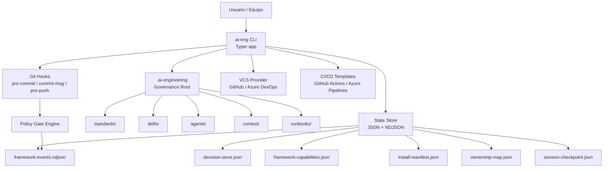
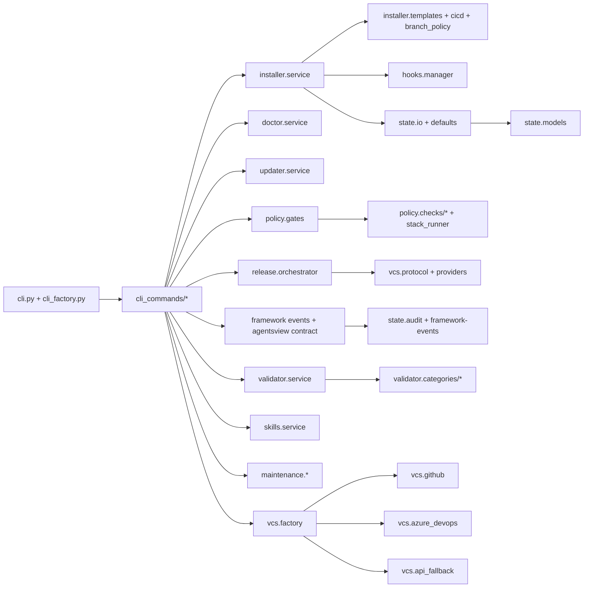
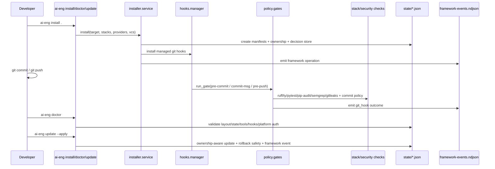
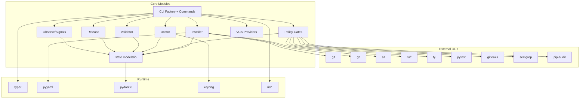
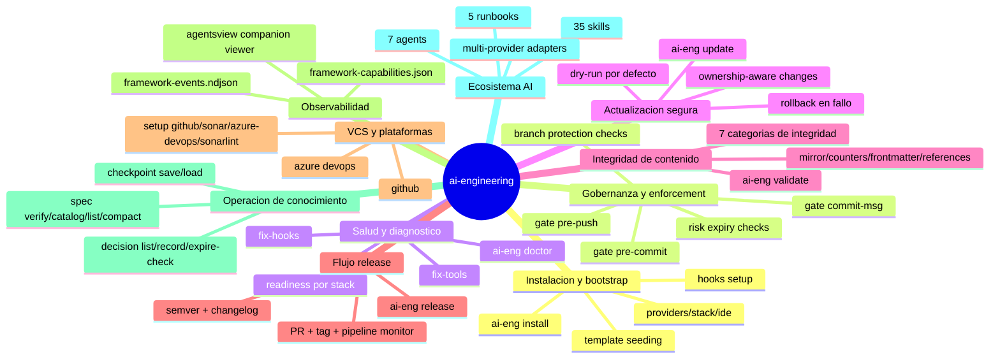
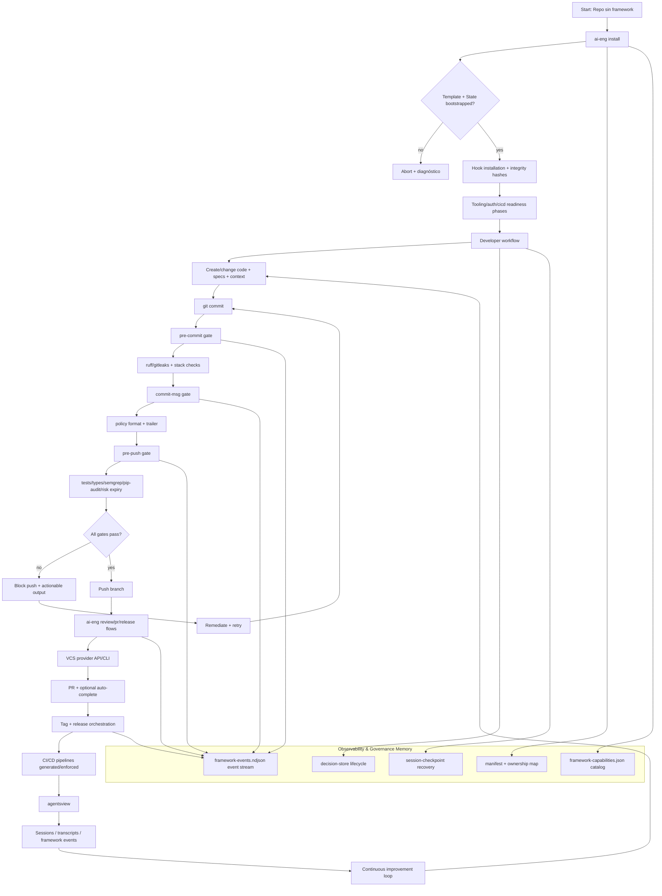

# Auditoría integral de ai-engineering (arquitectura + operación)

> Nota de vigencia: este documento contiene una auditoría histórica previa a `spec-082`. Donde aparezcan `observe`, `signals` o `.ai-engineering/state/audit-log.ndjson`, deben leerse como antecedentes del diseño retirado. La superficie soportada hoy es `.ai-engineering/state/framework-events.ndjson` + `.ai-engineering/state/framework-capabilities.json`, con `agentsview` instalado y abierto independientemente por el usuario.

## Alcance y método

Auditoría estática y funcional del repositorio `ai-engineering` con foco en:

- arquitectura de producto y de código
- gobernanza y enforcement local
- dependencias internas/externas
- mapa de funcionalidades por comandos
- operación end-to-end real (desde instalación hasta release/observabilidad)

Base analizada:

- `src/ai_engineering/**` (CLI, servicios, policy engine, estado, VCS)
- `.ai-engineering/**` (manifest, skills, agentes, runbooks, estándares, contexto, estado)
- `scripts/**`, `tests/**`, `README.md`, `pyproject.toml`

## Resumen ejecutivo

- `ai-engineering` es un **framework de gobernanza local-first** operado por CLI (`ai-eng`) y reforzado por git hooks.
- El núcleo operativo se divide en: `installer`, `policy/gates`, `doctor`, `validator`, `updater`, `release`, `state`.
- El **single source of truth** operativo es contenido en repo (`.ai-engineering/**`) + eventos en `.ai-engineering/state/framework-events.ndjson` y `.ai-engineering/state/framework-capabilities.json`.
- El diseño es **provider-aware** (GitHub/Azure DevOps y múltiples AI providers) con fallback de API/CLI.
- Se observan dos gaps operativos de entorno en esta sesión:
  - `pytest` no ejecuta por dependencia faltante (`pydantic`) en el entorno actual.
  - `ty check` reporta múltiples diagnósticos en el repo (no bloqueantes para documentar, pero relevantes para salud técnica).

## Inventario técnico observado

- Módulos Python en `src/ai_engineering`: 33 áreas funcionales.
- Comandos CLI: núcleo + subgrupos operativos (`stack`, `ide`, `gate`, `skill`, `maintenance`, `provider`, `vcs`, `review`, `cicd`, `setup`, `decision`, `spec`, `scan-report`, `metrics`, `workflow`, `work-item`).
- Skills: 34 (flat organization).
- Agentes: 7.
- Runbooks: 14.
- Tests: 82 archivos, 124 tests detectados.

## Diagrama 1: Alto nivel (producto/sistema)

## Diagrama 2: Arquitectura lógica del código (nivel arquitectura)

## Diagrama 3: Flujo técnico de enforcement (nivel técnico)

## Diagrama 4: Dependencias (nivel dependencias)

## Diagrama 5: Mapa de funcionalidades (nivel funcionalidades)

## Diagrama 6: Diagrama de lujo (operación completa 100% E2E)

## Hallazgos de auditoría

1. El diseño es coherente con la promesa del README: gobernanza local con enforce por hooks y estado auditable.
2. La arquitectura separa correctamente responsabilidades:
   - entrada CLI,
   - orquestadores de dominio,
   - estado tipado,
   - proveedores VCS pluggable,
   - validación de integridad.
3. El modo `update` aplica patrón seguro (dry-run + ownership + backup/rollback).
4. `framework-events.ndjson` y `framework-capabilities.json` son ahora la base canónica de observabilidad del framework; las sesiones y transcripts viven en `agentsview`.
5. Hay inconsistencia de entorno/comando en sesión:
   - La guía pide `ai-eng checkpoint load`; el binario ejecutado respondió “No such command 'checkpoint'”.
   - El código fuente sí registra subcomando `checkpoint` en `cli_factory.py`.
   - Esto sugiere desalineación entre instalación activa y árbol fuente actual.
6. La salud técnica local no está completamente verde en este entorno:
   - `pytest` no ejecuta por dependencia ausente (`pydantic`).
   - `ty check` reporta 84 diagnósticos.

## Recomendaciones priorizadas

1. Alinear binario activo vs código fuente (`ai-eng version`, reinstall editable/local, validar `ai-eng --help`).
2. Corregir baseline de tipos en `ty` y fijar política de severidad/ci para evitar drift.
3. Asegurar entorno dev reproducible (lock de deps dev y bootstrap único para tests).
4. Añadir un comando de “self-diagnostic contract” que valide explícitamente paridad entre comandos documentados y comandos registrados.
