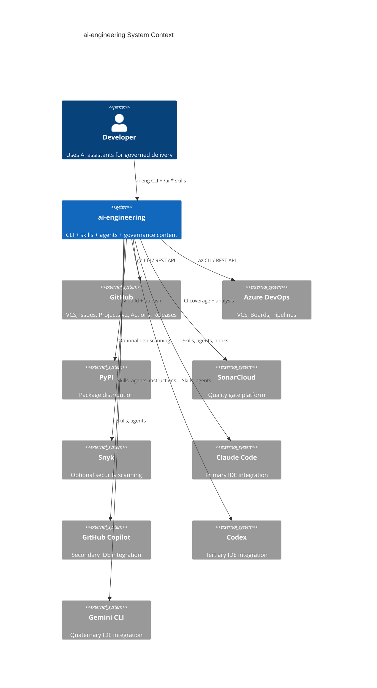
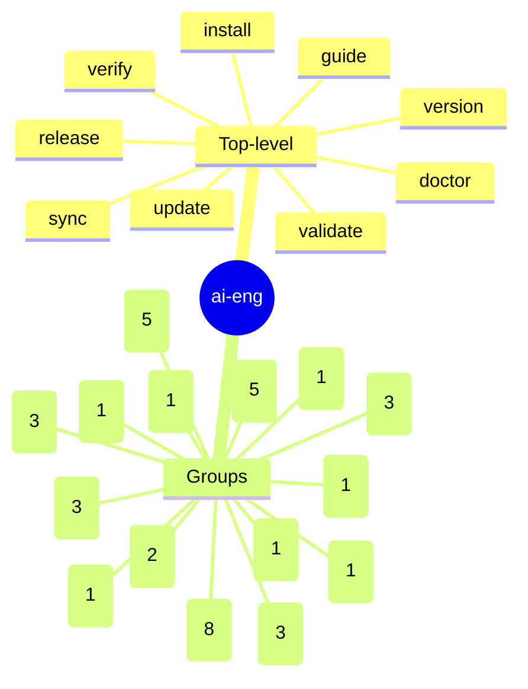
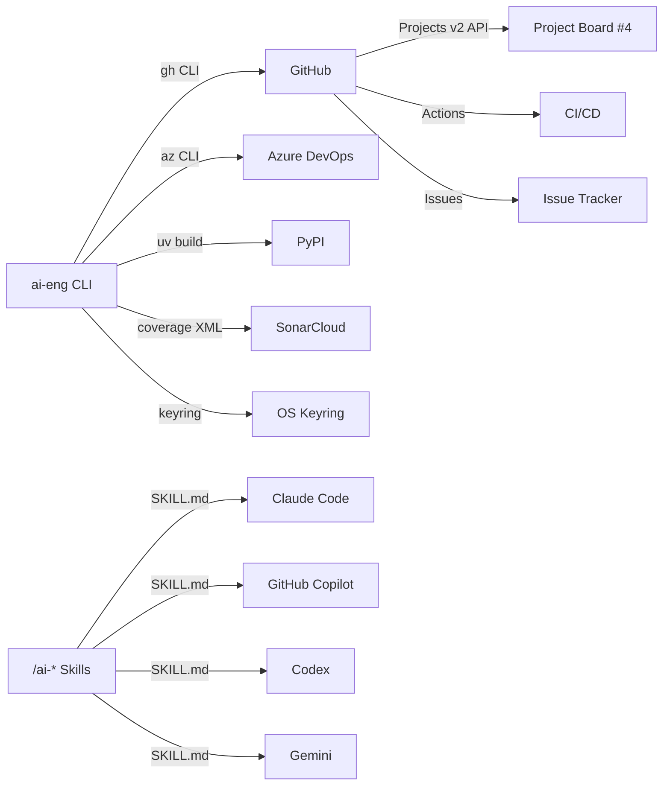
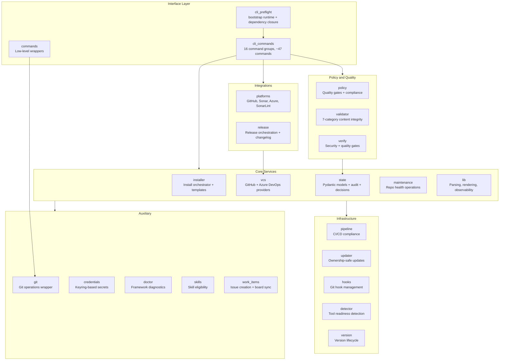
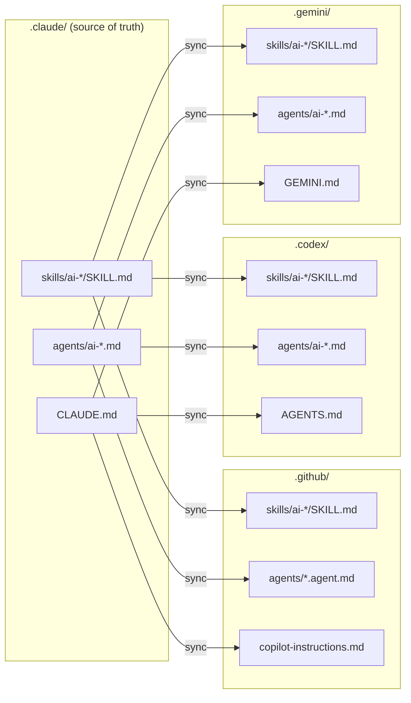
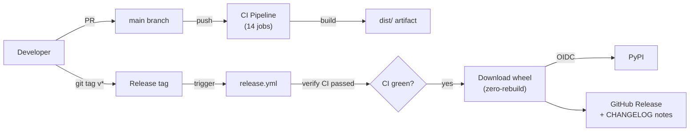
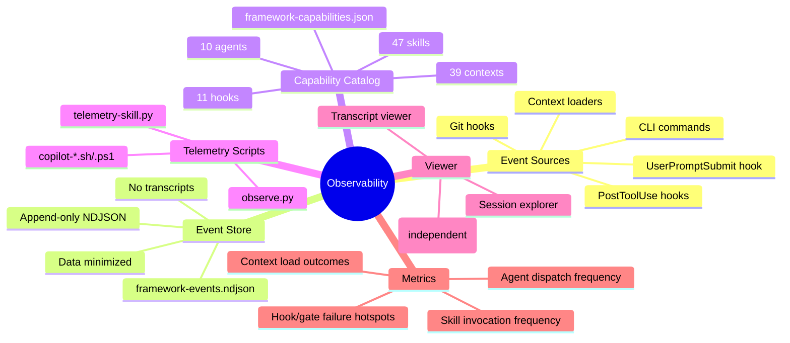
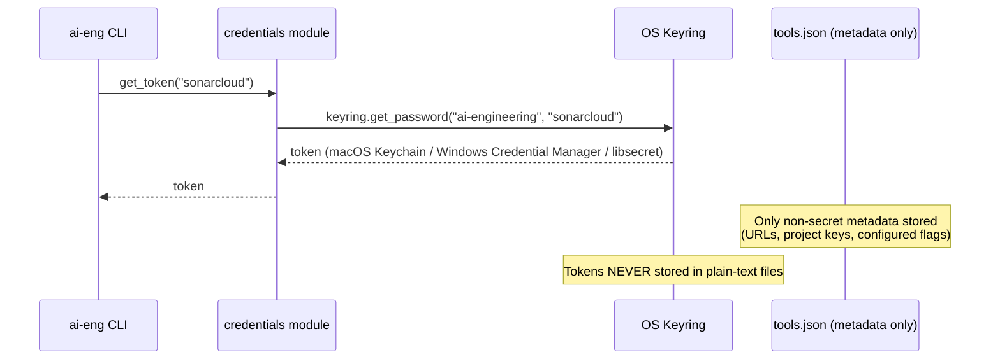
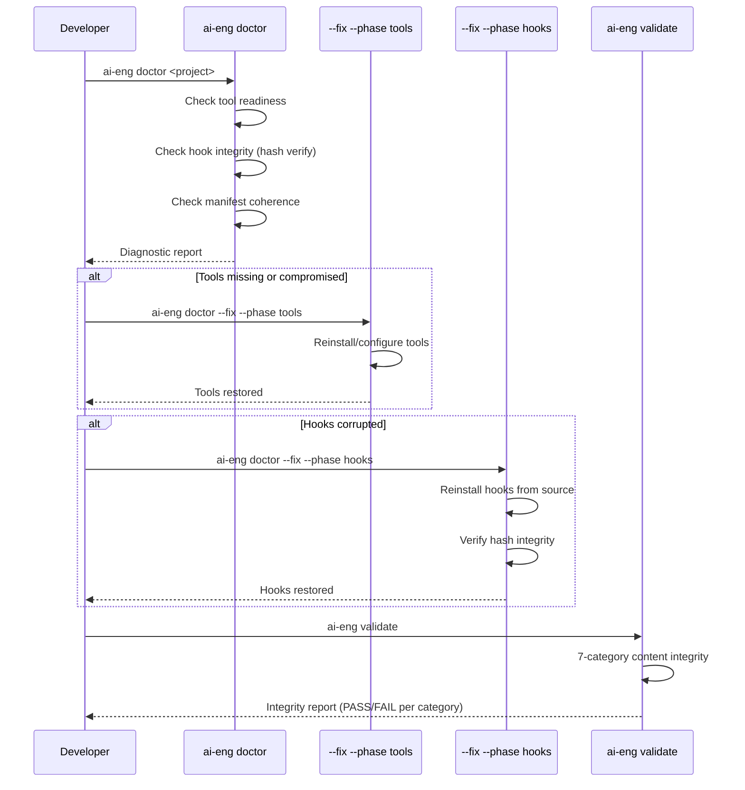
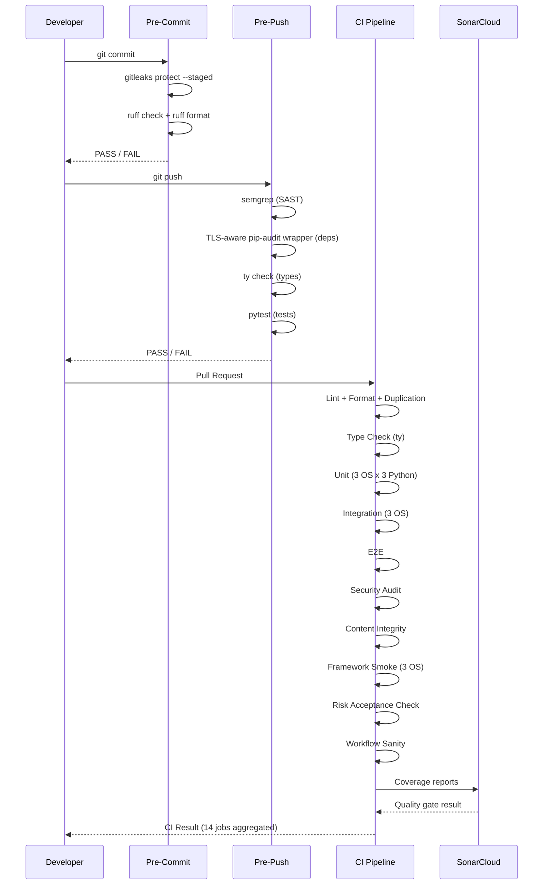

# Solution Intent -- ai-engineering

> Status: Evolving
> Last Review: 2026-04-06

---

## 1. Introduction

### 1.1 Identity

| Field | Value |
|-------|-------|
| Name | ai-engineering |
| Organization | arcasilesgroup/ai-engineering |
| Versions | 0.4.0 (framework), 2.0 (manifest schema), 0.1.0 (pyproject) |
| Description | AI governance framework for secure software delivery |
| License | MIT |
| Python | >= 3.11 |
| Entry point | `ai-eng` (via `ai_engineering.cli:app`) |
| Distribution | PyPI (`pip install ai-engineering`) |
| Build system | hatchling >= 1.25.0 |
| Status | Active development -- no active spec |
| Model | Content-first, AI-governed, multi-IDE |

### 1.2 Objective

Deterministic CLI tooling, 47 AI skills, 10 agents (+ 15 specialist sub-agents), and a governance surface that spans Claude Code, GitHub Copilot, Codex, and Gemini. Targets regulated enterprises (banking, healthcare, investment) that require auditable, governed AI-assisted software delivery.

### 1.3 Problem Statement

AI coding assistants operate without guardrails. In regulated industries, this creates compliance gaps: unaudited changes, missing quality gates, secret leaks, and inconsistent governance across IDE surfaces. ai-engineering provides the missing governance layer.

### 1.4 Desired Outcomes

- Zero secret leaks in committed code
- >= 80% test coverage enforced at every PR
- Consistent governance across 4 IDE surfaces from a single source
- Auditable decision trail with expiry-based lifecycle
- Environment-aware failure handling: fail fast for runtime integrity, repair framework packaging drift when possible, and block only when security or feed validation cannot be trusted

### 1.5 Scope

| In scope | Out of scope |
|----------|-------------|
| CLI tooling (`ai-eng`) | Runtime application code |
| AI skill definitions (47) | AI model training or fine-tuning |
| Agent orchestration (10) | Custom IDE plugin development |
| Quality gates and hooks | SonarCloud/Snyk platform management |
| Multi-IDE mirror generation | IDE-specific UI extensions |
| GitHub + Azure DevOps providers | Other VCS providers |
| Board integration (GitHub Projects v2) | Full project management features |

### 1.6 Stakeholders and Personas

| Persona | Journey | Primary actions |
|---------|---------|----------------|
| Developer | Code -> commit -> PR -> merge | `/ai-brainstorm`, `/ai-dispatch`, `/ai-commit`, `/ai-pr` |
| Tech Lead | Review -> approve -> release | `/ai-review`, `/ai-release-gate`, `/ai-verify` |
| Security Officer | Audit -> scan -> accept risk | `/ai-security`, `/ai-governance`, decision-store |
| DevOps Engineer | Pipeline -> deploy -> monitor | `/ai-pipeline`, `ai-eng doctor`, runbooks |
| New Team Member | Onboard -> learn -> contribute | `/ai-start`, `/ai-guide`, `/ai-explain` |

---

## 2. Requirements (Solution Intent)

### 2.1 High-Level Solution Architecture

### 2.2 Functional Requirements by Domain

#### Skills (47)

| Type | Skills | Count |
|------|--------|-------|
| Workflow | brainstorm, plan, dispatch, code, test, debug, verify, review, eval, schema | 10 |
| Delivery | commit, pr, release-gate, cleanup, market | 5 |
| Enterprise | security, governance, pipeline, docs, board-discover, board-sync, platform-audit | 7 |
| Teaching | explain, guide, write, slides, media, video-editing | 6 |
| Design | design, animation, canvas | 3 |
| SDLC | note, standup, sprint, postmortem, support, resolve-conflicts | 6 |
| Meta | create, learn, prompt, start, analyze-permissions, instinct, autopilot, run, constitution, skill-evolve | 10 |

**Effort distribution**: 11 max, 23 high, 13 medium.

#### Agents (10)

| Agent | Model | Role | Boundary |
|-------|-------|------|----------|
| plan | opus | Spec creation, architecture design | Plans but does NOT execute |
| build | opus | Code implementation | ONLY agent with write permissions |
| verify | opus | Quality + security assessment | Read-only, dispatches 4 sub-agents |
| guard | sonnet | Governance advisory | Advisory, never blocking |
| review | opus | Parallel code review | Read-only, dispatches 8 specialists |
| explore | sonnet | Deep codebase research | Read-only exploration |
| guide | sonnet | Teaching and onboarding | Read-only, educational |
| simplify | sonnet | Code simplification | Proposes changes, build executes |
| autopilot | opus | Autonomous multi-spec orchestrator | Decomposes, plans, builds, verifies |
| run-orchestrator | opus | Autonomous backlog execution | Plans, builds, converges work items |

**Specialist sub-agents (15):**

| Sub-agent | Parent | Focus |
|-----------|--------|-------|
| review-context-explorer | review | Pre-review architectural context |
| review-finding-validator | review | Adversarial finding disproof |
| reviewer-architecture | review | Necessity, simplicity, patterns |
| reviewer-backend | review | API boundaries, persistence |
| reviewer-compatibility | review | Breaking changes to shipped code |
| reviewer-correctness | review | Functional correctness |
| reviewer-frontend | review | React, hooks, accessibility |
| reviewer-maintainability | review | Readability, clarity |
| reviewer-performance | review | Bottlenecks, optimization |
| reviewer-security | review | Vulnerabilities, exploits |
| reviewer-testing | review | Test coverage, quality |
| verify-deterministic | verify | Tool-driven checks (gitleaks, ruff, pytest) |
| verifier-architecture | verify | Solution-intent alignment |
| verifier-feature | verify | Spec coverage, acceptance criteria |
| verifier-governance | verify | Compliance, integrity |

#### CLI Commands (~47)

### 2.3 Non-Functional Requirements

| Category | Requirement | Threshold | Measurement |
|----------|-------------|-----------|-------------|
| Coverage | Test coverage minimum | >= 80% | SonarCloud quality gate |
| Duplication | Code duplication ceiling | <= 3% | CI duplication check + SonarCloud |
| Complexity | Cyclomatic per function | <= 10 | SonarCloud |
| Complexity | Cognitive per function | <= 15 | SonarCloud |
| Security | Secret leaks | 0 | gitleaks (pre-commit + CI) |
| Security | Dependency vulnerabilities | 0 | TLS-aware pip-audit wrapper (pre-push + CI, fail-closed on unusable JSON) |
| Security | Medium+ findings | 0 | CI security audit |
| Reliability | Blocker/critical issues | 0 | SonarCloud |
| Portability | Cross-platform support | 3 OS | CI matrix: ubuntu, windows, macos |
| Portability | Python versions | 3 versions | CI matrix: 3.11, 3.12, 3.13 |

### 2.4 Integrations

| System A | System B | Protocol | Contract | SLA |
|----------|----------|----------|----------|-----|
| ai-eng CLI | GitHub | gh CLI / REST | Issues, PRs, Projects v2 | Best-effort, fail-open |
| ai-eng CLI | Azure DevOps | az CLI / REST | Work items, repos, pipelines | Best-effort, fail-open |
| ai-eng CLI | PyPI | OIDC trusted publisher | Wheel upload | Release-time only |
| ai-eng CLI | SonarCloud | Coverage XML upload | Quality gate check | CI-time only |
| ai-eng CLI | OS Keyring | keyring library | Credential CRUD | Local only |
| Skills | IDE surfaces | Markdown files (SKILL.md) | Sync via `scripts/sync_command_mirrors.py` | Build-time |

---

## 3. Technical Design

### 3.1 Stack and Architecture

| Layer | Component | Technology |
|-------|-----------|------------|
| Interface | CLI | typer + rich |
| Interface | Bootstrap preflight | `cli_preflight` + dependency-closure validation |
| Core | Data models | pydantic |
| Core | Configuration | pyyaml + ruamel-yaml |
| Core | Credentials | keyring |
| Policy | Lint + format | ruff |
| Policy | Type checking | ty |
| Policy | Secret scanning | gitleaks |
| Policy | Dependency audit | TLS-aware pip-audit wrapper (`uv run python -m ai_engineering.verify.tls_pip_audit`) |
| Policy | SAST | semgrep (required; manual installation on Windows) |
| Testing | Runner | pytest + pytest-xdist |
| Testing | Coverage | pytest-cov -> SonarCloud |
| Build | Package | hatchling |
| Build | Dependency management | uv |

The `ai-eng` entry point now crosses a deliberate bootstrap/runtime boundary: `cli_preflight` validates Python version, interpreter availability, and framework dependency closure before importing the full Typer application. Shared environment classification treats bootstrap packaging drift as the only auto-repairable class, using `uv sync --dev` from the repository root when the runtime is framework-managed.

#### IDE Mirror Architecture

Canonical source: `.claude/`. Mirrors generated by `scripts/sync_command_mirrors.py`. Each IDE uses its native directory structure -- no shared `.agents/` directory.

### 3.2 Environments

| Environment | Purpose | Variables | Secrets | Network |
|-------------|---------|-----------|---------|---------|
| Local dev | Development + testing | `AI_ENG_LIVE_TEST=1` (opt-in) | OS keyring (SonarCloud, Snyk tokens, package-manager credentials) | Internet for gh/az CLI and private package feeds |
| CI (GitHub Actions) | Quality gates + build | `SONAR_TOKEN`, `SNYK_TOKEN` (optional) | GitHub Actions secrets | GitHub-hosted runners; Windows dependency audit projects the OS trust store into the audit wrapper when no CA bundle is configured |
| PyPI (release) | Package distribution | -- | OIDC trusted publisher (no token) | PyPI upload API |

Shared environment handling normalizes failures into five categories: `runtime`, `packaging`, `feeds`, `tools`, and `provider-prerequisites`. The corresponding remediation policies are fail-fast, try-repair, validate-then-block, capability-check/manual follow-up, and scope-check-first.

Install and doctor repair both run private-feed preflight before dependency resolution. Feeds that are unreachable block the operation; feeds that answer with an authentication challenge are accepted as reachable and deferred to `uv` plus keyring-backed credentials.

### 3.3 API and Gateway Policies

| Surface | Auth | Rate limit | Versioning |
|---------|------|-----------|------------|
| `ai-eng` CLI | None (local tool) | N/A | SemVer (`pyproject.toml`) |
| GitHub API (via gh) | OAuth token (gh auth) | GitHub API limits | REST v3 / GraphQL v4 |
| Azure DevOps API (via az) | PAT or Azure AD | Azure rate limits | REST API versioning |
| PyPI upload | OIDC trusted publisher | PyPI limits | Package version |
| SonarCloud | Token (keyring) | SonarCloud limits | Web API |

### 3.4 Publication and Deployment

| Artifact | Method | Target | Trigger |
|----------|--------|--------|---------|
| Python wheel | `uv build` | CI artifact store | Every CI run |
| PyPI package | Trusted publisher (OIDC) | pypi.org | Git tag `v*` |
| GitHub Release | `gh release create` | GitHub Releases | Git tag `v*` |

Key decision (DEC-012): Release downloads the pre-built wheel from CI instead of rebuilding. What was tested is what ships.

---

## 4. Observability Plan

### 4.1 What We Measure

### 4.2 SLIs / SLOs / Alerts

| Signal | SLI | SLO | Alert threshold | Action |
|--------|-----|-----|-----------------|--------|
| Pre-commit gate | Execution time | < 10s | > 15s | Investigate gitleaks/ruff performance |
| Pre-push gate | Execution time | < 60s | > 90s | Profile slow checks |
| CI pipeline | Total duration | < 15min | > 20min | Review job parallelism |
| Secret scan | False positive rate | < 5% | > 10% | Update .gitleaksignore |
| Test suite | Pass rate on main | 100% | Any failure | Immediate investigation |

### 4.3 Logging and Reporting

| Log type | Format | Retention | Location |
|----------|--------|-----------|----------|
| Framework events | NDJSON | Indefinite (append-only) | `.ai-engineering/state/framework-events.ndjson` |
| Capability catalog | JSON | Overwritten on sync | `.ai-engineering/state/framework-capabilities.json` |
| CI logs | GitHub Actions format | 90 days (GitHub default) | GitHub Actions |
| Gate results | Exit code + stdout | Session-scoped | Terminal output |

### 4.4 Runbooks (14)

| Runbook | Type | Cadence |
|---------|------|---------|
| triage | intake | daily |
| refine | intake | daily |
| feature-scanner | operational | daily |
| stale-issues | operational | daily |
| work-item-audit | operational | weekly |
| consolidate | operational | weekly |
| dependency-health | operational | weekly |
| code-quality | operational | weekly |
| security-scan | operational | weekly |
| docs-freshness | operational | weekly |
| performance | operational | weekly |
| governance-drift | operational | weekly |
| architecture-drift | operational | weekly |
| wiring-scanner | operational | weekly |

---

## 5. Security

### 5.1 Authentication and Authorization

| Provider | Auth method | Storage |
|----------|------------|---------|
| GitHub | `gh auth` OAuth flow | OS keyring |
| Azure DevOps | PAT or Azure AD | OS keyring |
| SonarCloud | API token | OS keyring |
| Snyk | API token (optional) | OS keyring |
| PyPI | OIDC trusted publisher | No token needed |

### 5.2 Exposure Model

| Surface | Visibility | Data classification | Controls |
|---------|-----------|-------------------|----------|
| CLI (`ai-eng`) | Local only | Internal | OS permissions |
| Skills/Agents (SKILL.md) | Public (repo) | Public | Git access controls |
| Decision store | Public (repo) | Internal (risk acceptances) | PR review required |
| Framework events | Local (not committed) | Internal (telemetry) | .gitignore |
| Credentials | Local only | Secret | OS keyring encryption |
| CI secrets | GitHub Actions | Secret | Environment secrets |

### 5.3 Compromised Process Recovery

### 5.4 Hardening Checklist

| Check | Tool | Gate | Status |
|-------|------|------|--------|
| No secrets in commits | gitleaks | pre-commit + CI | Active |
| No suppression comments | ruff + CI policy | CI + deny rules | Active (DEC-008) |
| Dependency vulnerabilities | TLS-aware pip-audit wrapper | pre-push + CI | Active (fails closed when audit output is unusable) |
| SAST scanning | semgrep | pre-push + CI | Active (manual install on Windows) |
| Hook integrity | Hash verification | doctor --fix --phase hooks | Active |
| Destructive git operations | 19 deny rules | `.claude/settings.json` | Active |
| Automated actor exemption | Gate trailer skip | CI (dependabot only) | Active (DEC-020) |
| Optional deep scan | Snyk | CI (token-gated) | Optional (DEC-009) |
| CVE-2026-4539 (pygments) | Risk acceptance | decision-store | Accepted (DEC-025) |

---

## 6. Quality

### 6.1 Quality Gates

| Metric | Threshold | Enforcement |
|--------|-----------|-------------|
| Test coverage | >= 80% | SonarCloud quality gate |
| Code duplication | <= 3% | CI duplication check + SonarCloud |
| Cyclomatic complexity | <= 10 per function | SonarCloud |
| Cognitive complexity | <= 15 per function | SonarCloud |
| Blocker/critical issues | 0 | SonarCloud |
| Security findings (medium+) | 0 | CI security audit |
| Secret leaks | 0 | gitleaks (pre-commit + CI) |
| Dependency vulnerabilities | 0 | TLS-aware pip-audit wrapper (pre-push + CI, fail-closed on unusable JSON) |

### 6.2 Architecture Patterns

| Pattern | Implementation |
|---------|---------------|
| Service + CLI Separation | Pure service modules, no CLI imports in business logic |
| Protocol-Based Polymorphism | VCS providers via structural typing (`VcsProvider` protocol) |
| Ownership-Safe Updates | 4-tier boundaries: framework / team / project / system |
| Stack-Aware Gates | Policy checks filtered by installed stacks in manifest |
| Audit-First Observability | Append-only NDJSON event log, single source of truth |
| Environment-Aware Failure Policy | Fail fast for bootstrap/runtime integrity, try repair for framework packaging drift, validate then block unreachable private feeds, and require manual follow-up when platform tool automation is unavailable |
| Factory Pattern | VCS provider resolution: manifest-first, remote-URL-fallback |
| Single-Source Mirror | Canonical `.claude/` generates all IDE mirrors via native IDE directories |
| Constitution-Driven Governance | `CONSTITUTION.md` as foundational governance document replacing project-identity |
| Consolidated Learning | `LESSONS.md` as single learning store (consolidated from team/lessons.md) |
| Instincts v2 | Confidence scoring, pattern families, improvement funnel (proposals.md to work items) |
| Runbook Dedup Handler | Shared handler at `runbooks/handlers/dedup-check.md` with Finding contract |

### 6.3 Testing Strategy

| Tier | Marker | CI matrix | Coverage | Count |
|------|--------|-----------|----------|-------|
| Unit | `@pytest.mark.unit` | 3 OS x 3 Python | Yes (ubuntu-3.12) | 94 files |
| Integration | `@pytest.mark.integration` | 3 OS x Python 3.12 | Yes (ubuntu) | 26 files |
| E2E | `@pytest.mark.e2e` | Ubuntu x Python 3.12 | Yes | 3 files |
| Live | `@pytest.mark.live` | Manual (`AI_ENG_LIVE_TEST=1`) | No | On-demand |

**Total: 123 test files.** Coverage per tier merged for SonarCloud. Parallel execution via pytest-xdist (`-n auto --dist worksteal`).

### 6.4 Validator (7-Category Content Integrity)

| Category | What it checks |
|----------|---------------|
| File Existence | All internal path references resolve |
| Mirror Sync | SHA-256 compare canonical vs template mirrors |
| Counter Accuracy | Skill/agent counts match across instruction files and manifest |
| Cross-Reference | Bidirectional reference validation |
| Instruction Consistency | All instruction files list identical skills/agents |
| Manifest Coherence | Ownership globs match filesystem, active spec valid |
| Skill Frontmatter | Required YAML metadata and requirement schema validity |

---

## 7. Next Objectives

### 7.1 Roadmap

| Phase | Description | Status |
|-------|-------------|--------|
| Core framework | CLI, installer, quality gates, hooks | Complete |
| Multi-IDE | Mirror generation for Copilot, Codex, Gemini | Complete |
| Governance | Decision store, risk acceptance, gate trailers | Complete |
| Observability | Framework events, capability catalog, agentsview | Complete |
| Board integration | GitHub Projects v2 discovery and sync | Complete |
| Autonomy | Autopilot orchestrator, scheduled runbooks | Active |
| Enterprise hardening | SBOM, compliance reporting, audit exports | Planned |

### 7.2 Active Epics / Features

| Epic | Description | Priority | Status | Target |
|------|-------------|----------|--------|--------|
| Board lifecycle | Full issue lifecycle automation via Projects v2 | P1 | In progress | Q2 2026 |
| Runbook automation | Scheduled execution via GitHub Agentic Workflows | P1 | In progress (DEC-022) | Q2 2026 |
| Autopilot maturity | Multi-spec autonomous delivery refinement | P2 | Active (DEC-023) | Q2 2026 |

### 7.3 KPIs

| Metric | Target | Current |
|--------|--------|---------|
| Test coverage | >= 80% | **TBD -- pending measurement** |
| Skills count | 47 | 47 |
| Agent count | 10 | 10 |
| Active decisions | Tracked with expiry | 23 active, 5 superseded |
| Runbook coverage | All operational areas | 14 runbooks |
| IDE surfaces | 4 | 4 (Claude Code, Copilot, Codex, Gemini) |
| Context files | Comprehensive | 39 (14 lang, 15 framework, 10 other) |

### 7.4 Active Spec

No active spec. Run `/ai-brainstorm` to start a new spec.

### 7.5 Blockers and Risks

| ID | Description | Severity | Owner | Expiry |
|----|-------------|----------|-------|--------|
| DEC-025 | CVE-2026-4539 in pygments (accepted risk) | low | team | 2027-03-24 |

---

## 8. Decision Log

23 active decisions, 5 superseded. Full details in `.ai-engineering/state/decision-store.json`.

| ID | Title | Category | Criticality |
|----|-------|----------|-------------|
| DEC-001 | Flat skill layout with `ai-` namespace | architecture | high |
| DEC-003 | Plan/Execute split with Spec-as-Gate | governance | high |
| DEC-004 | Flat main with feature branches (no phase branching) | governance | medium |
| DEC-005 | Multi-IDE governance via single-source generation | architecture | medium |
| DEC-006 | SonarCloud as primary quality gate platform | tooling | high |
| DEC-009 | Snyk as optional (not required for CI) | tooling | low |
| DEC-010 | Dual VCS provider support (GitHub + Azure DevOps) | architecture | medium |
| DEC-011 | Gitleaks at pre-commit, not pre-push | security | high |
| DEC-012 | Release zero-rebuild (download CI artifacts) | delivery | medium |
| DEC-014 | Lean stack standards (max 1 page per stack) | governance | low |
| DEC-015 | Conventional commits with `spec-NNN` prefix | delivery | medium |
| DEC-016 | Slim root instructions (deduplicate CLAUDE.md/AGENTS.md) | governance | medium |
| DEC-017 | Checkpoint schema unification with namespaced sections | architecture | medium |
| DEC-018 | PR skill decomposition (extract shared pipeline) | architecture | medium |
| DEC-020 | Exempt automated actors from gate trailer verification | governance | medium |
| DEC-021 | Skill invocation uses hyphen prefix (`ai-`) not colon | architecture | medium |
| DEC-022 | Scheduled runbooks migrated to GitHub Agentic Workflows | delivery | medium |
| DEC-023 | Autopilot governance override: invocation-as-approval | governance | high |
| DEC-024 | Copilot subagent orchestration via sync pipeline | architecture | high |
| DEC-025 | Accept CVE-2026-4539 in pygments (risk acceptance) | security | low |
| DEC-026 | contexts/orgs eliminated -- no implementation | architecture | low |
| DEC-027 | contracts replaced by constitution + CLAUDE.md | architecture | medium |
| DEC-028 | Canonical framework-events stream + agentsview | architecture | high |

---

## 9. TBD Items

| Item | Status | Action needed |
|------|--------|--------------|
| Current test coverage percentage | **TBD -- pending measurement** | Run `pytest --cov` or check SonarCloud |
| SonarCloud current findings count | **TBD -- pending measurement** | Check SonarCloud dashboard |
| Performance SLOs for gate execution | **TBD -- pending team definition** | Baseline pre-commit/pre-push timing |
| Active epics priority and targets | **TBD -- pending team definition** | Map spec backlog to strategic themes |
| SBOM generation and compliance | **TBD -- planned** | Enterprise hardening phase |

---

## Source of Truth

| What | Where |
|------|-------|
| Skills (47) | `.claude/skills/ai-<name>/SKILL.md` |
| Agents (10) | `.claude/agents/ai-<name>.md` |
| Config | `.ai-engineering/manifest.yml` |
| Constitution | `.ai-engineering/CONSTITUTION.md` |
| Lessons | `.ai-engineering/LESSONS.md` |
| Instincts | `.ai-engineering/instincts/` |
| Decisions | `.ai-engineering/state/decision-store.json` |
| Framework events | `.ai-engineering/state/framework-events.ndjson` |
| Framework capabilities | `.ai-engineering/state/framework-capabilities.json` |
| Contexts (39) | `.ai-engineering/contexts/{languages,frameworks,team}/` |
| Runbooks (14) | `.ai-engineering/runbooks/` |
| CLI source | `src/ai_engineering/` |
| Tests (123 files) | `tests/{unit,integration,e2e}/` |
| Board config | `.ai-engineering/manifest.yml` (work_items section) |
| This document | `docs/solution-intent.md` |
