# Solution Intent — ai-engineering

> Status: Evolving
> Last Review: 2026-03-19

---

## 1. Identity and Purpose

| Field | Value |
|-------|-------|
| Name | ai-engineering |
| Organization | arcasilesgroup/ai-engineering |
| Versions | 0.4.0 (framework), 1.0.0 (manifest schema), 0.1.0 (pyproject) |
| Description | AI governance framework for secure software delivery |
| License | MIT |
| Python | >= 3.11 |
| Entry point | `ai-eng` (via `ai_engineering.cli:app`) |
| Distribution | PyPI (`pip install ai-engineering`) |
| Build system | hatchling >= 1.25.0 |
| Status | Active development -- spec-063 (ai-autopilot orchestrator) |
| Model | Content-first, AI-governed, multi-IDE |

The framework provides deterministic CLI tooling, 37 AI skills, 9 specialized agents, and a governance surface that spans Claude Code, GitHub Copilot, and Codex. It targets regulated enterprises (banking, healthcare, investment) that require auditable, governed AI-assisted software delivery.

### Providers (from manifest.yml)

| Provider type | Configured |
|---------------|-----------|
| VCS | GitHub |
| IDEs | Claude Code, GitHub Copilot |
| Stacks | Python |
| Work items | GitHub Issues |

---

## 2. Architecture

### 2.1 System Context

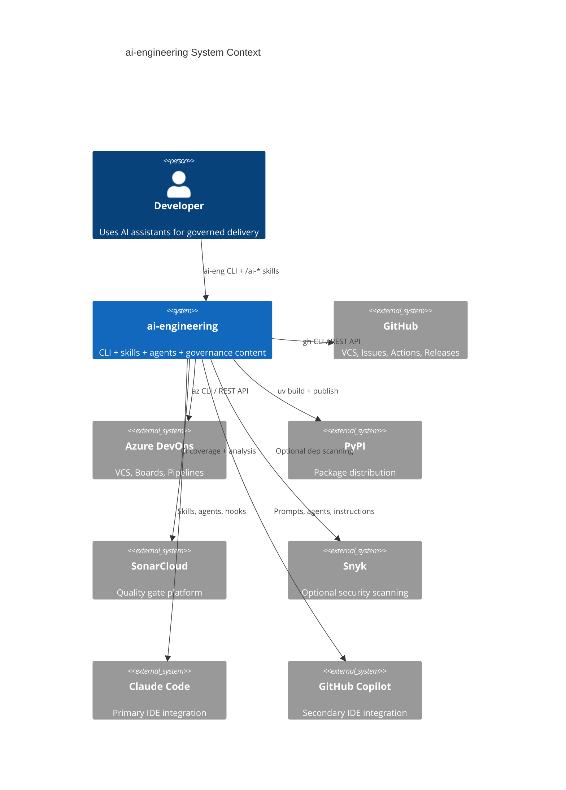

### 2.2 Code Module Map

135 Python files, 24,437 LOC across 22 modules.

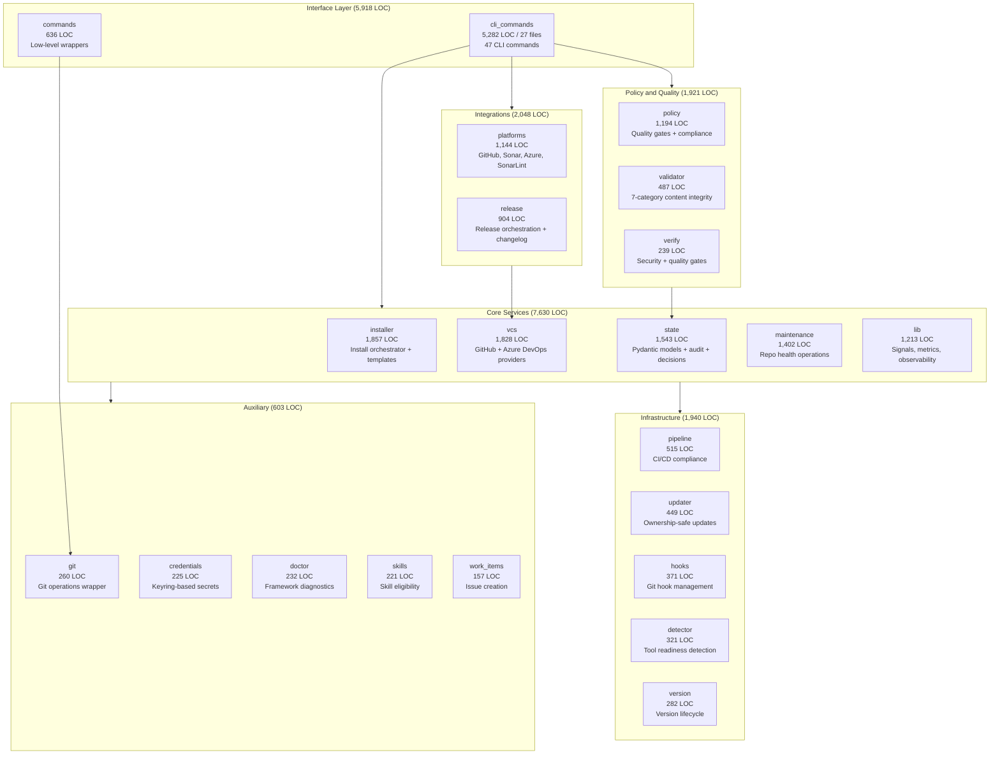

### 2.3 Runtime Dependencies (5)

| Dependency | Version constraint | Purpose |
|------------|-------------------|---------|
| typer | >= 0.12.0, < 1.0 | CLI framework |
| pyyaml | >= 6.0, < 7.0 | YAML parsing (manifest, skills) |
| pydantic | >= 2.0, < 3.0 | Data models, validation |
| keyring | >= 25.0, < 26.0 | OS-native credential storage |
| rich | >= 13.0, < 15.0 | Terminal formatting, tables |

### 2.4 Dev Dependencies (7)

| Dependency | Version constraint | Purpose |
|------------|-------------------|---------|
| pytest | >= 8.0, < 10.0 | Test runner |
| pytest-cov | >= 4.1, < 8.0 | Coverage reporting |
| pytest-xdist | >= 3.5, < 4.0 | Parallel test execution |
| ruff | >= 0.6.0 | Lint + format |
| ty | >= 0.0.1a1 | Type checking |
| pip-audit | >= 2.7.0 | Dependency vulnerability scanning |
| types-pyyaml | >= 6.0, < 7.0 | Type stubs for pyyaml |

### 2.5 Architecture Patterns

| Pattern | Implementation |
|---------|---------------|
| Service + CLI Separation | Pure service modules, no CLI imports in business logic |
| Protocol-Based Polymorphism | VCS providers via structural typing (`VcsProvider` protocol) |
| Ownership-Safe Updates | 4-tier boundaries: framework / team / project / system |
| Stack-Aware Gates | Policy checks filtered by installed stacks in manifest |
| Audit-First Observability | Append-only NDJSON event log, single source of truth |
| Fail-Open Design | Graceful degradation -- never block developer workflow |
| Factory Pattern | VCS provider resolution: manifest-first, remote-URL-fallback |

---

## 3. CLI Surface

47 commands organized into top-level commands and 16 groups.

### 3.1 CLI Command Tree

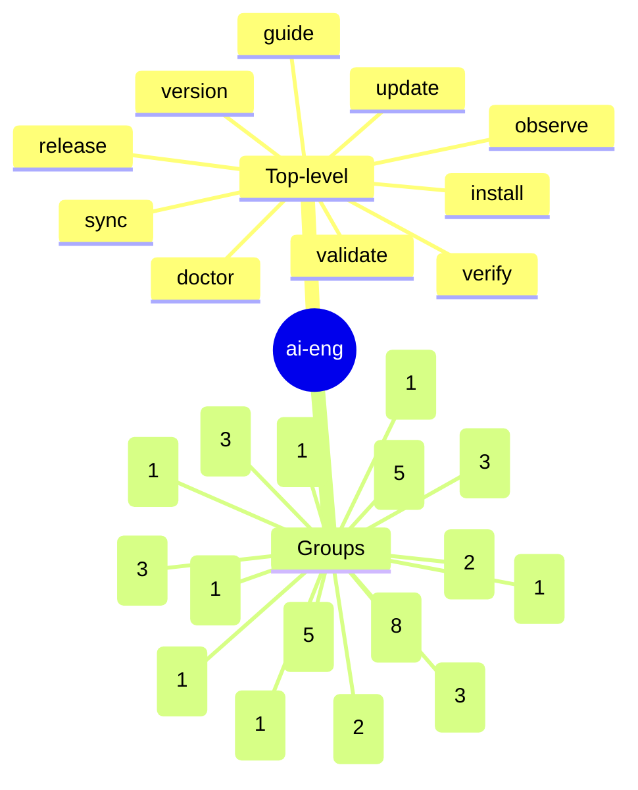

### 3.2 Key Commands

| Command | Purpose |
|---------|---------|
| `ai-eng install <path>` | Install framework into a project |
| `ai-eng update` | Ownership-safe update of framework files |
| `ai-eng doctor [--fix-tools\|--fix-hooks]` | Diagnose and repair framework health |
| `ai-eng validate [--json]` | Run 7-category content integrity validation |
| `ai-eng verify` | Execute security + quality gate checks |
| `ai-eng gate commit-msg <path>` | Validate commit message format |
| `ai-eng gate risk-check --strict` | Verify risk acceptances in decision-store |
| `ai-eng observe [engineer\|team\|ai\|dora\|health]` | Dashboard views |
| `ai-eng signals emit <event>` | Emit telemetry event to audit log |
| `ai-eng sync [--check]` | Synchronize IDE mirror surfaces |
| `ai-eng release <version>` | Orchestrate release (tag + changelog + PR) |

---

## 4. Governance Surface

### 4.1 IDE Mirror Architecture

Canonical source: `.claude/`. Mirrors generated by `scripts/sync_command_mirrors.py`.

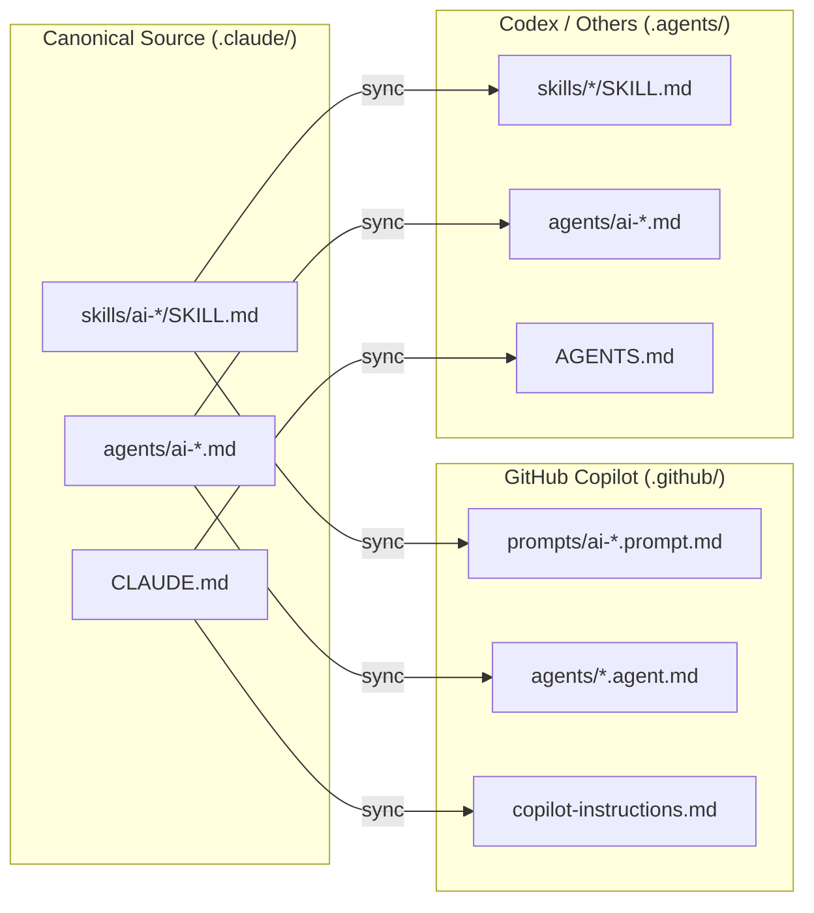

| Surface | Skills location | Agents location | Instruction file |
|---------|----------------|----------------|-----------------|
| `.claude/` | `skills/ai-*/SKILL.md` | `agents/ai-*.md` | `CLAUDE.md` |
| `.github/` | `prompts/ai-*.prompt.md` | `agents/*.agent.md` | `copilot-instructions.md` |
| `.agents/` | `skills/*/SKILL.md` | `agents/ai-*.md` | `AGENTS.md` |

### 4.2 Skills Registry (30)

| Type | Skills | Count |
|------|--------|-------|
| Workflow | brainstorm, plan, dispatch, test, debug, verify, review | 7 |
| Delivery | commit, pr, release, cleanup | 4 |
| Enterprise | security, governance, pipeline, schema, solution-intent | 5 |
| Teaching | explain, guide | 2 |
| Writing | write | 1 |
| SDLC | note, standup, sprint, postmortem, support, resolve-conflicts | 6 |
| Meta | create, learn, prompt, onboard, analyze-permissions | 5 |

#### Skills with Handlers (6 skills, 18 handlers)

| Skill | Handlers | Purpose |
|-------|----------|---------|
| ai-brainstorm | interrogate, spec-review | Design interrogation and spec critique |
| ai-create | create-skill, create-agent, validate | Framework authoring |
| ai-pipeline | generate, evolve, validate | CI/CD pipeline management |
| ai-review | find, learn, review | Code review with pattern learning |
| ai-solution-intent | init, sync, validate | This document lifecycle |
| ai-write | changelog, content, docs | Documentation generation |

### 4.3 Agents (8)

| Agent | Model | Color | Responsibility | Boundary |
|-------|-------|-------|---------------|----------|
| plan | opus | purple | Spec creation, architecture design | Plans but does NOT execute |
| build | opus | blue | Code implementation | ONLY agent with write permissions |
| verify | opus | green | Quality + security assessment | Read-only analysis |
| guard | sonnet | yellow | Governance advisory | Advisory, never blocking |
| review | opus | red | Parallel code review | Read-only, multi-perspective |
| explore | sonnet | cyan | Deep codebase research | Read-only exploration |
| guide | sonnet | cyan | Teaching and onboarding | Read-only, educational |
| simplify | sonnet | green | Code simplification | Proposes, build executes |

### 4.4 Ownership Model

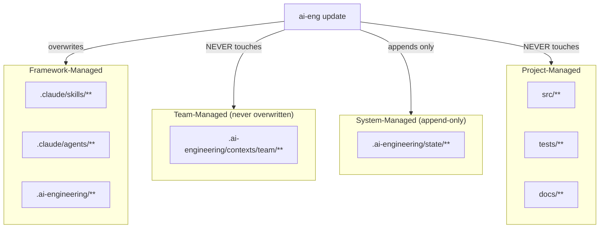

| Path pattern | Owner | Update policy |
|-------------|-------|---------------|
| `.claude/**`, `.agents/**`, `.github/prompts/**` | Framework | Allow (overwrite on update) |
| `.ai-engineering/contexts/team/**` | Team | Deny (never overwritten) |
| `.ai-engineering/state/**` | System | Append-only |
| `src/**`, `tests/**`, `docs/**` | Project | Framework never touches |

### 4.5 Contexts (26 files)

| Category | Count | Files |
|----------|-------|-------|
| Languages | 15 | python, rust, bash, csharp, dart, elixir, go, java, javascript, kotlin, php, ruby, sql, swift, typescript |
| Frameworks | 8 | django, react, nodejs, aspnetcore, flutter, android, ios, react-native |
| Team | 2 | README.md, lessons.md |
| Organization | 1 | README.md |

---

## 5. Quality Strategy

### 5.1 Quality Gates

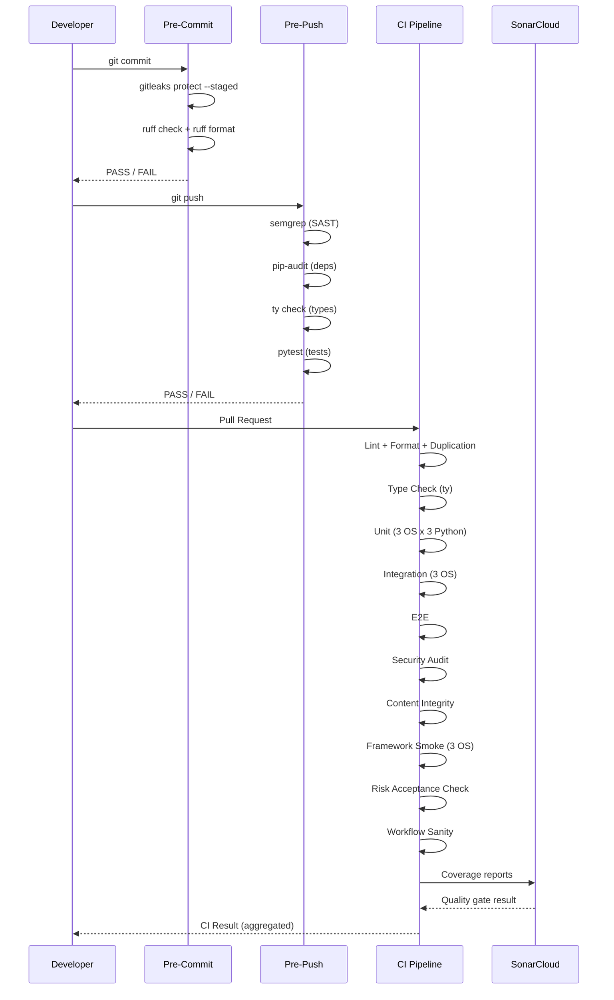

| Metric | Threshold | Enforcement point |
|--------|-----------|-------------------|
| Test coverage | >= 80% | SonarCloud quality gate |
| Code duplication | <= 3% | CI duplication check + SonarCloud |
| Cyclomatic complexity | <= 10 per function | SonarCloud |
| Cognitive complexity | <= 15 per function | SonarCloud |
| Blocker/critical issues | 0 | SonarCloud |
| Security findings (medium+) | 0 | CI security audit |
| Secret leaks | 0 | gitleaks (pre-commit + CI) |
| Dependency vulnerabilities | 0 | pip-audit (pre-push + CI) |

### 5.2 Tooling Matrix

| Tool | Hook | CI | Purpose |
|------|------|-----|---------|
| gitleaks | pre-commit | Security Audit job | Secret detection |
| ruff | pre-commit | Lint job | Lint + format (Python) |
| semgrep | pre-push | Security Audit job | SAST |
| pip-audit | pre-push | Security Audit job | Dependency vulnerabilities |
| ty | pre-push | Typecheck job | Type checking |
| pytest | pre-push | Unit/Integration/E2E jobs | Test execution |
| SonarCloud | -- | SonarCloud job | Quality gate platform |
| Snyk | -- | Snyk Security job (optional) | Additional security (DEC-009) |
| actionlint | -- | Workflow Sanity job | Workflow YAML validation |

### 5.3 Test Strategy

| Tier | Marker | CI matrix | Scope |
|------|--------|-----------|-------|
| Unit | `@pytest.mark.unit` | 3 OS x 3 Python (3.11, 3.12, 3.13) | Pure logic, no I/O, < 1s per test |
| Integration | `@pytest.mark.integration` | 3 OS x Python 3.12 | Local I/O (filesystem, git) |
| E2E | `@pytest.mark.e2e` | Ubuntu x Python 3.12 | Full flows (install, CLI, hooks) |
| Live | `@pytest.mark.live` | Manual (`AI_ENG_LIVE_TEST=1`) | External API tests |

106 test files. Coverage reported per tier and merged for SonarCloud.

Selective test execution: `ai_engineering.policy.test_scope` computes affected tests per PR diff, with full-suite fallback on main branch and test-config changes.

### 5.4 Validator (7-Category Content Integrity)

| Category | What it checks |
|----------|---------------|
| File Existence | All internal path references resolve |
| Mirror Sync | SHA-256 compare canonical vs template mirrors |
| Counter Accuracy | Skill/agent counts match across instruction files and manifest |
| Cross-Reference | Bidirectional reference validation |
| Instruction Consistency | All instruction files list identical skills/agents |
| Manifest Coherence | Ownership globs match filesystem, active spec valid |
| Skill Frontmatter | Required YAML metadata and requirement schema validity |

### 5.5 Hook Integrity

Git hooks are hash-verified. Modification is forbidden (enforced by DEC-008 and `.claude/settings.json` deny rules).

19 explicit deny rules in `.claude/settings.json` prevent:
- Destructive git operations (`push --force`, `reset --hard`, `checkout .`, `restore .`, `clean -f`)
- Hook bypass (`--no-verify` on any git command)
- Blanket file deletion (`rm -rf *`)

---

## 6. Security Posture

### 6.1 Defense in Depth

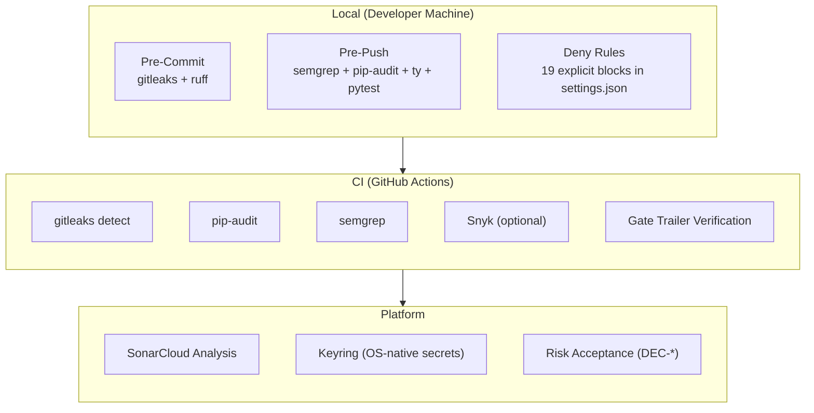

### 6.2 Authentication Flow

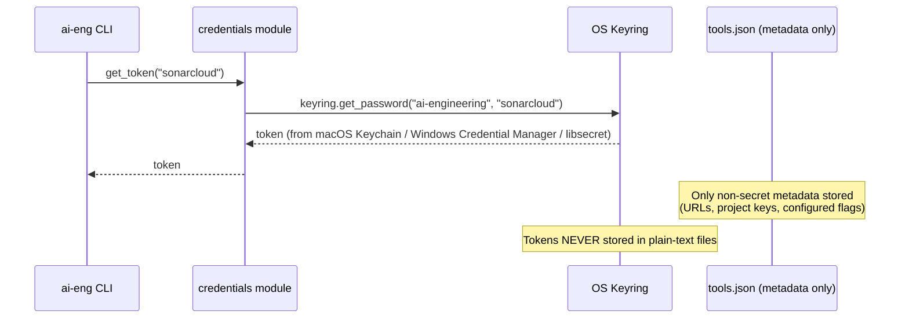

### 6.3 Security Controls

| Control | Mechanism | Decision |
|---------|-----------|----------|
| Secret scanning | gitleaks at pre-commit (`gitleaks protect --staged`) | DEC-011 |
| SAST | semgrep at pre-push and CI | -- |
| Dependency audit | pip-audit at pre-push and CI | -- |
| Credential storage | OS-native keyring (never committed) | -- |
| Suppression ban | No `# noqa`, `# nosec`, `# type: ignore` ever | DEC-008 |
| Hook integrity | Hash-verified, modification forbidden | -- |
| Automated actor exemption | Dependabot exempt from gate trailers (CI validates independently) | DEC-020 |
| Snyk | Optional (SNYK_TOKEN controls activation) | DEC-009 |

---

## 7. Delivery and Operations

### 7.1 Publication Flow

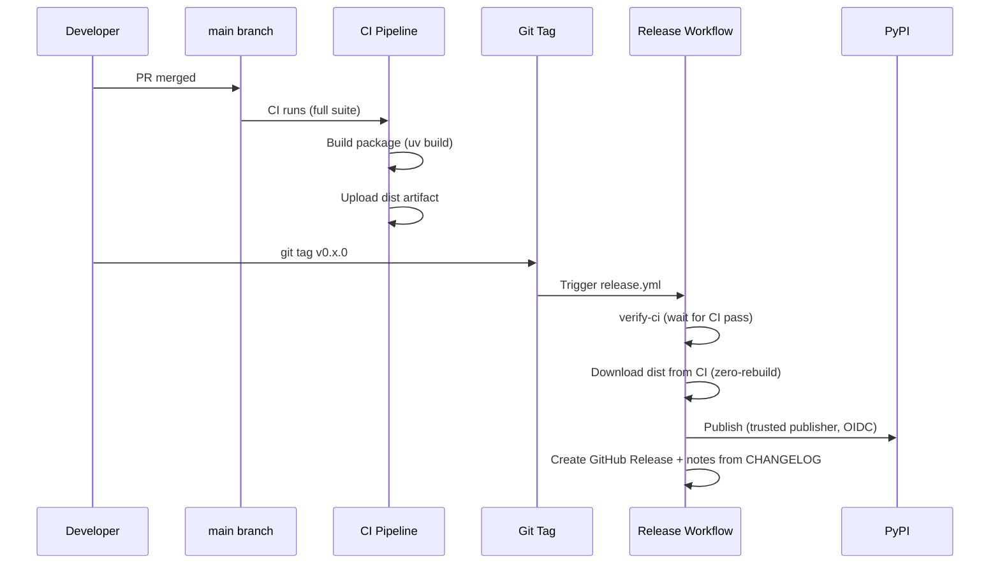

Key decision (DEC-012): Release downloads the pre-built wheel from CI instead of rebuilding. What was tested is what ships.

### 7.2 CI Pipeline Jobs (ci.yml)

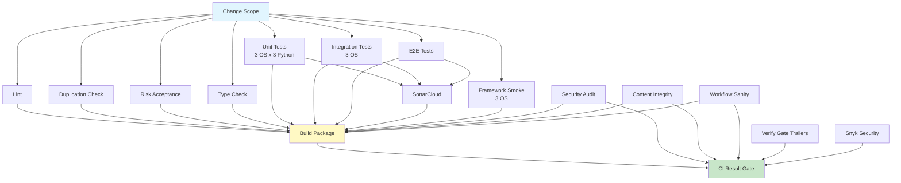

### 7.3 Workflows (18 total)

| Category | Workflows | Format |
|----------|-----------|--------|
| Core CI | ci.yml, install-smoke.yml, release.yml | GitHub Actions YAML |
| Agentic (gh-aw) | code-simplifier, daily-triage, governance-drift, perf-audit, security-scan, weekly-health | Markdown + YAML frontmatter |
| Event-driven | pr-review, ci-fixer | GitHub Actions YAML |
| Maintenance | maintenance.yml | GitHub Actions YAML |
| Lock files | 6 `.lock.yml` (placeholder stubs for gh-aw workflows) | GitHub Actions YAML |

Agentic workflows (DEC-022) use GitHub Copilot as engine -- zero API key required.

### 7.4 Runbooks (8)

| Runbook | Trigger |
|---------|---------|
| code-simplifier | Scheduled (gh-aw) |
| daily-triage | Scheduled (gh-aw) |
| dependency-upgrade | Manual / scheduled |
| governance-drift-repair | Scheduled (gh-aw) |
| incident-response | Manual (on-call) |
| perf-audit | Scheduled (gh-aw) |
| security-incident | Manual (on-call) |
| weekly-health | Scheduled (gh-aw) |

### 7.5 Observability

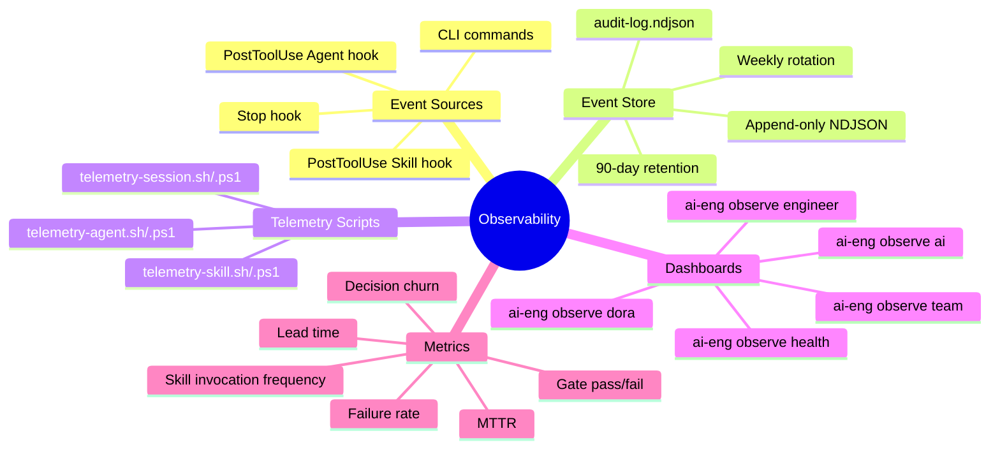

| Event | Hook trigger | Data captured |
|-------|-------------|---------------|
| `skill_invoked` | PostToolUse(Skill) | Skill name, actor, timestamp |
| `agent_dispatched` | PostToolUse(Agent) | Agent name, actor, timestamp |
| `session_end` | Stop | Session duration, commands executed |

Telemetry is strict-opt-in, default disabled (from manifest.yml).

Cross-IDE telemetry (DEC-013): all skills emit via `ai-eng signals emit <event>`, works in any IDE with shell access.

---

## 8. VCS Provider Architecture

### 8.1 Provider Resolution

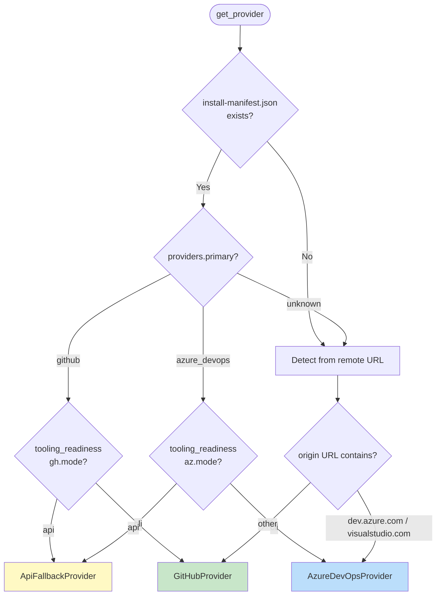

### 8.2 Provider Implementations

| Provider | Backend | Detection |
|----------|---------|-----------|
| GitHubProvider | `gh` CLI + REST fallback | Default, `github.com` in remote |
| AzureDevOpsProvider | `az repos` CLI | `dev.azure.com` or `visualstudio.com` in remote |
| ApiFallbackProvider | Generic REST | When CLI mode is `api` in install manifest |

---

## 9. Decision Log (Active)

20 active decisions in `.ai-engineering/state/decision-store.json` (schema v1.1).

| ID | Title | Category | Criticality |
|----|-------|----------|-------------|
| DEC-001 | Flat skill layout with `ai-` namespace | architecture | high |
| DEC-003 | Plan/Execute split with Spec-as-Gate | governance | high |
| DEC-004 | Flat main with feature branches (no phase branching) | governance | medium |
| DEC-005 | Multi-IDE governance via single-source generation | architecture | medium |
| DEC-006 | SonarCloud as primary quality gate platform | tooling | high |
| DEC-007 | Single event store (audit-log.ndjson) | architecture | high |
| DEC-008 | No-suppression rule (never bypass static analysis) | governance | high |
| DEC-009 | Snyk as optional (not required for CI) | tooling | low |
| DEC-010 | Dual VCS provider support (GitHub + Azure DevOps) | architecture | medium |
| DEC-011 | Gitleaks at pre-commit, not pre-push | security | high |
| DEC-012 | Release zero-rebuild (download CI artifacts) | delivery | medium |
| DEC-013 | Cross-IDE telemetry via `ai-eng signals emit` | architecture | medium |
| DEC-014 | Lean stack standards (max 1 page per stack) | governance | low |
| DEC-015 | Conventional commits with `spec-NNN` prefix | delivery | medium |
| DEC-016 | Slim root instructions (deduplicate CLAUDE.md/AGENTS.md) | governance | medium |
| DEC-017 | Checkpoint schema unification with namespaced sections | architecture | medium |
| DEC-018 | PR skill decomposition (extract shared pipeline) | architecture | medium |
| DEC-019 | 8-agent architecture with SRP boundaries | architecture | high |
| DEC-020 | Exempt automated actors from gate trailer verification | governance | medium |
| DEC-021 | Skill invocation uses hyphen prefix (`ai-`) not colon (`ai:`) | architecture | medium |
| DEC-022 | Scheduled runbooks migrated to GitHub Agentic Workflows | delivery | medium |

Decisions have expiry dates (1 year from creation) and criticality-based prioritization. Superseded decisions (e.g., DEC-002 superseded by DEC-019) are preserved for audit trail.

---

## 10. Specs and Evolution

### 10.1 Spec Lifecycle

~53 total specs: 15 active (041-055), 38 archived (001-040).

Current active: **spec-055 -- Radical Simplification**. Redesign based on patterns from reference repos.

| Dimension | Before | After |
|-----------|--------|-------|
| Skills | 37 | 30 |
| Standards | 65 files | 0 (replaced by contexts/) |
| Contracts | 2 | 0 (replaced by solution-intent) |
| State files | 6 | 2 (decision-store + audit-log) |
| Agents | 10 | 8 |

### 10.2 Recovery Sequence

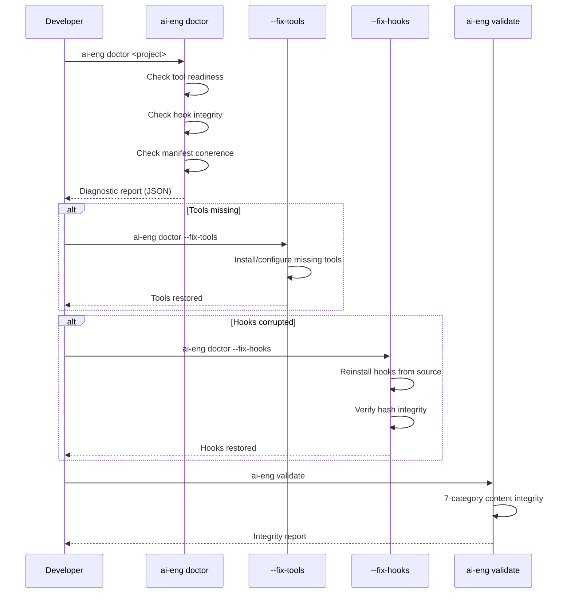

---

## 11. TBD Items

The following items require verification or team definition before they can be documented as facts.

| Item | Status | Action needed |
|------|--------|--------------|
| Cross-OS CI matrix results | **TBD -- pending verification** | Run CI and verify all 3 OS x 3 Python pass |
| SonarCloud current findings count | **TBD -- pending measurement** | Check SonarCloud dashboard for current state |
| Current test coverage percentage | **TBD -- pending measurement** | Run `pytest --cov` and record actual value |
| Performance SLOs for gate execution | **TBD -- pending team definition** | Historical target: < 10s pre-commit, < 60s pre-push |
| Active epics and their current status | **TBD -- pending team definition** | Map spec backlog to strategic themes |
| Specific KPI current values | **TBD -- pending measurement** | Run `ai-eng observe` dashboards and capture baselines |

---

## Source of Truth

| What | Where |
|------|-------|
| Skills (31) | `.claude/skills/ai-<name>/SKILL.md` |
| Agents (8) | `.claude/agents/ai-<name>.md` |
| Config | `.ai-engineering/manifest.yml` |
| Decisions (20+) | `.ai-engineering/state/decision-store.json` |
| Audit events | `.ai-engineering/state/audit-log.ndjson` |
| Active spec | `.ai-engineering/specs/_active.md` |
| Contexts (26) | `.ai-engineering/contexts/{languages,frameworks,team,orgs}/` |
| Runbooks (8) | `.ai-engineering/runbooks/` |
| CLI source | `src/ai_engineering/` |
| Tests (106 files) | `tests/{unit,integration,e2e}/` |
| This document | `docs/solution-intent.md` |
