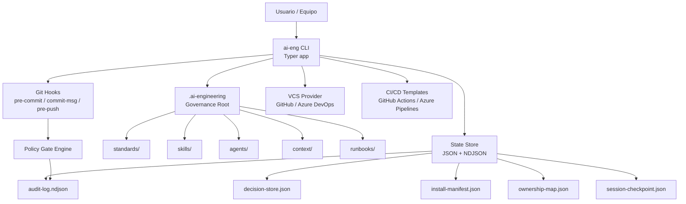
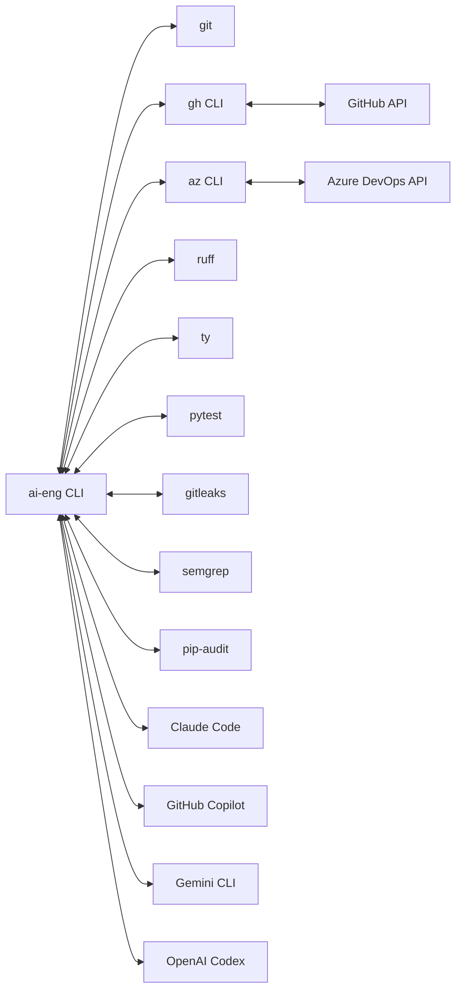
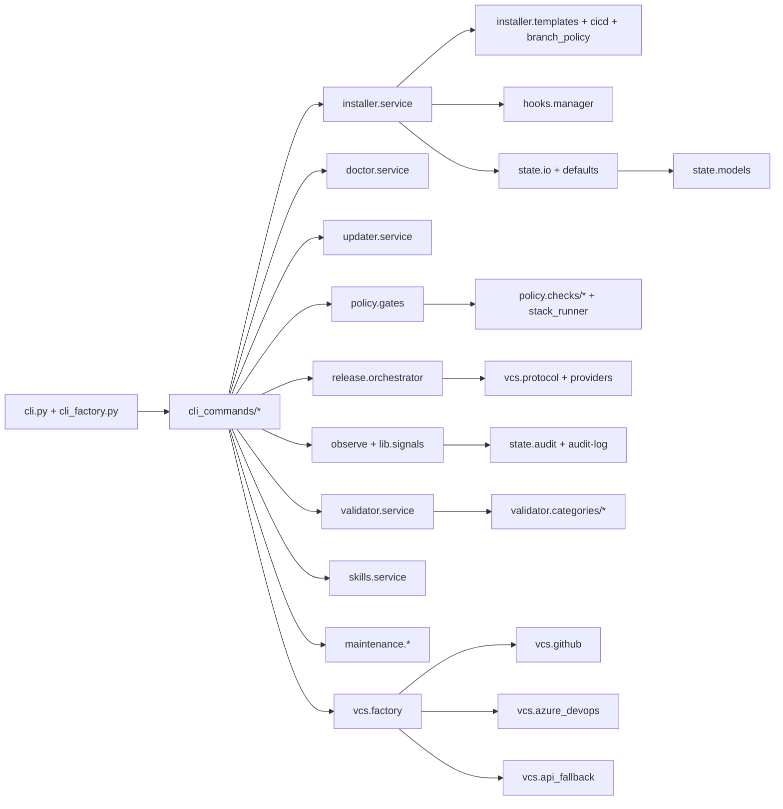
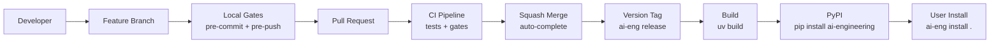
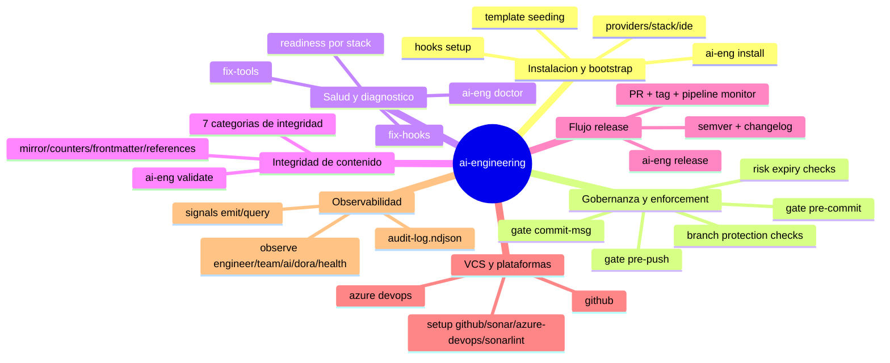
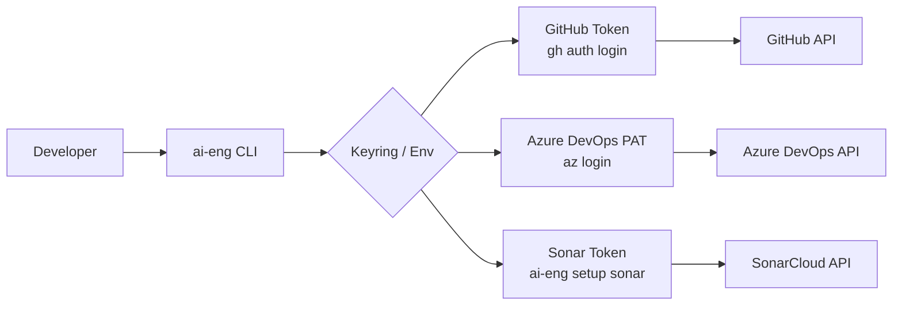
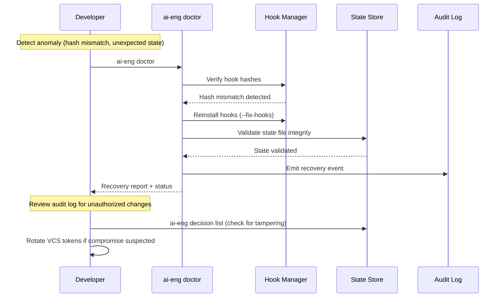
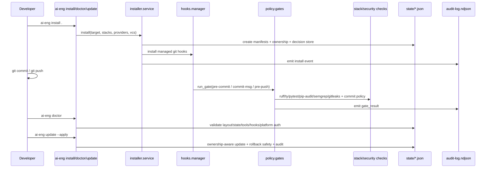

# Product Contract -- ai-engineering

> Status: Evolving
> Last Review: 2026-03-06

## 1. Introduction

### 1.1 Identity

| Field | Value |
|-------|-------|
| Name | ai-engineering |
| Org/Repo | `arcasilesgroup/ai-engineering` |
| Version | 0.2.0 (next: 0.3.0) |
| Status | Active development -- Phase 3 (Architecture v3) |
| Model | Content-first, AI-governed |
| License | MIT |

### 1.2 Objective

Provide an open-source governance framework that turns any repository into a governed AI workspace with mandatory local enforcement, observability, and DevSecOps -- enforced through git hooks so problems are caught before code leaves the developer's machine.

### 1.3 Problem Statement

AI-assisted development lacks governance guardrails. Without local enforcement, code quality, security scanning, and risk management are deferred to CI/CD pipelines (or skipped entirely). Teams lack visibility into AI agent behavior, decision persistence across sessions, and auditability of governance events. No framework exists that works across Claude Code, GitHub Copilot, Gemini CLI, and OpenAI Codex with the same governance layer.

### 1.4 Desired Outcomes

- Every commit and push is governed by quality and security gates locally.
- AI agents operate within defined behavioral contracts with explicit boundaries.
- Decisions persist across sessions with SHA-256 context hashing -- no repeated questions.
- Governance is content (Markdown/YAML/JSON), not platform-specific code.
- Framework updates never overwrite team or project customizations.
- Zero medium+ security findings before any release.

### 1.5 Scope

**In scope:**

- Local governance enforcement via git hooks (pre-commit, commit-msg, pre-push).
- CLI lifecycle: install, update, doctor, validate, release.
- Multi-provider AI integration (Claude Code, GitHub Copilot, Gemini CLI, OpenAI Codex).
- Multi-VCS support (GitHub, Azure DevOps).
- Stack-aware enforcement (21 stacks: Python, .NET, TypeScript, Rust, Java/Kotlin, Swift, Ruby, PHP, C/C++, React, Next.js, NestJS, Node, React Native, Astro, Azure, Infrastructure, Database, Bash/PowerShell, Helm, Ansible).
- Observability dashboards (engineer, team, AI, DORA, health).
- Spec-driven delivery model with session recovery.

**Out of scope:**

- Cloud-hosted governance platform or SaaS.
- Runtime monitoring or APM integration.
- Language-specific SDKs or libraries.
- AI model training or fine-tuning.

### 1.6 Stakeholders and Personas

| Persona | Journey | Primary Actions |
|---------|---------|-----------------|
| Solo Developer | Install framework, configure stack, commit governed code | `ai-eng install`, `git commit`, `ai-eng doctor` |
| Team Lead | Set team standards, review PRs, monitor quality | `standards/team/`, `/ai-verify`, `/ai-observe` |
| DevSecOps Engineer | Enforce security gates, manage risk acceptances | `ai-eng gate`, `/ai-security`, `/ai-risk` |
| Framework Maintainer | Evolve skills/agents, release updates, maintain templates | `/ai-create`, `/ai-release`, `ai-eng update` |
| AI Agent (automated) | Read governance content, execute skills, report findings | Skills, agents, state files |

## 2. Requirements (Solution Intent)

### 2.1 High-Level Solution Architecture

### 2.2 Functional Requirements by Domain

| Domain | Requirement | Priority | Status |
|--------|------------|----------|--------|
| **Installation/Bootstrap** | One-command install with stack/IDE/provider detection | P0 | Done |
| Installation/Bootstrap | Guided wizard for empty repos | P1 | Done |
| Installation/Bootstrap | First-commit readiness after install | P0 | Done |
| **Governance/Enforcement** | Non-bypassable git hooks (pre-commit, commit-msg, pre-push) | P0 | Done |
| Governance/Enforcement | Stack-aware checks (ruff, gitleaks, semgrep, pip-audit, ty) | P0 | Done |
| Governance/Enforcement | Branch protection policy enforcement | P0 | Done |
| Governance/Enforcement | Risk acceptance lifecycle with severity-based expiry | P0 | Done |
| **Health/Diagnostics** | `ai-eng doctor` with auto-fix for hooks and tools | P0 | Done |
| Health/Diagnostics | Readiness checks per stack | P1 | Done |
| **Content Integrity** | 7-category validation (file-existence, mirror-sync, counter-accuracy, cross-reference, instruction-consistency, manifest-coherence, skill-frontmatter) | P0 | Done |
| **Release** | SemVer release with changelog, PR, tag, pipeline monitor | P0 | Done |
| Release | Governed PR workflow with auto-complete squash merge | P0 | Done |
| **VCS/Platforms** | GitHub and Azure DevOps provider detection and auth | P0 | Done |
| VCS/Platforms | Platform setup commands (github, sonar, azure-devops, sonarlint) | P1 | Done |
| **Observability** | Signal emit/query event store | P0 | Done |
| Observability | 5-mode dashboards (engineer, team, AI, DORA, health) | P0 | Done |
| Observability | Audit log with weekly rotation and 90-day retention | P0 | Done |
| **Knowledge Ops** | Spec lifecycle (verify, catalog, list, compact) | P0 | Done |
| Knowledge Ops | Decision store with context hashing and reprompt conditions | P0 | Done |
| Knowledge Ops | Session checkpoint save/load for recovery | P0 | Done |
| **AI Ecosystem** | 38 procedural skills in flat organization | P0 | Active |
| AI Ecosystem | 8 role-based agents with behavioral contracts | P0 | Active |
| AI Ecosystem | Multi-provider adapters (Claude Code, Copilot, Gemini, Codex) | P0 | Done |
| AI Ecosystem | Governed parallel execution with phase gates | P1 | Active |

#### Skills (34)

Path: `.ai-engineering/skills/<name>/SKILL.md` (flat organization, no category subdirectories)

| Domain | Skills |
|--------|--------|
| Planning | discover, plan, contract, spec, cleanup, explain |
| Build | code, test, debug, refactor, simplify, api, schema, pipeline, infra, migrate |
| Verify | security, quality, governance, architecture, performance, accessibility, gap |
| Ship | commit, pr, release, changelog, triage |
| Write | document |
| Observe | dashboard, evolve |
| Guard | guard |
| Guide | onboard |
| Execute | dispatch |
| Operate | ops |
| Governance | risk, standards, lifecycle |

> Note: `cli` skill absorbed into `code`. `guide` is agent-only (no canonical SKILL.md).

Slash commands: `/ai-<name>` for all skills and agents.

#### Agents (8)

Path: `.ai-engineering/agents/<name>.md`

| Agent | Purpose | Scope |
|-------|---------|-------|
| plan | Planning pipeline, spec creation -- STOPS before execution | read-write |
| guard | Proactive governance advisory during development | read-only + decision-store |
| build | Implementation across 20 stacks (ONLY code write agent) | read-write |
| verify | 7-mode assessment: governance, security, quality, perf, accessibility, architecture, gap | read-write (work items) |
| guide | Developer growth: teach, onboard, explain, tour | read-only |
| operate | SRE: runbook execution, incident response, operational health | read-write (issues only) |
| explorer | Context gatherer: codebase navigation, dependency mapping, architecture discovery | read-only |
| simplifier | Background code cleaner: reduce complexity, guard clauses, early returns, dead code removal | read-write |

#### Python CLI (`ai-eng`)

Deterministic tasks run locally without AI tokens:

| Command | What |
|---------|------|
| `ai-eng observe [mode]` | Dashboards: engineer, team, ai, dora, health |
| `ai-eng gate pre-commit\|pre-push\|all` | Run quality gate checks |
| `ai-eng signals emit\|query` | Event store operations |
| `ai-eng checkpoint save\|load` | Session recovery |
| `ai-eng decision list\|expire-check` | Decision store management |
| `ai-eng validate` | Content integrity validation |
| `ai-eng stack add\|remove\|list` | Stack management |
| `ai-eng ide add\|remove\|list` | IDE configuration |
| `ai-eng provider add\|remove\|list` | Provider management |
| `ai-eng skill status` | Skill eligibility diagnostics |
| `ai-eng maintenance report\|pr\|all` | Repo hygiene + maintenance |
| `ai-eng vcs status\|set-primary` | VCS operations |
| `ai-eng review pr` | PR review |
| `ai-eng cicd regenerate` | CI/CD workflow generation |
| `ai-eng setup platforms\|github\|sonar` | Platform setup |
| `ai-eng scan-report format` | Format scan findings → markdown |
| `ai-eng metrics collect` | Collect signals → dashboard data |
| `ai-eng release` | Release management |
| `ai-eng install\|update\|doctor` | Installation + diagnostics |

### 2.3 Non-Functional Requirements

| Category | Requirement | Threshold | Measurement |
|----------|------------|-----------|-------------|
| Reliability | Quality gate pass rate | 100% | `ai-eng gate all` pass/fail |
| Reliability | Hook installation success on clean install | 100% | `ai-eng doctor` report |
| Performance | Pre-commit gate execution | < 10s | Wall clock per commit |
| Performance | Pre-push gate execution | < 60s | Wall clock per push |
| Performance | Token deferred to local CLI | >= 95% | Framework overhead audit |
| Maintainability | Test coverage | >= 80% | `pytest --cov` |
| Maintainability | Code duplication | <= 3% | Sonar / manual audit |
| Maintainability | Cyclomatic complexity | <= 10 per function | `ruff` rules |
| Maintainability | Cognitive complexity | <= 15 per function | `ruff` rules |
| Portability | Cross-OS support | Windows + macOS + Linux | CI matrix 3x3 |
| Portability | Python version | 3.11+ | `pyproject.toml` constraint |
| Observability | Audit trail coverage | 100% governance events | `audit-log.ndjson` analysis |

### 2.4 Integrations

| System A | System B | Protocol | Contract | SLA |
|----------|----------|----------|----------|-----|
| ai-eng CLI | git | Shell subprocess | Hook scripts (hash-verified) | Sync, local |
| ai-eng CLI | gh | Shell subprocess | `gh pr`, `gh auth`, `gh api` | Sync, requires auth |
| ai-eng CLI | az | Shell subprocess | `az repos pr`, `az account` | Sync, requires PAT |
| ai-eng CLI | ruff | Shell subprocess | `ruff check`, `ruff format` | Sync, local |
| ai-eng CLI | gitleaks | Shell subprocess | `gitleaks protect --staged` | Sync, local |
| ai-eng CLI | semgrep | Shell subprocess | `semgrep scan --config auto` | Sync, local |
| ai-eng CLI | pip-audit | Shell subprocess | `pip-audit` | Sync, local |
| ai-eng CLI | AI Providers | File-based (Markdown) | Skills, agents, slash commands | Async, session-scoped |
| State store | Decision store | JSON file I/O | `decision-store.json` schema | Sync, local |
| State store | Audit log | NDJSON append | `audit-log.ndjson` schema | Sync, append-only |

## 3. Technical Design

### 3.1 Stack and Architecture

| Layer | Component | Technology |
|-------|-----------|------------|
| CLI | Entry point + factory + commands | Python 3.11+, Typer, Rich |
| Installer | Template seeding, hooks, state bootstrap | PyYAML, Pydantic |
| Policy | Gate engine, stack-specific checks | subprocess (ruff, gitleaks, semgrep, pip-audit, ty, pytest) |
| State | Models, I/O, defaults, audit | Pydantic, JSON, NDJSON |
| VCS | Provider factory, GitHub, Azure DevOps | gh CLI, az CLI, keyring |
| Release | Orchestrator, changelog, PR | VCS providers, SemVer |
| Observe | Signals, dashboards, metrics | audit-log.ndjson, Rich tables |
| Validator | 7-category integrity checks | File-based, content hashing |
| Maintenance | Health reports, branch cleanup, spec reset | git, VCS APIs |

### 3.2 Environments

| Environment | Purpose | Variables | Secrets | Network |
|-------------|---------|-----------|---------|---------|
| Local dev | Primary -- all enforcement happens here | `AI_ENG_ROOT`, stack config | VCS tokens via keyring/env | Local only (no outbound required) |
| CI (GitHub Actions) | Validate governance post-push | Matrix: OS x Python x Stack | `GITHUB_TOKEN`, `SONAR_TOKEN` | GitHub API |
| CI (Azure Pipelines) | Validate governance post-push | Pipeline variables | `AZ_PAT`, `SONAR_TOKEN` | Azure DevOps API |
| PyPI (release) | Package distribution | `TWINE_USERNAME` | `TWINE_PASSWORD` / trusted publisher | PyPI API |

### 3.3 API and Gateway Policies

| Surface | Auth | Rate Limit | Versioning |
|---------|------|------------|------------|
| CLI (`ai-eng`) | None (local-first) | N/A | SemVer via `pyproject.toml` |
| VCS CLI (gh/az) | Token-based (keyring/env) | Provider limits | Provider API versions |
| AI Providers | Session-scoped (provider auth) | Provider limits | Skill schema versioning |

> ai-engineering is local-first. No public API is exposed. All interactions are CLI-to-subprocess or file-based.

### 3.4 Publication and Deployment

| Artifact | Method | Target | Trigger |
|----------|--------|--------|---------|
| Python package | `uv build` + `twine upload` | PyPI (`ai-engineering`) | `ai-eng release <version>` |
| Git tag | `git tag v<version>` | GitHub/Azure DevOps | Release command |
| CI workflows | Template generation | `.github/workflows/` | `ai-eng cicd regenerate` |
| Governance root | `ai-eng install .` | Target repo `.ai-engineering/` | User command |

## 4. Observability Plan

### 4.1 What We Measure

### 4.2 SLIs / SLOs / Alerts

| Signal | SLI | SLO | Alert Threshold | Action |
|--------|-----|-----|-----------------|--------|
| Gate pass rate | % of gate executions passing | 100% | < 95% sustained | Review failing checks, update stack rules |
| Install success | % of `ai-eng install` completing | 100% | Any failure | `ai-eng doctor --fix-hooks --fix-tools` |
| Security findings | Count of medium+ findings | 0 | > 0 | Block release, remediate |
| Test coverage | Line coverage % | >= 80% | < 78% | Add tests before next PR |
| Risk expiry | Days until nearest expiry | > 7 days | <= 3 days | Remediate or renew risk acceptance |
| Token efficiency | % of deterministic ops local | >= 95% | < 90% | Move ops to CLI |

### 4.3 Logging and Reporting

| Log Type | Format | Retention | Location |
|----------|--------|-----------|----------|
| Audit log | NDJSON (append-only) | 90 days, weekly rotation | `state/audit-log.ndjson` |
| Audit archive | NDJSON | 90 days | `state/audit-archive/audit-YYYY-WW.ndjson` |
| Gate results | Structured events in audit log | 90 days | `state/audit-log.ndjson` |
| Session checkpoints | JSON | Current session | `state/session-checkpoint.json` |
| Observe dashboards | Rich terminal output | Transient | stdout via `ai-eng observe` |
| Decision store | JSON with SHA-256 hashes | Indefinite | `state/decision-store.json` |

### 4.4 Runbooks

| Alert/Condition | Runbook | Owner | Auto/Manual |
|-----------------|---------|-------|-------------|
| Gate failure (pre-commit) | `runbooks/gate-failure.md` | Developer | Manual (fix + retry) |
| Gate failure (pre-push) | `runbooks/gate-failure.md` | Developer | Manual (fix + retry) |
| Security finding medium+ | `runbooks/security-remediation.md` | DevSecOps | Manual (remediate or risk-accept) |
| Hook hash mismatch | `runbooks/hook-integrity.md` | Developer | Auto (`ai-eng doctor --fix-hooks`) |
| Missing tool | `runbooks/tool-install.md` | Developer | Auto (`ai-eng doctor --fix-tools`) |
| Risk acceptance expiring | `runbooks/risk-expiry.md` | Team Lead | Manual (renew or remediate) |
| CI pipeline failure | `runbooks/incident-response.md` | Developer | Semi-auto (runbook-guided) |
| Spec staleness | `runbooks/spec-hygiene.md` | Plan agent | Auto (`maintenance spec-reset`) |

## 5. Security

### 5.1 Authentication and Authorization

| Provider | Auth Method | Token Scope | Storage |
|----------|------------|-------------|---------|
| GitHub | `gh auth login` (OAuth/PAT) | `repo`, `read:org`, `workflow` | `gh` credential store / keyring |
| Azure DevOps | `az login` + PAT | Code (Read/Write), PR (Read/Write) | keyring / env `AZURE_DEVOPS_PAT` |
| SonarCloud | API token | Analysis + quality gate | keyring / env `SONAR_TOKEN` |
| PyPI | Trusted publisher / token | Package upload | env `TWINE_PASSWORD` |

### 5.2 Exposure Model

| Surface | Visibility | Data Classification | Controls |
|---------|-----------|-------------------|----------|
| CLI binary | Local only | N/A | OS permissions |
| Governance root (`.ai-engineering/`) | Repo-scoped | Internal (standards, skills, state) | Git access controls |
| State files (JSON/NDJSON) | Repo-scoped | Internal (decisions, audit trail) | `.gitignore` for sensitive state |
| VCS tokens | Local only | Secret | Keyring, never committed |
| Audit log | Repo-scoped | Internal (no secrets) | Append-only, rotated |

> ai-engineering is local-first. No public surfaces are exposed. Secrets never leave the local machine. VCS tokens are stored in the OS keyring or environment variables, never in files committed to the repository.

### 5.3 Compromised Process Recovery

### 5.4 Hardening Checklist

| Check | Tool | Gate | Status |
|-------|------|------|--------|
| Secret detection | gitleaks | pre-commit | Active |
| SAST/OWASP scanning | semgrep | pre-push | Active (7 findings: 1E+6W) |
| Dependency vulnerabilities | pip-audit | pre-push | Active |
| Hook integrity (hash verification) | ai-eng doctor | on-demand | Active |
| Commit message policy | commit-msg hook | commit-msg | Active |
| Branch protection | pre-push hook | pre-push | Active |
| Risk acceptance expiry | ai-eng gate risk-check | pre-push | Active |
| Type checking | ty | pre-push | Active |
| Cross-OS enforcement | CI matrix | CI | Stabilizing |

## 6. Quality

### 6.1 Quality Gates

| Gate | Checks | Stage | Threshold |
|------|--------|-------|-----------|
| pre-commit | `ruff format`, `ruff check`, `gitleaks protect --staged` | Every commit | Zero lint issues, zero secrets |
| commit-msg | Commit message format, trailer policy | Every commit | Policy-compliant format |
| pre-push | `semgrep`, `pip-audit`, `pytest`, `ty check` | Every push | Zero medium+, zero vulns, tests pass, types pass |
| risk-check | Risk acceptance status | pre-push (optional strict) | No expired acceptances |
| CI | Full matrix (OS x Python x Stack) | Post-push | All checks pass |

### 6.2 Architecture Patterns

| Pattern | Where Applied | Why |
|---------|--------------|-----|
| Content-first governance | `.ai-engineering/` root | Human-readable, AI-readable, version-controlled |
| Ownership boundaries | framework/team/project/system | Safe updates without overwriting customizations |
| Provider-agnostic skills | `skills/` + multi-provider adapters | Same governance across Claude, Copilot, Gemini, Codex |
| Event sourcing (append-only) | `audit-log.ndjson` | Full audit trail, no data loss |
| Decision persistence | `decision-store.json` + SHA-256 | No repeated questions across sessions |
| Spec-driven delivery | `specs/` lifecycle | Traceable work with session recovery |
| Dry-run by default | `ai-eng update` | Safe preview before write |

### 6.3 Testing Strategy

| Level | Tool | Coverage Target | Current |
|-------|------|----------------|---------|
| Unit tests | pytest | 90% | 91% |
| Type checking | ty | Zero errors | 84 diagnostics (non-blocking) |
| Linting | ruff | Zero issues | Zero |
| SAST | semgrep | Zero medium+ | 7 (1E+6W) |
| Integration | pytest + subprocess | Key CLI commands | Partial |
| E2E | Manual + CI matrix | Cross-OS green | Stabilizing |

### 6.4 Scalability Plan

| Dimension | Current | Target | Strategy |
|-----------|---------|--------|----------|
| Skills | 38 | 50+ | Flat organization, remote skill sources |
| Stacks | 3 (Python, .NET, Next.js) | 14+ | Stack-aware enforcement, pluggable checks |
| Agents | 8 | 15+ | Capability-task matching, parallel execution |
| Repos governed | 1 (dogfooding) | N | PyPI distribution, `ai-eng install .` |
| AI providers | 4 | N | File-based adapters, no provider-specific code |

## 7. Next Objectives

### 7.1 Roadmap

| Phase | Description | Status |
|-------|------------|--------|
| Phase 1 -- MVP | Core governance, hooks, CLI, state | Delivered |
| Phase 2 -- Dogfooding | Signature enforcement, IDE adapters, SAST remediation to zero medium+ | Delivered |
| Phase 3 -- Architecture v3 | 8 agents, 38 skills, guard/guide/operate/explorer/simplifier agents, skill domain restructure, parallel orchestration | In Progress |
| Phase 4 -- Release Readiness | Docs site (Nextra), PyPI stable release, remote skill sources | Planned |

**Blockers**: Architecture v3 restructure must complete before 0.3.0 release.

### 7.2 Active Epics / Features

| Epic | Description | Priority | Status | Target |
|------|------------|----------|--------|--------|
| SAST Remediation | Remediate 7 semgrep findings (1 ERROR + 6 WARNING) | P0 | In Progress | 0.2.0 |
| Cross-OS CI | Stabilize CI matrix (Windows + macOS + Linux) | P1 | In Progress | 0.2.0 |
| Product Contract | Redesign product-contract.md as Solution Intent | P1 | In Progress | 0.2.0 |
| Work Item Sync | Bidirectional sync with GitHub Projects / Azure Boards | P1 | In Progress | 0.2.0 |
| OSS Doc Gates | Documentation gate enforcement in governed workflows | P1 | Done | 0.2.0 |

### 7.3 KPIs

| Metric | Target | Current |
|--------|--------|---------|
| Quality gate pass rate | 100% | 100% |
| Security scan (zero medium+) | 0 | 7 semgrep (1E+6W) |
| Tamper resistance | 100/100 | 85/100 |
| Test coverage | 80% | 91% |
| Cross-OS CI matrix | 3x3 green | Stabilizing |
| Token efficiency | >= 95% deferred | 99.19% |
| Skills count | 38 | 38 |
| Agents count | 8 | 8 |

### 7.4 Active Spec

Read: `context/specs/_active.md`.
Verify: `ai-eng spec list`.
Catalog: `context/specs/_catalog.md`.

### 7.5 Blockers and Risks

| ID | Description | Severity | Owner | Expiry |
|----|------------|----------|-------|--------|
| RISK-001 | 7 semgrep findings blocking 0.2.0 release | High | DevSecOps | 30 days |
| RISK-002 | `ty check` reports 84 diagnostics (non-blocking but technical debt) | Medium | Build | 60 days |
| RISK-003 | Cross-OS CI matrix not fully green | Medium | Build | 60 days |
| RISK-004 | Architecture v3 restructure: 2 new agents (explorer, simplifier) need behavioral contracts and testing | Medium | Build | 60 days |
| RISK-005 | Skill consolidation (40 to 38) and agent reduction (10 to 8) may break existing slash command references in user workflows | Medium | Build | 30 days |
