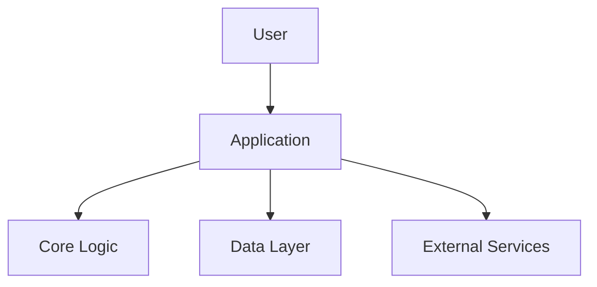
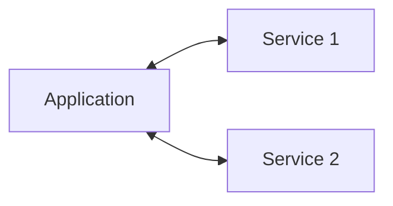
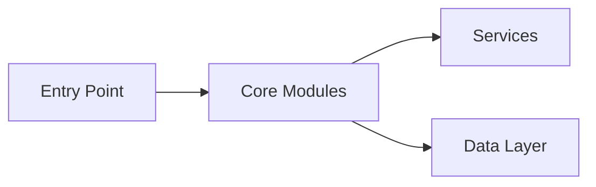
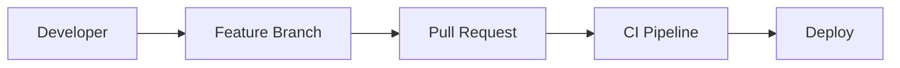
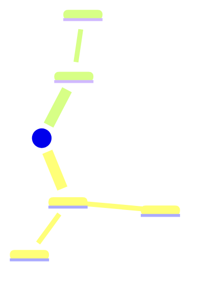
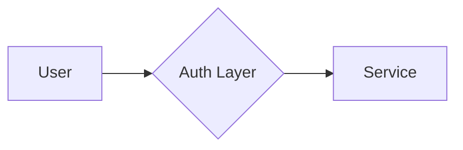
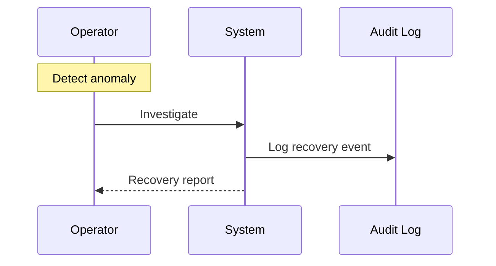
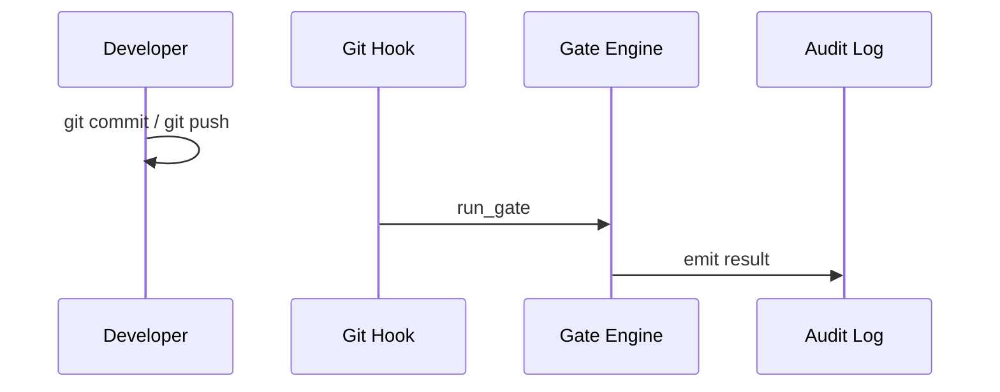

# Product Contract -- <project-name>

> Status: <Draft | Evolving | Stable>
> Last Review: <YYYY-MM-DD>

## 1. Introduction

### 1.1 Identity

| Field | Value |
|-------|-------|
| Name | <project-name> |
| Org/Repo | `<org>/<repo>` |
| Version | <version> (next: <next-version>) |
| Status | <Active development | Maintenance | Pre-release> |
| Model | content-first, AI-governed |
| License | <license> |

### 1.2 Objective

<One paragraph describing the project's primary objective.>

### 1.3 Problem Statement

<What problem does this project solve? Why does it need to exist?>

### 1.4 Desired Outcomes

- <Outcome 1>
- <Outcome 2>
- <Outcome 3>

### 1.5 Scope

**In scope:**

- <Capability 1>
- <Capability 2>

**Out of scope:**

- <Exclusion 1>
- <Exclusion 2>

### 1.6 Stakeholders and Personas

| Persona | Journey | Primary Actions |
|---------|---------|-----------------|
| <Persona 1> | <Journey description> | <Key actions> |
| <Persona 2> | <Journey description> | <Key actions> |

## 2. Requirements (Solution Intent)

### 2.1 High-Level Solution Architecture

### 2.2 Functional Requirements by Domain

| Domain | Requirement | Priority | Status |
|--------|------------|----------|--------|
| <Domain 1> | <Requirement description> | P0 | <Status> |
| <Domain 2> | <Requirement description> | P1 | <Status> |

### 2.3 Non-Functional Requirements

| Category | Requirement | Threshold | Measurement |
|----------|------------|-----------|-------------|
| Reliability | <Requirement> | <Threshold> | <How to measure> |
| Performance | <Requirement> | <Threshold> | <How to measure> |
| Maintainability | Test coverage | >= 90% | `pytest --cov` |
| Portability | <Requirement> | <Threshold> | <How to measure> |

### 2.4 Integrations

| System A | System B | Protocol | Contract | SLA |
|----------|----------|----------|----------|-----|
| <System A> | <System B> | <Protocol> | <Contract reference> | <SLA> |

## 3. Technical Design

### 3.1 Stack and Architecture

| Layer | Component | Technology |
|-------|-----------|------------|
| <Layer 1> | <Component> | <Technology> |
| <Layer 2> | <Component> | <Technology> |

### 3.2 Environments

| Environment | Purpose | Variables | Secrets | Network |
|-------------|---------|-----------|---------|---------|
| Local dev | <Purpose> | <Variables> | <Secrets> | <Network> |
| CI | <Purpose> | <Variables> | <Secrets> | <Network> |
| Production | <Purpose> | <Variables> | <Secrets> | <Network> |

### 3.3 API and Gateway Policies

| Surface | Auth | Rate Limit | Versioning |
|---------|------|------------|------------|
| <Surface 1> | <Auth method> | <Rate limit> | <Versioning> |

### 3.4 Publication and Deployment

| Artifact | Method | Target | Trigger |
|----------|--------|--------|---------|
| <Artifact 1> | <Method> | <Target> | <Trigger> |

## 4. Observability Plan

### 4.1 What We Measure

### 4.2 SLIs / SLOs / Alerts

| Signal | SLI | SLO | Alert Threshold | Action |
|--------|-----|-----|-----------------|--------|
| <Signal 1> | <SLI definition> | <SLO target> | <Threshold> | <Action> |

### 4.3 Logging and Reporting

| Log Type | Format | Retention | Location |
|----------|--------|-----------|----------|
| <Log type> | <Format> | <Retention> | <Location> |

### 4.4 Runbooks

| Alert/Condition | Runbook | Owner | Auto/Manual |
|-----------------|---------|-------|-------------|
| <Condition 1> | <Runbook path> | <Owner> | <Auto/Manual> |

## 5. Security

### 5.1 Authentication and Authorization

| Provider | Auth Method | Token Scope | Storage |
|----------|------------|-------------|---------|
| <Provider 1> | <Method> | <Scope> | <Storage> |

### 5.2 Exposure Model

| Surface | Visibility | Data Classification | Controls |
|---------|-----------|-------------------|----------|
| <Surface 1> | <Visibility> | <Classification> | <Controls> |

### 5.3 Compromised Process Recovery

### 5.4 Hardening Checklist

| Check | Tool | Gate | Status |
|-------|------|------|--------|
| Secret detection | gitleaks | pre-commit | <Status> |
| SAST scanning | semgrep | pre-push | <Status> |
| Dependency vulnerabilities | pip-audit | pre-push | <Status> |

## 6. Quality

### 6.1 Quality Gates

| Gate | Checks | Stage | Threshold |
|------|--------|-------|-----------|
| pre-commit | <Checks> | Every commit | <Threshold> |
| pre-push | <Checks> | Every push | <Threshold> |

### 6.2 Architecture Patterns

| Pattern | Where Applied | Why |
|---------|--------------|-----|
| <Pattern 1> | <Where> | <Why> |

### 6.3 Testing Strategy

| Level | Tool | Coverage Target | Current |
|-------|------|----------------|---------|
| Unit tests | pytest | 90% | -- |
| Type checking | ty | Zero errors | -- |

### 6.4 Scalability Plan

| Dimension | Current | Target | Strategy |
|-----------|---------|--------|----------|
| <Dimension 1> | <Current> | <Target> | <Strategy> |

## 7. Next Objectives

### 7.1 Roadmap

| Phase | Description | Status |
|-------|------------|--------|
| Phase 1 | <Description> | <Status> |
| Phase 2 | <Description> | <Status> |

### 7.2 Active Epics / Features

| Epic | Description | Priority | Status | Target |
|------|------------|----------|--------|--------|
| <Epic 1> | <Description> | P0 | <Status> | <Target> |

### 7.3 KPIs

| Metric | Target | Current |
|--------|--------|---------|
| Quality gate pass rate | 100% | -- |
| Security scan (zero medium+) | 0 | -- |
| Test coverage | 90% | -- |

### 7.4 Active Spec

Read: `context/specs/_active.md`.
Verify: `ai-eng spec list`.
Catalog: `context/specs/_catalog.md`.

### 7.5 Blockers and Risks

| ID | Description | Severity | Owner | Expiry |
|----|------------|----------|-------|--------|
| <RISK-001> | <Description> | <Severity> | <Owner> | <Expiry> |
